**CÀI ĐẶT CENTOS 7 64 BIT TRÊN VMWARE WORKSTATION 15.5**
# **1.Chuẩn bị**
- Vmware workstation 15.5
- Centos 7(http://centos-hn.viettelidc.com.vn/7/isos/x86\_64/)
# **2. Cấu hình Centos 7 64 bit trên Vmware workstation 15.5**

Bước 1: Khởi động máy ảo VMware > **File** > **New Virtual Machine.**

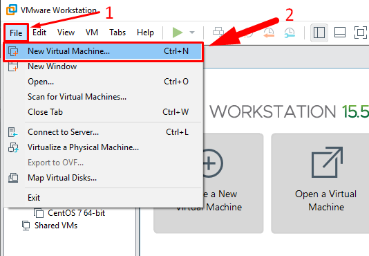

Bước 2: Chọn **Typical**.  > Next

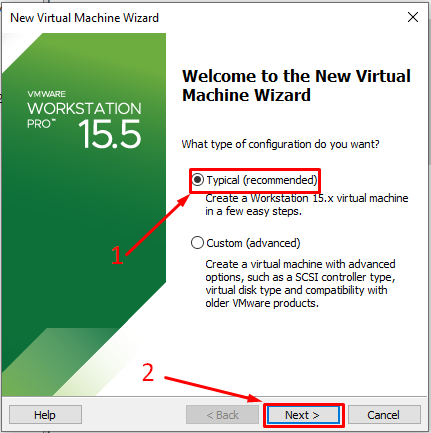

Bước 3: Chọn **I will install the operating system later**. > Next

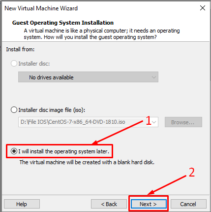

Bước 4:  Chọn **Linux** > Version: **Centos 7 64-bit.**

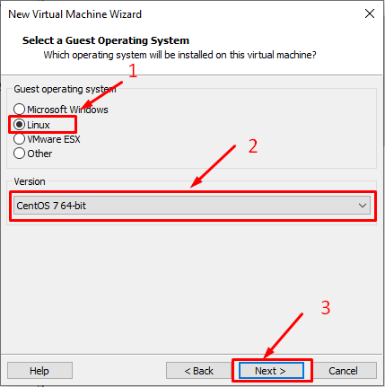

Bước 5:  Đặt tên (tuỳ ý) ở ô **Virtual machine name**. Chọn nơi lưu file ở ô **Location** > Next

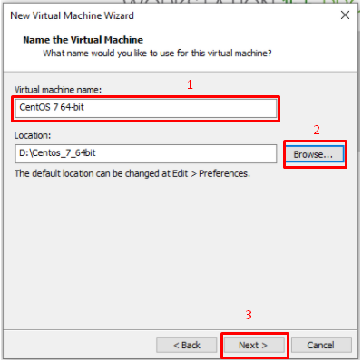

Bước 6: Chọn dung lượng cho ổ đĩa (40GB). Chọn dạng lưu trữ:

\+ **Store virtual disk as a single files**: Ổ đĩa ảo tạo thành 1 file lớn

+**Split virtual disk into multiple files**: Ổ đĩa ảo cắt thành nhiều file nhỏ

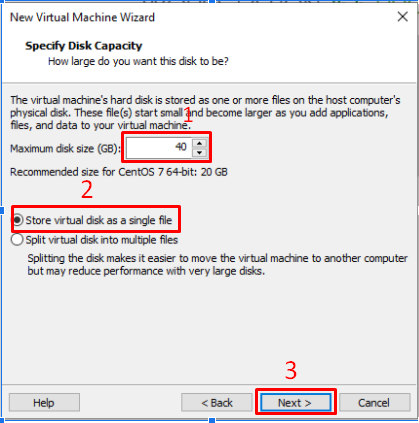

Bước 7: Chọn **Finish.**

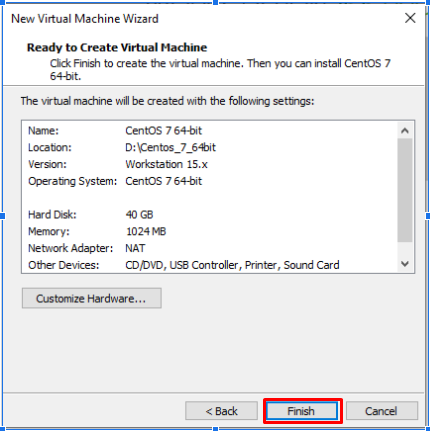

Bước 8: Chọn **Edit virtual machine settings** để chỉnh sửa cấu hình

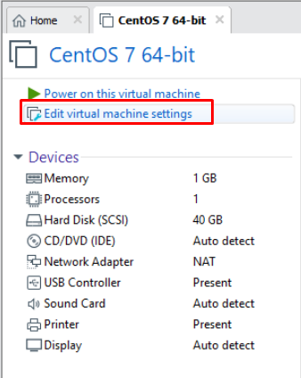

Bước 9: Chọn **New CD/DVD (IDE)** > **Use ISO image file** để chọn đến đường dẫn file ISO centos 7. > Ấn OK

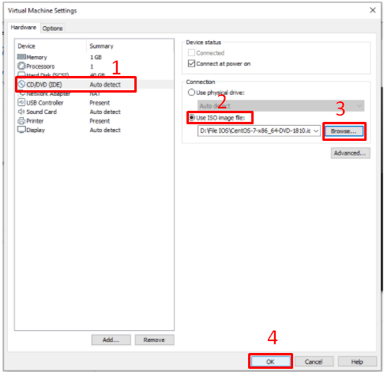

Bước 10: Chọn **Power on this virtual machine** để khởi động Centos 7

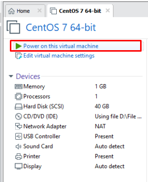

Bước 11: Chọn **Install centos 7.**

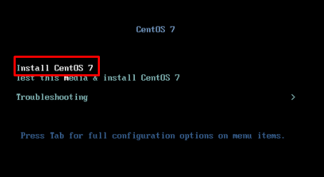

Bước 12: Nhấn Enter.

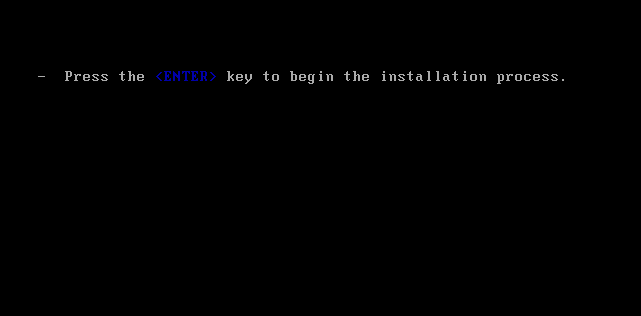

Bước 13 : Lựa chọn ngôn ngữ > Continue

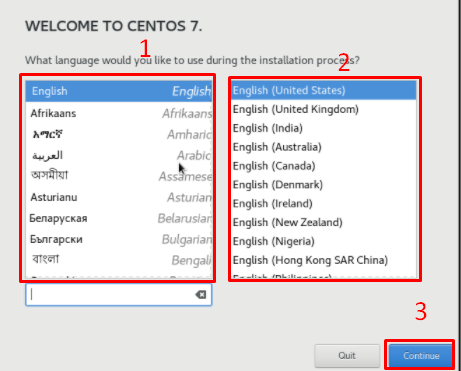

Bước 14: Chọn múi giờ.

  - Chọn  Ho Chi Minh City > Done

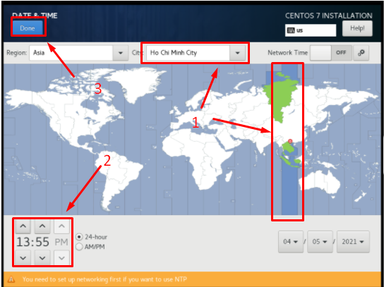

Bước 15:Mục **INSTALLATION DESTINATION**, chọn ổ đĩa ảo 40GB đã tạo. 

+Chọn **Automatically configure partitioning** để tự động phân vùng ổ cứng.

+Chọn **I will configure partitioning** để tự phân vùng. > Done

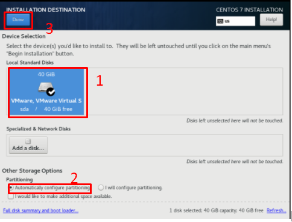

Bước 16: Ở mục **SOFTWATE SELECTION**, chọn gói cài đặt. > **Done**

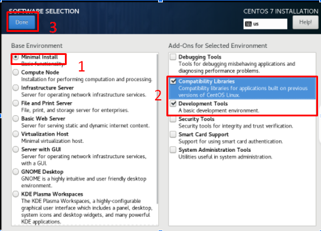

Bước 17: Chọn **Begin Installation** để bắt đầu cài đặt.

Bước 18 :  Chọn **Root password** để thiết lập mật khẩu tài khoản root.

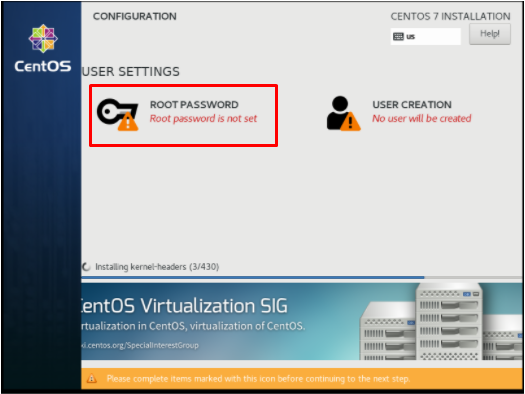

- Nhập mật khẩu. Chọn **Done** để hoàn thành.

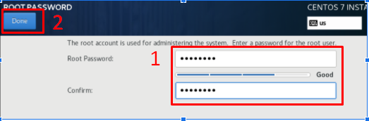

- Chọn user creation để thêm user.

Bước 19: Chọn **Reboot** để khởi động lại. Cài Centos 7 64bit hoàn tất.

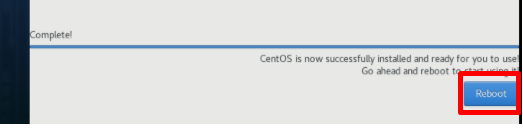

10 ĐỊA CHỈ IP PUBLIC VÀ 10 ĐỊA CHỈ IP PRIVATE
# 10 IP PUBLIC

\1. 	8.8.8.8

\2.	17.2.2.29

\3.	1.77.5.55

\4.	126.1.29.7

\5.	156.55.1.198

\6.	191.15.223.6

\7.	96.4.75.22

\8.	173.45.1.59

\9.	7.7.7.7

\10.	9.252.6.129

# 10 IP PRIVATE

\1.	192.168.131.133

\2.	192.168.2.107

\3.	10.0.20.7

\4.	10.56.34.1

\5.	172.16.56.24

\6.	172.30.168.55

\7.	172.23.60.96

\8.	192.168.222.36

\9.	10.10.50.1

\10.	192.168.40.203

PAGE
