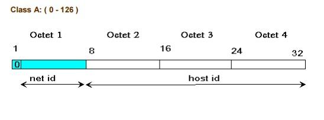
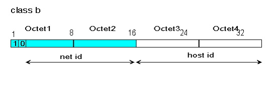
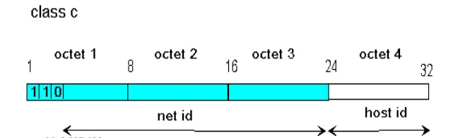
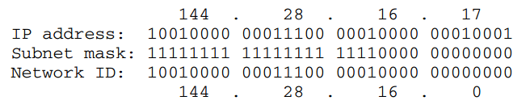

**TÌM HIỂU VỀ ĐỊA CHỈ IPv4**
# **1. Địa chỉ IP**
\- Địa chỉ **Internet Protocol** (Viết tắt là **IP** - giao thức Internet) là **số** định dạng cho một **phần cứng mạng**, các thiết bị sử dụng địa chỉ IP để **liên lạc** với nhau qua mạng dựa trên IP như mạng Internet.[\[1\]](https://quantrimang.com/dia-chi-ip-la-gi-143625)

\- Địa chỉ IP cung cấp **nhận dạng** cho một thiết bị mạng, tương tự như địa chỉ nhà riêng hoặc doanh nghiệp. Các thiết bị trên mạng có các địa chỉ IP khác nhau.
## **1.1 Địa chỉ IP Static**
\- IP Static còn có tên gọi khác là **IP tĩnh**, đôi khi được gọi là fixed IP addresses (địa chỉ IP cố định)

\- Địa chỉ  IP được **cấu hình thủ công** cho thiết bị so với địa chỉ được gán thông qua DHCP server. 

\- Nói về ip tĩnh thì hoàn toàn không thay đổi theo thời gian,  cách đặt IP cho từng thiết bị hoàn toàn thủ công và không bị thay đổi theo thời gian.
## **1.2 Địa chỉ IP Dynamic**
\- IP Dynamic là **IP động**, đồng nghĩa là địa chỉ ip có thể **thay đổi** được.

\- Địa chỉ thay thế hoàn toàn tự động và được quản lý qua máy chủ DHCP Server.
# **2. Địa chỉ IPv4**
\- Giao thức Internet **phiên bản 4** (IPv4 - *Internet Protocol version 4*) là phiên bản thứ tư trong quá trình phát triển của các [giao thức Internet](https://vi.wikipedia.org/wiki/IP) (IP). Đây là phiên bản đầu tiên của IP được sử dụng rộng rãi. 

\- IPv4 cùng với [IPv6](https://vi.wikipedia.org/wiki/IPv6) (giao thức Internet phiên bản 6) là nòng cốt của giao tiếp internet.[\[2\]](https://vi.wikipedia.org/wiki/IPv4)
## **2.1 Cấu trúc địa chỉ IPv4[\[3\]**](https://anninhmang.edu.vn/ipv4-la-gi/)**
\- Địa chỉ IP gồm **32 bit nhị phân**, chia thành **4 cụm 8 bit** (gọi là các **octet**). Các octet được biểu diễn dưới dạng thập phân và được ngăn cách nhau bằng các dấu chấm.

\- Địa chỉ IP được chia thành hai phần: 

\+ Network ID - địa chỉ mạng là địa chỉ được cấp cho từng mạng riêng.

\+ Host ID (hay Host Address) là địa chỉ của máy trong mạng.

\- Quy tắc đặt IPv4:

\+ Các bit phần mạng **không được phép đồng thời bằng 0**.

*Ví dụ:* Địa chỉ 0.0.0.1 với phần mạng là 0.0.0 và phần *host* là 1 là không hợp lệ.

\+ Nếu các bit phần *host* **đồng thời bằng 0**, ta có một **địa chỉ mạng**.

*Ví dụ:* Địa chỉ 192.168.7.1 là một địa chỉ có thể gán cho *host* nhưng địa chỉ 192.168.7.0 là một địa chỉ mạng, không thể gán cho *host* được.

\+ Nếu các bit phần *host* **đồng thời bằng 1**, ta có một địa chỉ *broadcast.[*\[4\]](https://vi.wikipedia.org/wiki/Broadcast_\(m%E1%BA%A1ng\))*

*Ví dụ:* Địa chỉ 192.168.7.255 là địa chỉ *broadcast* cho mạng 192.168.7.0
## **2.2 Các lớp địa chỉ IPv4**
### **2.2.1 Lớp A:**

\- Sử dụng **1** octet đầu - phần mạng, **3** octet sau - phần *host*.

\- **Bit đầu** của một địa chỉ lớp A luôn được giữ là **0**.

\- Gồm: 1.0.0.0 -> 126.0.0.0.

\- Mạng 127.0.0.0 được sử dụng làm mạng [*loopback*](https://www.it-swarm-vi.com/vi/networking/dia-chi-loopback-la-gi-i-e.-127.0.0.1/959526867/).
### **2.2.2 Lớp B:**

\- Sử dụng 2 octet đầu-  phần mạng, 2 octet sau - phần *host.*

\- Hai bit đầu của một địa chỉ lớp B luôn được giữ là **10**.

\- Gồm: 128.0.0.0 -> 191.255.0.0. 
### **2.2.3 Lớp C:**

\- Sử dụng 3 octet đầu - phần mạng, 1 octet sau - phần *host.*

\- Ba bit đầu của một địa chỉ lớp C luôn được giữ là **110**.

\- Gồm: 192.0.0.0 -> 223.255.255.0. 
### **2.2.4 Lớp D:**
\- Gồm các địa chỉ thuộc dải: 224.0.0.0 -> 239.255.255.255

\- Được sử dụng làm địa chỉ *multicast.*

Ví dụ: 224.0.0.5 dùng cho OSPF; 224.0.0.9 dùng cho RIPv2
### **2.2.5 Lớp E:**
\- Từ 240.0.0.0 trở đi.

\- Được dùng cho mục đích dự phòng.
## **2.3 Subnet mask**
\- Mỗi địa chỉ IP luôn kèm với một Subnet mask, để xác định được phần Net-id của địa chỉ đó. 

\- Subnet mask bao gồm phần các bits 1 và phần còn lại là các bits 0, subnet mask có bao nhiêu bit 1 thì địa chỉ IP tương ứng sẽ có bấy nhiêu bit phần net-id.

Ví dụ: 11111111.11111111.11111111.00000000 hay 255.255.255.0

` 	`- Subnet mask là kỹ thuật dùng để xác định một địa chỉ IP thuộc Network ID nào.  

`	`Ví dụ: có địa chỉ IP là 144.28.16.17/20

Kết quả là Network ID của subnet này là 144.28.16.0
## **2.4 Địa chỉ Unicast**
\- Khi ta muốn gửi gói tin đến một máy tính cụ thể, khi đó địa chỉ để bạn gửi tới sẽ là một địa chỉ unicast. Đây đơn giản chỉ là địa chỉ IP của một thiết bị nào đó trong cùng hoặc mạng cục bộ khác.
## **2.5 Địa chỉ Multicast**
\- Trường hợp ta muốn gửi gói tin đến nhiều máy tính, ta không thể gửi lần lượt đến tất cả các máy được. Vì thế, địa chỉ bạn cần gửi tới trong trường hợp này sẽ là một địa chỉ Multicast, địa chỉ này đại diện cho một nhóm các thiết bị.

\- Địa chỉ multicast này chính là các địa chỉ trong dải địa chỉ lớp D.
## **2.6 Địa chỉ Broadcast**
\- Khi muốn gửi thông điệp đến tất cả các máy trong mạng nội bộ, ta cần sử dụng đến địa chỉ Broadcast. 

\- Địa chỉ Broadcast là địa chỉ có toàn bộ các bits phần host-id là 1. Khi gói tin được gửi đến địa chỉ Broadcast, thì nó sẽ được gửi tới tất cả các máy cùng mạng, tức là cùng phần net-id. 

\- Vì đại diện cho toàn bộ thiết bị trong mạng nên địa chỉ Broadcast không thể đặt được cho bất kỳ thiết bị nào.

\- Ví dụ: 192.168.7.255/24 là địa chỉ Broadcast của mạng 192.168.7.0/24.
## **2.7 Địa chỉ mạng**
\- Không chỉ các thiết bị mới có địa chỉ IP, mà các mạng thành phần của Internet hay mạng cục bộ cũng có một địa chỉ để xác định chính xác mạng đó. 

\- Khi tất cả các bits phần Host của một địa chỉ IP là 0, thì địa chỉ đó được gọi là địa chỉ mạng của mạng đó.

\- Vì đại diện cho mạng nên địa chỉ mạng cũng không thể đặt được cho bất kỳ thiết bị nào.

\- Ví dụ: 192.168.7.0/24 là địa chỉ mạng của mạng 192.168.7.0/24.
## **2.8 Default Gateway**
\- Khi gói tin cần gửi đến địa chỉ không cùng mạng hiện tại, hoặc đơn giản là không biết gửi đi đâu, thì gói tin đó sẽ được gửi tới địa chỉ Default gateway.

\- thường là một interface của Router nối trực tiếp với mạng đó. Tại đây, Router sẽ dùng các chức năng định tuyến để chuyển tiếp gói tin đi các hướng khác nhau.

\- Default Gateway thường là địa chỉ IP có thể sử dụng đầu tiên của mạng đó.

Ví dụ: Default gateway của mạng 192.168.1.0/24 là 192.168.1.1/24.
## **2.9 Địa chỉ IP Private và địa chỉ IP Public**
Địa chỉ IP được phân thành 2 loại: *private* và *public.*

*- Private:* chỉ được sử dụng trong mạng nội bộ (mạng LAN), không được định tuyến trên môi trường Internet. Có thể được sử dụng lặp lại trong các mạng LAN khác nhau.

*- Public:* là địa chỉ được sử dụng cho các gói tin đi trên môi trường Internet, được định tuyến trên môi trường Internet. Địa chỉ *public* phải là duy nhất cho mỗi *host* tham gia vào Internet.

Dải địa chỉ *private (*được quy định trong RFC 1918):

Lớp A: 10.x.x.x

Lớp B: 172.16.x.x -> 172.31.x.x

Lớp C: 192.168.x.x

\- Kỹ thuật NAT (Network Address Translation)[\[4\]](https://www.totolink.vn/article/90-3-loai-nat-network-address-translation-ban-can-biet.html#:~:text=Nat%20\(Network%20Address%20Translation\)%20l%C3%A0,k%E1%BA%BFt%20n%E1%BB%91i%20gi%E1%BB%AFa%20hai%20m%E1%BA%A1ng.) được sử dụng để chuyển đổi giữa IP *private* và IP *public.*

\- Ý nghĩa của địa chỉ private: được sử dụng để bảo tồn địa chỉ public.
# **3. Chia mạng con bằng VLSM (Variable Length Subnet Masking):**
\- Bước 1: Sắp xếp các mạng con theo thứ tự có số host giảm dần.

\- Bước 2: Xác định số bits cần phải mượn là phần host trong mỗi mạng con theo nguyên tắc n bits mượn thì 2^n -2 >= nhu cầu.( Vì địa chỉ đầu và địa chỉ cuối không dùng)

Ví dụ 100 host cần mượn 7 bít

\- Bước 3: Chia.

Ví dụ: 192.168.1.0/24 chia thành:

**A**: 100 host ( mượn 7bit)

**B**: 60 host (6 bit)

**C**: 30 host (5 bit)

**D**: 10 host (4 bit)

**E**: 6 host (3 bit)

32 - 7 = 25

192.168.1.0/25(**A**)			192.168.1.128/25

`				`32 - 6 = 26

192.168.1.128/26(**B**)		192.168.1.192/26

`					`32 - 5 = 27

`		`192.168.1.192/27(**C**)		192.168.1.224/27

`						`32 - 4 = 28

`			`192.168.1.224/28(**D**)		192.168.1.240/28

`							`32 - 3 = 29

`				`192.168.1.240/29(**E**)		192.168.1.248/29

PAGE
