Hướng dẫn cài đặt Apache trên Centos 7 64bit
# 1. Cài đặt Apache
Apache là nền tảng Web server mã nguồn mở. 

- là một phần mềm chạy trên server.
- Công việc: thiết lập kết nối giữa server và trình duyệt người dùng (Firefox, Google Chrome, Safari,...) rồi chuyển file tới và lui giữa chúng (cấu trúc 2 chiều dạng client-server).
- là một phần mềm đa nền tảng, nó hoạt động tốt với cả server Unix và Windows.

Hoạt động:

- Khi một khách truy cập tải một trang web trên website của bạn,trình duyệt người dùng sẽ gửi yêu cầu tải trang web đó lên server và Apache sẽ trả kết quả với tất cả đầy đủ các file cấu thành nên trang (hình ảnh, chữ,...). 
- Server và client giao tiếp với nhau qua giao thức HTTP và Apache chịu trách nhiệm cho việc đảm bảo tiến trình này diễn ra mượt mà và bảo mật giữa 2 máy.

Lệnh cài đặt Apache:

|# yum install httpd –y|
| - |
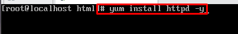

Khởi chạy Apache:

|# systemctl start httpd|
| - |
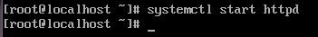

Tự động chạy khi khởi động:

|# systemctl enable httpd|
| - |
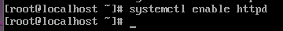

Kiểm tra trạng thái hoạt động của Apache:

|# systemctl status httpd|
| - |
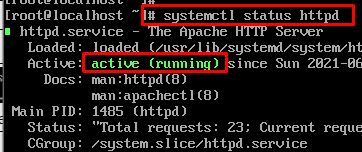

Mở port trên firewall:

|
# firewall-cmd --permanent --zone=public --add-service=http

# firewall-cmd --permanent --zone=public --add-service=https

# firewall-cmd --reload
|
| - |
Dừng Apache:

|# systemctl stop httpd|
| - |
Khởi động lại Apache:

|# systemctl restart httpd|
| - |
# 2. Đặt trang html
- Vào thư mục chứa code

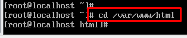

- Tạo file index.html

- Tạo 1 trang html đơn giản

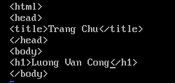

- Truy cập bằng trình duyệt để kiểm tra:

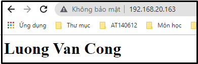
# 3. Các file cấu hình
- Tất cả các file cấu hình của Apache đều nằm trong thư mục **/etc/httpd**

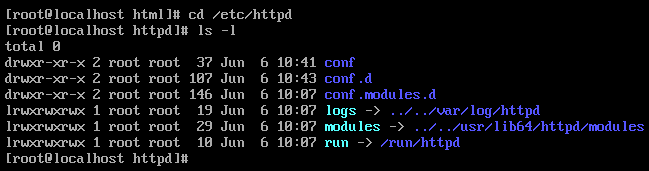

- File cấu hình chính của Apache là **/etc/httpd/conf/httpd.conf**

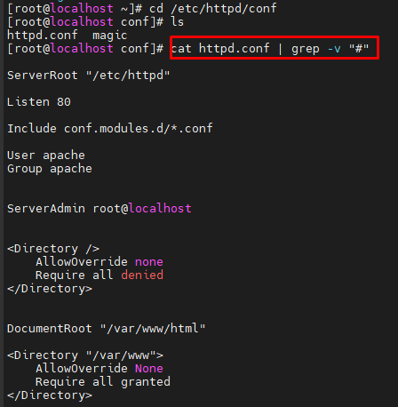

- Tất cả các tệp cấu hình đều phải kết thúc bằng .conf và nằm trong thư mục **/etc/httpd/conf.d**.

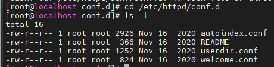

- Các tệp cấu hình chịu trách nhiệm tải các modules Apache được đặt trong thư mục **/etc/httpd/conf.modules.d**.
- 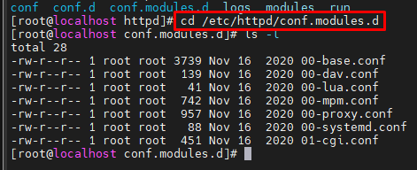
- Để quản lý tốt hơn, nên tạo một tệp cấu hình riêng (vhost) cho mỗi tên miền.
- Các tệp vhost Apache phải kết thúc bằng .conf và được lưu trữ trong thư mục /etc/httpd/conf.d. Ví dụ: nếu tên miền của bạn là mydomain.com thì tệp cấu hình sẽ được đặt tên /etc/httpd/conf.d/mydomain.com.conf
- Các file log của Apache ( access \_ log và error \_ log ) nằm trong thư mục **/var/log/httpd/**. Bạn nên có file log riêng cho mỗi vhost.

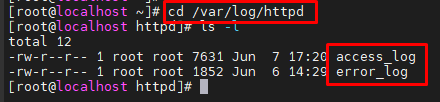
# 3. File log
Đường dẫn chứa file log:

- /var/log/httpd/
- /etc/httpd/logs
## 3.1 Access\_log log đăng nhập
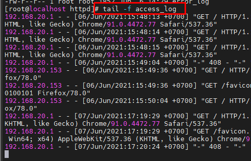

Khi có 1 host truy cập vào website

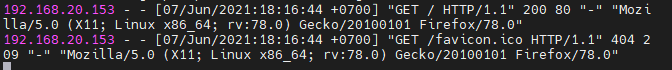
## 3.2 Error\_log: log lỗi dịch vụ
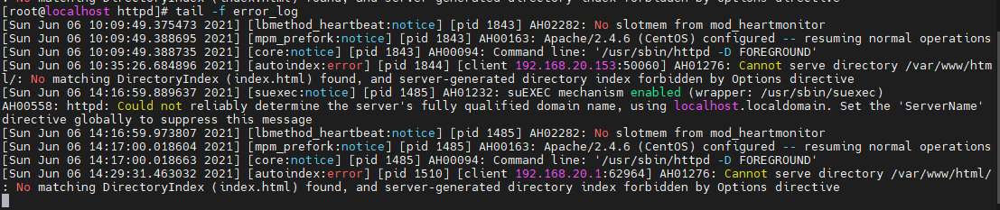
