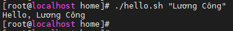

# Thực hành Bash Shell Day 1- Getting started with Bash

## 1.1 Interactive Shell

```
# echo "Helloworld"
Helloworld
# echo "Xin chao"
Xin chao
```


- Echo là một lệnh trong bash ghi các đối số mà nó nhận được vào đầu ra tiêu chuẩn. Nó thêm một dòng mới vào đầu ra.

## 1.2 Non-Interactive Shell – Shell không tương tác

Bash shell cũng có thể chạy không tương tác từ một script, làm làm shell không cần sự tương tác từ con người.

Tạo một script Hello world:

- Tạo file mới có tên `hello.sh`:

``#touch hello.sh``

- Thêm quyền thực thi đối với file: 

`#chmod +x hello.sh`

- Thêm code vào file `hello.sh`:

```
#!/bin/bash
echo "Hello World"
```

**Note**:
- *Dòng đầu tiên chuỗi ký tự `#!` được gọi là `shebang1`. `Shebang` hướng dẫn hệ điều hành chạy.*
- *Dòng 2 sử dụng `echo` để ghi `Hello World` vào đầu ra tiêu chuẩn*

Thực thi tập lệnh hello.sh từ dòng lệnh bằng cách sử dụng một trong những cách sau:

- Cách mà được sử dụng phổ biến nhất:
 
`# ./hello.sh`

`# /bin/bash hello.sh`

`# bash hello.sh`

`# sh hello.sh`

- Tất cả đều được kết quả cuối cùng là `Hello World`.

## 1.3 Hello World sử dụng biến
- Tạo một file `hello.sh` với nội dung và cấp quyền thực thi.

Đoạn mã sau châp nhận một đối số $1 , là đối số dòng lệnh đầu tiên và xuất nó ra một chuỗi định dạng. Nôi dung tệp lệnh như sau:

```
#!/usr/bin/env bash
printf "Hello, %s\n" "$1"
```


Thực hiện lệnh với đối số là ký tự theo sao câu lệnh:

- Không có đối số
```# ./hello.sh ```


- Đối số bằng với một chuỗi:

```# ./hello.sh Cong```


- Chuỗi có phân cách nhau bằng dấu cách, đối số `$1` chỉ được ứng với 1 chuỗi đầu tiên sau câu lệnh.


```#./hello.sh Lương Công```


- Không hiển thị được chuỗi `Lương Công`, thì cần thêm dấu ngoặc kép(`"`):

```# ./hello.sh  "Lương Công"```




## 1.4 Hello World with user Input

Phần sau sẽ nhắc người dùng nhập dữ liệu sau đó lưu thông tin văn bản dưới dạng string (text) trong một biến. Biến sau đó được sử dụng để in thông điệp cho người dùng

```
#!/usr/bin/env bash

echo "Tên của bạn là gì?"
read name
echo "Hello, $name."
```


Lệnh read ở đây đọc dữ liệu từ đầu vào tiêu chuẩn vào tên biến. Sau đó sử dụng $name và in ra bằng echo

Thực hành: nhập tên `cong`


Ở đây người dùng nhập tên là ```cong``` và mã này được sử dụng rồi in ra ```Hello, cong```

Nếu bạn muốn nối một cái gì đó vào giá trị biến trong khi in nó, hãy sử dụng dấu ngoặc nhọn quanh biến tên như được hiển thị trong ví dụ sau

```
#!/usr/bin/env bash
echo "Bạn đang làm gì?"
read action
echo "Bạn đang ${action} ở bờ hồ."
```

## 1.5 Tầm quan trọng của trích dẫn chuỗi
- kiểm soát bash phân tích cú pháp và mở rộng chuỗi của bạn.

Có hai loại qouting – trích dẫn:

- Weak-Yếu: sử dụng dấu ngoặc kép: “”
- Strong – Mạnh: sử dụng dấu ngoặc đơn: ”


Nếu bạn muốn mở rộng đối số của mình, bạn có thể sử dụng Weak qouting:

```
#!/usr/bin/env bash
world="Vietnamese"
echo "Hello $world"
```


Nếu bạn không muốn mở rộng đối số, hãy sử dụng Strong qouting:

```
#!/usr/bin/env bash
world="Vietnamese"
echo 'Hello $world'
```

Bạn cũng có thể sử dụng dấu \ để ngăn mở rộng:

```
#!/usr/bin/env bash
world="Vietnamese"
echo "Hello \$world"
```
Output:

```
[root@localhost ~]# ./hello.sh
Hello $world
```

## 1.6 Chế độ “Debug”
```
[root@localhost ~]# cat hello.sh
#!/usr/bin/env bash

echo "Hello world"
x=4
v=$(expr 4 + $x)
printf "v= $v\n"
```

```
[root@localhost ~]# bash -x hello.sh
+ echo 'Hello world'
Hello world
+ x=4
++ expr 4 + 4
+ v=8
+ printf 'v= 8\n'
v= 8
```


- Đối số `-x` cho phép bạn xem qua từng dòng lệnh trong tệp và cho biết lệnh đang lỗi ở đâu.


# Phần 2 Script shebang
## 2.1 ENV Shebang

Để thực thi một script với tệp thực thi bash được tìm thấy trong biến môi trường PATH bằng cách sử dụng tệp thực thi env, Dòng đầu tiên của script phải chỉ ra đường dẫn tuyệt đối đến tệp thực thi env với đối số là bash:

```#!/usr/bin/env bash```

- Đường dẫn env trong shebang được giải quyết và chỉ được sử dụng nếu một tệp lệnh được khởi chạy trực tiếp với đường dẫn tệp script:

``script.sh``

- Tệp lệnh phải có quyền thực thi

- Shebang (```#!/usr/bin/env bash```) bị bỏ qua khi một trình thông dịch bash được chỉ định rõ ràng để thực thi một script:

`bash script.sh`

`sh script.sh`

## 2.2 Direct shebang
Để thực thi một tệp script với trình thông dịch bash, dòng đầu tiên của tệp lệnh phải chỉ ra đường dẫn tuyệt đối đến bash thực thi để sử dụng:

``#!/bin/bash``

Đường dẫn bash trong she bang được giải quyết và chỉ được sử dụng khi một script được khởi chạy trực tiếp như này:

```./script.sh```

Script phải được cấp quyền thực thi.

Shebang bị bỏ qua khi một trình thông dịch bash được chỉ định rõ ràng để thực thi một tệp lệnh:

```bash script.sh```

## 2.3 Other shebangs

Có 2 loại chương trình mà kernel biết. Một chương trình nhị phân được xác định bởi tiêu đề ELF(ExtenableLoadableFormat – Định dạng có thể tái mở rộng), thường được tạo bởi trình biên dịch. Thứ hai là kịch bản của bất kỳ loại nào.

- Nếu một tệp bắt đầu với dòng đầu tiên bằng chuỗi #! thì tiếp theo phải là tên đường dẫn của trình thông dịch.

- Nếu kernel đọc được dòng này, nó sẽ gọi trình thông dịch được đặt tên theo tên đường dẫn này và đưa các từ trong dòng làm đối số thông dịch.

`
#!/usr/bin/env something 
echo "hello world"
`

- Sẽ không thực thi được câu lệnh vì trong `/usr/bin/evn` không có trình thông dịch `something`, something không thể xử lý được lệnh.

Mục tiêu:
– Tạo file bash script.
– Thêm quyền thực thi file bash script.
– biết 4 cách để thực thi file bash script.
– Cách sử dụng biến đơn giản, sử dụng chuỗi ký tự.
– Đối số với câu lệnh.
– Lệnh read.
– Shebang

# Tài liệu tham khảo

1. https://hocchudong.com/bash-shell-day1-getting-started-with-bash/