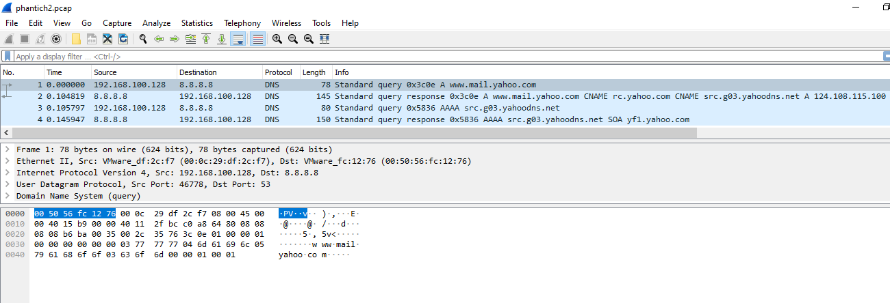

# Phân tích gói tin DNS

**Mục lục**
  - [1.Bắt gói tin DNS](#1bắt-gói-tin-dns)
  - [2.Dùng WireShark phân tích gói tin DNS: ```phantich2.pcap```](#2dùng-wireshark-phân-tích-gói-tin-dns-phantich2pcap)
    - [2.1Query/Response type A](#21queryresponse-type-a)
      - [2.1.1 Query type A](#211-query-type-a)
      - [2.1.2 Response type A](#212-response-type-a)
    - [2.2 Query/Response type AAAA](#22-queryresponse-type-aaaa)
      - [2.2.1 Query type AAAA](#221-query-type-aaaa)
      - [2.2.2 Response type AAAA](#222-response-type-aaaa)

## 1.Bắt gói tin DNS
Trên Server Centos 7:
- Dùng tcpdump bắt gói tin DNS:


- Chạy lệnh nslookup để tìm máy chủ mail của Yahoo!Mail (www.mail.yahoo.com)


- Các gói tin bắt được:


## 2.Dùng WireShark phân tích gói tin DNS: ```phantich2.pcap```

- Mở gói tin ```phantich2.pcap```


- Chúng ta nhìn thấy từ hình trên nslookup đã gửi 2 truy vấn DNS và nhận được 2 câu trả lời DNS.
- Chúng được gửi qua: UDP


- Cổng nguồn của Message Response: Cổng 53


- Truy vấn DNS gửi tới địa chỉ IP nào: DNS Local Server: 8.8.8.8.


- Tiếp theo, phân tích chi tiết gói tin query/reponse DNS.
### 2.1Query/Response type A
Xét gói tin: Lọc ```dns.qry.type==1```


#### 2.1.1 Query type A
Xét gói tin:


- ID:0x3c0e
- Flags: 0x0100 Standard query
- Questions(Số lần hỏi): 1
- Queries(Truy vấn)
  - Tên: www.mail.yahoo.com
  - Type: A (Host Address)
  - Class: IN
#### 2.1.2 Response type A
Xét gói tin:


- ID:0x3c0e
- Flags: 0x8180 Standard query response
- Questions(Số lần hỏi): 1
- Answer RRs(Số lần trả lời): 3
- Queries(Truy vấn)
  - Tên: www.mail.yahoo.com
  - Type: A (Host Address)
  - Class: IN
- Answers:
**(1)** Bản ghi CNAME 1:


Thông tin:
  - Name: www.mail.yahoo.com
  - Loại: CNAME
  - Class: IN
  - TTL: 1800(30 phút)
  - Độ dài: 5
  - Bí danh: rc.yahoo.com
**(2)** Bản ghi CNAME 2:


Thông tin:
  - Name: rc.yahoo.com
  - Loại: CNAME
  - Độ dài: 22
  - Bí danh: src.g03.yahoodns.net
**(3)** Bản ghi A:


Thông tin:
  - Name: src.g03.yahoodns.net
  - Type: A(Host address)
  - Class: IN
  - TTL:172 (2 phút, 52 giây)
  - Data length: 4
  - Address: 124.108.115.100
### 2.2 Query/Response type AAAA
Xét 2 gói tin:Lọc ```dns.qry.type==28```


#### 2.2.1 Query type AAAA
Xét gói tin:

- ID: 0x5836
- Cờ: 0x0100 Standard query
- Questions (Số lần hỏi): 1
- Queries (Try vấn)
  - Name: src.g03.yahoodns.net
  - Type: AAAA(IPv6 Address) (28)
  - Class: IN
#### 2.2.2 Response type AAAA
Xét gói tin:


- ID: 0x5836
- Cờ: 0x8180 Standard query response
- Authority RRs (Số lần trả lời bản ghi thẩm quyền quyền): 1
- Queries
  - Name: src.g03.yahoodns.net
  - Type: AAAA
  - Class IN
- Authoritative nameservers(Các máy chủ định danh có thẩm quyền)


Thông tin:
- Name: g03.yahoodns.net
- Loại SOA (Start Of a zone of Authority)
- Class: IN
- TTL: 164 (2 phút, 44 giây)
- Độ dài: 58
- Primary name server (Máy chủ chính): yf1.yahoo.com
- Responsible authority's mailbox: hostmaster.yahoo-inc.com
- Số Serial: 1632292379
- Refresh Interval: 30 giây
- Retry Interval: 30 giây
- Expire limit: 86400 (1 ngày)
- Minimum TTL: 300 (5 phút)