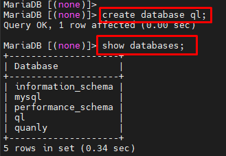

# Cài đặt và cấu hình Mariadb server

**Mục lục**
- [Cài đặt và cấu hình Mariadb server](#cài-đặt-và-cấu-hình-mariadb-server)
  - [1. Tổng quan về Mariadb](#1-tổng-quan-về-mariadb)
    - [1.1 Lịch sử](#11-lịch-sử)
    - [1.2 Ưu điểm của Mariadb](#12-ưu-điểm-của-mariadb)
  - [2. Cài đặt MariaDB 5.5 trên Centos 7](#2-cài-đặt-mariadb-55-trên-centos-7)
  - [3. Cài đặt mật khẩu root cho MariaDB](#3-cài-đặt-mật-khẩu-root-cho-mariadb)
  - [4.Kết nối Mariadb bằng root](#4kết-nối-mariadb-bằng-root)
  - [5.Câu lệnh SQL cơ bản sử dụng máy chủ MariaDB](#5câu-lệnh-sql-cơ-bản-sử-dụng-máy-chủ-mariadb)
    - [5.1 Đăng nhập vào MariaDB với tài khoản root:](#51-đăng-nhập-vào-mariadb-với-tài-khoản-root)
    - [5.2 Tạo,xoá database, tables](#52-tạoxoá-database-tables)
    - [5.3 Thao tác với CSDL](#53-thao-tác-với-csdl)
  - [6. File log](#6-file-log)
- [Tài liệu tham khảo](#tài-liệu-tham-khảo)


## 1. Tổng quan về Mariadb
- MariaDB là hệ quản trị cơ sở dữ liệu miễn phí được phát triển từ hệ quản trị cơ sở dữ liệu mã nguồn mở MySQL. 
- MariaDB được phát triển nhằm thay thế công nghệ cơ sở dữ liệu MySQL.
### 1.1 Lịch sử
- Nền móng cơ sở đầu tiên của MariaDB được phát triển bởi “trụ cột” của MySQL AB là Michael “Monty” Widenius. 
- Năm 2008, sau khi Sun mua lại MySQL AB, Michael “Monty” Widenius rời khỏi MySQL AB và tiếp tục phát triển một hệ cơ sở quản trị mới của mình.
- Đầu năm 2009, Michael cùng với 1 vài đồng nghiệp khác bắt đầu tiến hành dự án chuyên sâu về công cụ lưu trữ MySQL, sau này trở thành MariaDB.
- Tên gọi MariaDB được đặt tên theo tên con gái út của Widenius – Maria. Sau nhiều lần nâng cấp và phát triển, hiện tại MariaDB đã ra mắt phiên bản mới nhất là MariaDB 10.7.

### 1.2 Ưu điểm của Mariadb
- Hoàn toàn miễn phí
- Khắc phục những hạn chế của MySQL
- Bổ sung thêm nhiều Engine hơn
- Kết hợp cả SQL và NoSQL


**Hoàn toàn miễn phí**

- MariaDB có 2 bản trả phí và không cần trả phí. Tuy nhiên, với phiên bản không trả phí, người dùng vẫn có thể sử dụng đầy đủ các tính năng mà không ảnh hưởng đến việc chạy hệ thống.

**Khắc phục những hạn chế của MySQL**

- MariaDB được phát triển từ MySQL, do đó nó kế thừa những đặc điểm chủ yếu của hệ quản trị này từ phiên bản 5.1 -> 5.5. Do đó, người dùng có thể chuyển từ MySQL sang MariaDB mà không ảnh hưởng đến hệ thống. 

- Đặc biệt, những hạn chế của MySQL, khi chuyển qua MariaDB đều sẽ được khắc phục một cách triệt để nhất, thậm chí có thể tăng tốc độ hơn so với MySQL từ 3-5%. Ngoài ra, hệ quản trị này còn cải thiện hiệu năng và có thêm nhiều chức năng mới hơn so với MySQL.

**Bổ sung thêm nhiều Engine hơn**

- Các storage engines cơ bản như 
  - MyISAM 
  - BLACKHOLE
  - CSV
  - MEMORY 
  - ARCHIVE 
  - MERGE. 
- MariaDB phát triển thêm các storage engines khác bao gồm: 
  - Aria
  - XtraDB
  - FederatedX
  - OQGRAPH
  - SphinxSE
  - IBM DB2I
  - Spider
  - PBXT,…


**Note**: *Storage engine thực chất là cách mà MySQL lưu trữ dữ liệu trên đĩa cứng. Mỗi database sẽ được MySQL lưu dưới dạng thư mục con của thư mục data. Khi tạo table, MySQL sẽ tạo ra một file có tên trùng với tên table đó và có đuôi file định dạng .frm ở trong thư mục database.*

**Kết hợp cả SQL và NoSQL**

- MariaDB là sự kết hợp của cả 2 loại cơ sở dữ liệu là SQL và NoSQL. Việc kết hợp sẽ giúp hệ thống này có thể tích hợp được tất cả ưu điểm của cả 2 cơ sở dữ liệu này là Dynamic Column và Cassandra Storage Engine.

## 2. Cài đặt MariaDB 5.5 trên Centos 7
- Cài đặt:

`# yum -y install mariadb-server`


- Cấu hình chuẩn utf8

```
# vi /etc/my.cnf
[mysqld]
character-set-server=utf8
```

- Khởi động dịch vụ:

```
# systemctl start mariadb
# systemctl enable mariadb
```


- Cấu hình firewall
  - MariaDB có thể được sử dụng từ các Máy chủ từ xa.
  - MariaDB sử dụng 3306 / TCP.
  - Cho phép dịch vụ qua firewall:

```
#irewall-cmd --add-service=mysql --permanent
#firewall-cmd --reload
```

## 3. Cài đặt mật khẩu root cho MariaDB

- Câu lệnh:

``# mysql_secure_installation``

- Nhập mật khẩu root hiện tại (Nếu lần đầu nhấn Enter)


- Cài đặt mật khẩu cho root:


- Remove người dùng ẩn danh:
  


- Không cho phép login root từ xa và Remove test database:


- Reload privilege table: Áp dụng cấu hình vừa đặt ở trên


##  4.Kết nối Mariadb bằng root
- Câu lệnh:

```# mysql -u root -p```
- Nhập mật khẩu đã đặt ở bước 2


## 5.Câu lệnh SQL cơ bản sử dụng máy chủ MariaDB
### 5.1 Đăng nhập vào MariaDB với tài khoản root:

```# mysql -u root -p ```

- Hiển thị toàn bộ users:

```select user,host from mysql.user;```

Output:


- Đổi tên tài khoản root (bảo mật):

 ```UPDATE mysql.user SET user="admindb" WHERE user="root"; ```

Kết quả:


### 5.2 Tạo,xoá database, tables
- Tạo database:


``` create database [name];```

Ex: ``create database ql;``

- Xem danh sách database hiện có:

``` show databases; ```



- Xoá database:

```Drop database db_name;```

Ex:  ```drop database ql;```

- Truy cập vào cơ sở dữ liệu:

``` use  [database_name]; ```

- Tạo bảng:

```create  table [table name](các trường);```

Ex:

use ql;
 create table nhanvien(
  manv int not null auto_increment,
  ho varchar(100) not null,
  ten varchar(100) not null,
  tuoi int not null,
  diachi varchar(200) not null,
  primary key (manv)
  ); 


- Hiển thị toàn bộ table hiện có

 ```show tables;``` 


- Xóa bảng:

```drop table  [tên bảng];``` 
### 5.3 Thao tác với CSDL

- `SELECT `được dùng khi bạn muốn đọc (hoặc lựa chọn) dữ liệu của bạn.
  - ``SELECT manv, ten FROM ql WHERE manv = 1;``
- `INSERT` được dùng khi bạn muốn thêm (hoặc chèn) dữ liệu mới.
  - ```INSERT INTO ql VALUES ('luong', 'cong',23,'ha noi');```
- `UPDATE` được sử dụng khi bạn muốn thay đổi (hoặc cập nhật) dữ liệu sẵn có.
  - `UPDATE ql SET ten = 'cong moi' WHERE manv = 1;`
- DELETE được sử dụng khi bạn muốn loại bỏ (hoặc xóa) dữ liệu sẵn có.
  - ```DELETE FROM ql WHERE id = 1;```
## 6. File log
- Folder mặc định:

```#cd /var/log/mariadb ```

- Giám sát hoạt động trên file log:

```# tail -f /var/log/mariadb/mariadb.log```


S
# Tài liệu tham khảo
1. https://www.server-world.info/en/note?os=CentOS_7&p=mariadb&f=1
2. https://mariadb.com/kb/vi/basic-sql-statements/