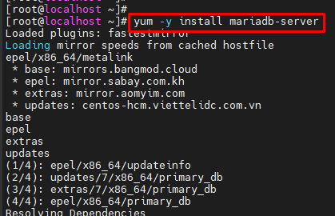

# Tìm hiểu về MySQL

- [Tìm hiểu về MySQL](#tìm-hiểu-về-mysql)
  - [MySQL là gì?](#mysql-là-gì)
  - [Lịch sử hình thành và phát triển của MySQL](#lịch-sử-hình-thành-và-phát-triển-của-mysql)
  - [Cách hoạt động](#cách-hoạt-động)
  - [Ưu điểm và nhược điểm của MySQL](#ưu-điểm-và-nhược-điểm-của-mysql)
- [Mối quan hệ giữa MySQL và MariaDB](#mối-quan-hệ-giữa-mysql-và-mariadb)
- [Thuật ngữ](#thuật-ngữ)
  - [Database](#database)
  - [SQL](#sql)
  - [Phần mềm nguồn mở](#phần-mềm-nguồn-mở)
- [Cài đặt MySQL trên Centos 7](#cài-đặt-mysql-trên-centos-7)
  - [Các bước cài đặt](#các-bước-cài-đặt)
  - [Đặt mật khẩu bảo mật tài khoản MySQL root](#đặt-mật-khẩu-bảo-mật-tài-khoản-mysql-root)
  - [Đăng nhập vào MySQL](#đăng-nhập-vào-mysql)
- [Tài liệu tham khảo](#tài-liệu-tham-khảo)

## MySQL là gì?
- MySQL là một hệ thống quản trị cơ sở dữ liệu mã nguồn mở (gọi tắt là RDBMS) hoạt động theo mô hình client-server. 
- Với RDBMS là viết tắt của Relational Database Management System. 
-  nó giúp lưu thông tin dữ liệu và quản lý truy xuất bằng các câu lệnh SQL
- MySQL quản lý dữ liệu thông qua các cơ sở dữ liệu. Mỗi cơ sở dữ liệu có thể có nhiều bảng quan hệ chứa dữ liệu. 

## Lịch sử hình thành và phát triển của MySQL
- Công ty Thuy Điển MySQL AB phát triển MySQL vào năm 1994.
- Phiên bản đầu tiên của MySQL phát hành năm 1995
- Công ty Sun Microsystems mua lại MySQL AB trong năm 2008
- Năm 2010 tập đoàn Oracle thâu tóm Sun Microsystems. Ngay lúc đó, đội ngũ phát triển của MySQL tách MySQL ra thành 1 nhánh riêng gọi là MariaDB. Oracle tiếp tục phát triển MySQL lên phiên bản 5.5.
- 2013 MySQL phát hành phiên bản 5.6
- 2015 MySQL phát hành phiên bản 5.7
- MySQL đang được phát triển lên phiên bản 8.0

## Cách hoạt động


Cách vận hành chính trong môi trường MySQL như sau:

- MySQL tạo ra bảng để lưu trữ dữ liệu, định nghĩa mối quan hệ giữa các bảng đó.
- Client sẽ gửi yêu cầu SQL bằng một lệnh đặc biệt trên MySQL.
- Ứng dụng trên server sẽ phản hồi thông tin và trả về kết quả trên máy client.

## Ưu điểm và nhược điểm của MySQL

**Ưu điểm của MySQL là gì?**

- Dễ sử dụng: MySQL là cơ sở dữ liệu tốc độ cao, ổn định, dễ sử dụng và hoạt động trên nhiều hệ điều hành cung cấp một hệ thống lớn các hàm tiện ích rất mạnh.
- Độ bảo mật cao:  MySQL rất thích hợp cho các ứng dụng có truy cập CSDL trên Internet khi sở hữu nhiều nhiều tính năng bảo mật thậm chí là ở cấp cao.
- Đa tính năng: MySQL hỗ trợ rất nhiều chức năng SQL được mong chờ từ một hệ quản trị cơ sở dữ liệu quan hệ cả trực tiếp lẫn gián tiếp.
Khả năng mở rộng và mạnh mẽ: MySQL có thể xử lý rất nhiều dữ liệu và hơn thế nữa nó có thể được mở rộng nếu cần thiết.
- Nhanh chóng: Việc đưa ra một số tiêu chuẩn cho phép MySQL để làm việc rất hiệu quả và tiết kiệm chi phí, do đó nó làm tăng tốc độ thực thi.

Nên Mysql được xem là cơ sở dữ liệu mã nguồn mở phổ biến nhất trên thế giới.

**Nhược điểm của MySQL là gì?**
- Giới hạn: Theo thiết kế, MySQL không có ý định làm tất cả và nó đi kèm với các hạn chế về chức năng mà một vào ứng dụng có thể cần.
- Độ tin cậy: Cách các chức năng cụ thể được xử lý với MySQL (ví dụ tài liệu tham khảo, các giao dịch, kiểm toán,…) làm cho nó kém tin cậy hơn so với một số hệ quản trị cơ sở dữ liệu quan hệ khác.
- Dung lượng hạn chế: Nếu số bản ghi của bạn lớn dần lên thì việc truy xuất dữ liệu của bạn là khá khó khăn, khi đó chúng ta sẽ phải áp dụng nhiều biện pháp để tăng tốc độ truy xuất dữ liệu như là chia tải database này ra nhiều server, hoặc tạo cache MySQL

# Mối quan hệ giữa MySQL và MariaDB
- MariaDB là một nhánh của hệ thống quản lý cơ sở dữ liệu quan hệ MySQL do cộng đồng phát triển nhằm mục đích duy trì miễn phí theo GNU GPL. Sự phân tách đã được dẫn dắt bởi các nhà phát triển ban đầu của MySQL, những người đã chia tách nó do lo ngại về việc mua lại nó bởi Oracle.
- Nhà phát triển chính của MariDB là Michael "Monty" Widenius, một trong những người sáng lập của MySQL AB và là người sáng lập Chương trình Monty AB.
- Là máy chủ cơ sở dữ liệu cung cấp các chức năng thay thế cho MySQL. 
- MariaDB chạy trên Windows, Linux và macOS...hỗ trợ các ngôn ngữ bao gồm C ++, C #, Java, Python,...
- MariaDB và MySQL đều được sử dụng như các lựa chọn thay thế chi phí thấp hơn cho các cơ sở dữ liệu Oracle, Microsoft SQL Server và IBM DB2.
# Thuật ngữ
## Database
Database là tập hợp dữ liệu theo cùng một cấu trúc được đặt trong một bộ dữ liệu chung dataset. Database được tổ chức sắp xếp giống như một bảng tính có sự liên kết chặt chẽ với nhau.
## SQL
Hệ Quản trị Cơ sở dữ liệu quan hệ (RDBMS) sử dụng Ngôn ngữ truy vấn có cấu trúc SQL– Structured Query Language. 
## Phần mềm nguồn mở
Phần mềm nguồn mở là phần mềm với mã nguồn được công bố và sử dụng một giấy phép nguồn mở. Giấy phép này cho phép bất cứ ai cũng có thể nghiên cứu, thay đổi và cải tiến phần mềm, và phân phối phần mềm ở dạng chưa thay đổi hoặc đã thay đổi.

# Cài đặt MySQL trên Centos 7
## Các bước cài đặt
- Cài kho lưu trữ MySQL

```wget http://dev.mysql.com/get/mysql57-community-release-el7-9.noarch.rpm```


- Một số phiên bản khác: https://dev.mysql.com/downloads/repo/yum/

- Update gói MySQL

```rpm -Uvh mysql57-community-release-el7-9.noarch.rpm```


- Cài đặt MySQL trên Centos 7

```yum install mysql-server -y```



- Khởi động dịch vụ
  ```# systemctl start mysqld```


## Đặt mật khẩu bảo mật tài khoản MySQL root
- Chạy lệnh:

  ```# mysql_secure_installation```


## Đăng nhập vào MySQL
- Chạy lệnh:
  ```# mysql -u root -p```


# Tài liệu tham khảo

1. https://wiki.matbao.net/mysql-la-gi-huong-dan-toan-tap-ve-mysql/
2. https://vi.wikipedia.org/wiki/MariaDB
3. https://www.hostinger.vn/huong-dan/huong-dan-cai-mysql-trong-centos-7