# Cài đặt Wordpress trên Centos 7

- [Cài đặt Wordpress trên Centos 7](#cài-đặt-wordpress-trên-centos-7)
  - [Mô hình mạng](#mô-hình-mạng)
  - [Các bước cài đặt Wordpress](#các-bước-cài-đặt-wordpress)
    - [1. Cài đặt CSDL](#1-cài-đặt-csdl)
    - [2. Cài đặt Apache](#2-cài-đặt-apache)
    - [3. Cài đặt PHP](#3-cài-đặt-php)
    - [4. Cài đặt Wordpress](#4-cài-đặt-wordpress)
      - [4.1 Tạo cơ sở dữ liệu](#41-tạo-cơ-sở-dữ-liệu)
      - [4.2 Cài đặt WordPress](#42-cài-đặt-wordpress)
      - [4.3 Kiểm tra](#43-kiểm-tra)
- [Tài liệu tham khảo](#tài-liệu-tham-khảo)


## Mô hình mạng

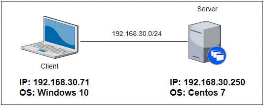

## Các bước cài đặt Wordpress
### 1. Cài đặt CSDL
- Cài đặt:

```# yum -y install mariadb-server```
- Ảnh minh hoạ:


- Khởi động dịch vụ và cấu hình tường lửa:

```# systemctl start mariadb```

```# systemctl enable mariadb```

```# firewall-cmd --add-service=mysql --permanent```

```# firewall-cmd --reload```

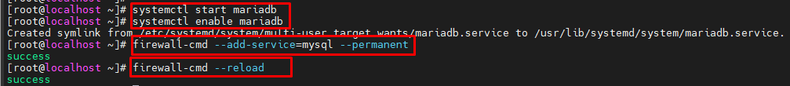

- Đặt mật khẩu cho root mariadb:

```mysql_secure_installation```

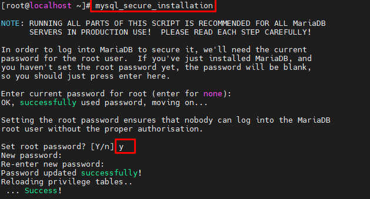

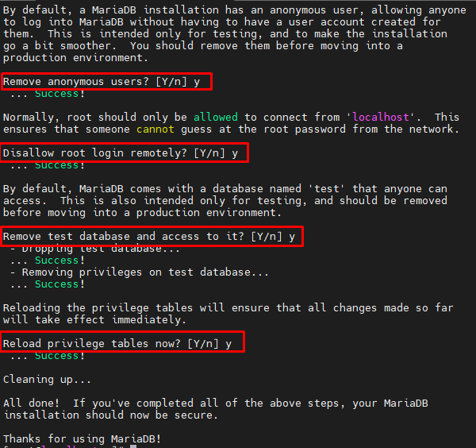

### 2. Cài đặt Apache
- Cài đặt:

```# yum install httpd –y```

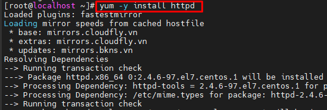

- Khởi động dịch vụ:

```# systemctl start httpd```

```# systemctl enable httpd```

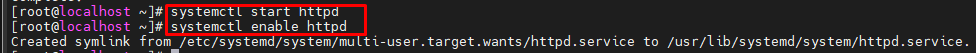

- Cấu hình tường lửa:

```# firewall-cmd --permanent --zone=public --add-service=http```

```# firewall-cmd --permanent --zone=public --add-service=https```

```# firewall-cmd --reload```

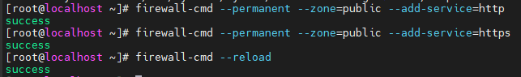

### 3. Cài đặt PHP
- Cài đặt kho lưu trữ EPLE và Remi

```
# yum install https://dl.fedoraproject.org/pub/epel/epel-release-latest-7.noarch.rpm
# yum install http://rpms.remirepo.net/enterprise/remi-release-7.rpm
```

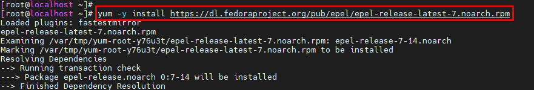

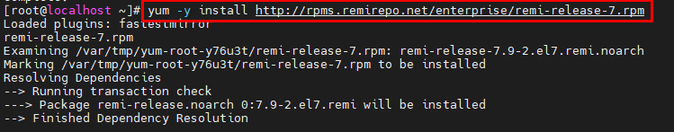

- Cài đặt yum-utils

```# yum install yum-utils -y```

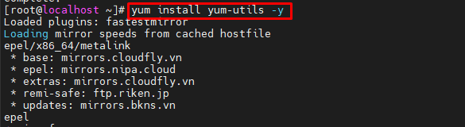

- Cài đặt PHP 5.6
  - Kích hoạt PHP 5.6 trên Remi:
  
```# yum-config-manager --enable remi-php56```


- Cài đặt PHP 5.6

```# yum install php php-mcrypt php-cli php-gd php-curl php-mysql php-ldap php-zip php-fileinfo```

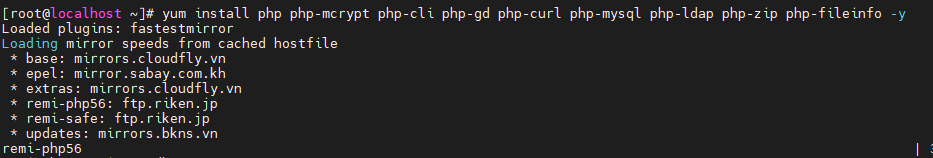

- Kiểm tra phiên bản:

```# php -v```

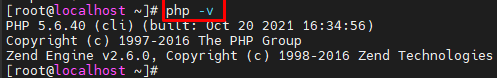

### 4. Cài đặt Wordpress
#### 4.1 Tạo cơ sở dữ liệu
- Đăng nhập vào Mariadb:

```# mysql -u root -p```

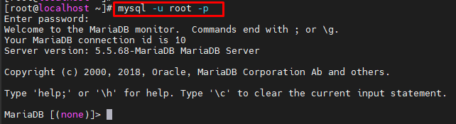

- Tạo cơ sở dữ liệu bằng lệnh:

```CREATE DATABASE wordpressdb;```

- Tạo user cho CSDL wordpressdb:

```CREATE USER userwp@localhost IDENTIFIED BY '123456';```

- Cấp cho userwp quyền truy cập vào CSDL:
```GRANT ALL PRIVILEGES ON wordpressdb.* TO userwp@localhost IDENTIFIED BY '123456';```
- Lưu thay đổi:

```FLUSH PRIVILEGES;```
- Cuối cùng thoát MySQL:

```exit```

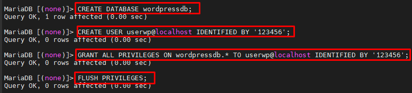

#### 4.2 Cài đặt WordPress

- Cài đặt Wordpress từ internet:

    ```wget https://wordpress.org/latest.tar.gz```

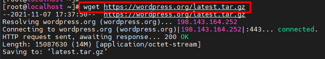

Note: Nếu chưa có wget, có thể tải bằng lệnh yum sau:
    ```yum -y install wget```

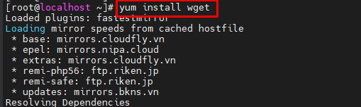

- Giải nén tệp:

```tar -xzvf latest.tar.gz```

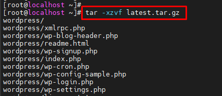

- Tạo tệp cấu hình từ tệp mẫu:

    ```cp wp-config-sample.php wp-config.php```

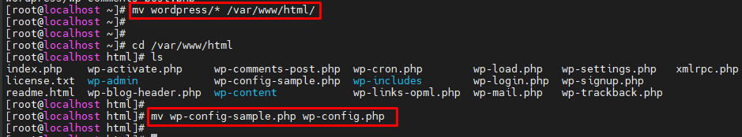

- Chỉnh sửa tệp cấu hình:

    ```# vi wp-config.php```

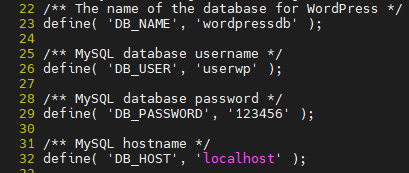

#### 4.3 Kiểm tra
Trên Client: Truy cập  Wordpress bằng trình duyệt

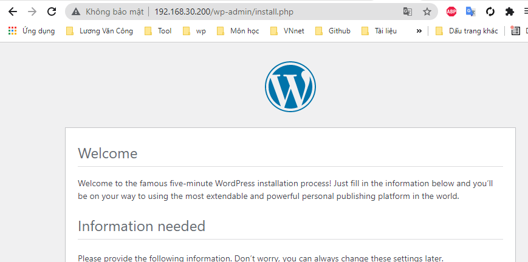

# Tài liệu tham khảo

1. https://www.liquidweb.com/kb/how-to-install-wordpress-on-centos-7/
2. https://blog.cloud365.vn/linux/huong-dan-cai-dat-wordpress/