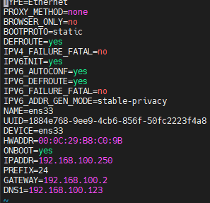
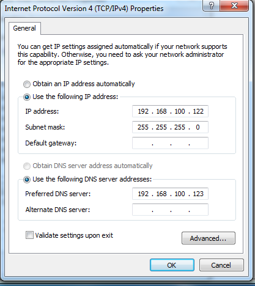
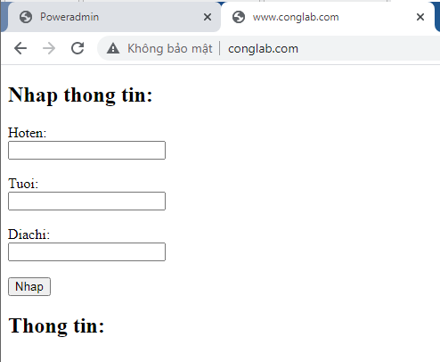

# Cài đặt và cấu hình PowerDNS trên Centos 7

**Mục lục**
- [Cài đặt và cấu hình PowerDNS trên Centos 7](#cài-đặt-và-cấu-hình-powerdns-trên-centos-7)
  - [1. Mô hình mạng](#1-mô-hình-mạng)
  - [2. Cài đặt PowerDNS trên DNS server](#2-cài-đặt-powerdns-trên-dns-server)
    - [2.1 Cài đặt PowerDNS với MariaDB Backend](#21-cài-đặt-powerdns-với-mariadb-backend)
    - [2.2. Cấu hình PowerDNS: ```/etc/pdns/pdns.conf```](#22-cấu-hình-powerdns-etcpdnspdnsconf)
    - [2.3 Cài đặt PowerAdmin](#23-cài-đặt-poweradmin)
    - [2.4 Thêm, chỉnh sửa và xóa zone DNS trong PowerDNS](#24-thêm-chỉnh-sửa-và-xóa-zone-dns-trong-powerdns)
      - [2.4.1 Thêm zone mới](#241-thêm-zone-mới)
      - [2.4.2 Thêm các loại Bản ghi DNS:](#242-thêm-các-loại-bản-ghi-dns)
- [Link tham khảo:](#link-tham-khảo)
## 1. Mô hình mạng

## 2. Cài đặt PowerDNS trên DNS server
- PowerDNS là một máy chủ DNS chạy trên Linux / Unix. 
- Nó có thể được cấu hình với các phụ trợ khác nhau bao gồm BIND, MySQL,...
- Nó cũng có thể được thiết lập như một đệ quy DNS chạy như một quy trình riêng biệt trên máy chủ.
- Trong bài này sử dụng hiên bản hiện có trong kho EPEL là 3.4.3 . 
### 2.1 Cài đặt PowerDNS với MariaDB Backend
- Trước tiên,tải kho EPEL cho máy chủ, sử dụng lệnh:

```# yum install epel-release.noarch -y```


*Tải kho lưu trữ epel*

- Bước tiếp theo là cài đặt MariaDB bằng cách chạy lệnh sau:
  
```# yum -y install mariadb-server mariadb```


*Cài đặt máy chủ MariaDB*

- Tiếp theo, chúng ta sẽ cấu hình MySQL để kích hoạt và khởi động khi khởi động hệ thống:

```# systemctl enable mariadb.service```

```# systemctl start mariadb.service```


*Bật Khởi động Khởi động Hệ thống MariaDB*

- Bây giờ dịch vụ MySQL đang chạy
- Tiếp theo bảo thiết lập mật khẩu cho MariaDB:

```# mysql_secure_installation```

- Nhập mật khẩu hiện tại(không có mật khẩu nhấn enter)


- Cài mật khẩu root:


- Xoá người dùng ẩn danh: chọn ```y```


- Không cho phép đăng nhập từ xa: chọn ``n``


Xóa CSDL test và truy cập vào nó: ```y```


Reload bảng privilege bây giờ : ```y```


- Cấu hình MariaDB được thực hiện thành công.
- Tiếp theo, cài đặt PowerDNS:

```#yum -y install pdns pdns-backend-mysql```


*Cài đặt PowerDNS với MariaDB Backend*

- Tiếp theo, thiết lập cơ sở dữ liệu MySQL cho dịch vụ PowerDNS . 
- Kết nối với máy chủ MySQL và sẽ tạo một cơ sở dữ liệu với tên ```powerdns```:


```#mysql -u root -p```

```MariaDB [(none)]> CREATE DATABASE powerdns;```


*Tạo cơ sở dữ liệu PowerDNS*

- Tạo một người dùng ```powerdns``` cho cơ sở dữ liệu:

```MariaDB [(none)]> GRANT ALL ON powerdns.* TO 'powerdns'@'localhost' IDENTIFIED BY 'conglab';```

```MariaDB [(none)]> FLUSH PRIVILEGES;```


*Tạo người dùng PowerDNS*

- Trong đó:
   - Powerdns là user
   - Conglab là password

- Tạo các bảng ```domains```, ```records``` và ```supermasters ``` trong CSDL ```powerdns```. 

- Tạo bảng ```domains``` cho PowerDNS

```
MariaDB [(none)]> USE powerdns;
MariaDB [(none)]> CREATE TABLE domains(```
    id INT auto_increment,```
    name VARCHAR(255) NOT NULL,```
    master VARCHAR(128) DEFAULT NULL,
    last_check INT DEFAULT NULL,
    type VARCHAR(6) NOT NULL,
    notified_serial INT DEFAULT NULL,
    account VARCHAR(40) DEFAULT NULL,
    primary key (id)
);
```


- Tạo miền chỉ mục cho PowerDNS


- Tạo bảng ```records```:

```
CREATE TABLE records (
    id INT auto_increment,
    domain_id INT DEFAULT NULL,
    name VARCHAR(255) DEFAULT NULL,
    type VARCHAR(6) DEFAULT NULL,
    content VARCHAR(255) DEFAULT NULL,
    ttl INT DEFAULT NULL,
    prio INT DEFAULT NULL,
    change_date INT DEFAULT NULL,
    primary key(id)
);
```


- Tạo các chỉ mục sau cho bảng ```records```:

```
CREATE INDEX rec_name_index ON records(name);
CREATE INDEX nametype_index ON records(name,type);
CREATE INDEX domain_id ON records(domain_id);
```


- Tạo bảng ```supermasters```:

```
CREATE TABLE supermasters (
    ip VARCHAR(25) NOT NULL,
    nameserver VARCHAR(255) NOT NULL,
    account VARCHAR(40) DEFAULT NULL
);
```


- Thoát khỏi MySQL bằng lệnh:

```
MariaDB [(none)]> quit;
```


### 2.2. Cấu hình PowerDNS: ```/etc/pdns/pdns.conf```
- Tiếp theo cấu hình ```PowerDNS``` sử dụng ```MySQL``` để lưu trữ các tệp và bản ghi Zone.
- Đầu tiên, sao lưu tệp cấu hình cũ:
```
#cp /etc/pdns/pdns.conf /etc/pdns/pdns.conf.bak
```


- Sau đó, mở tệp ```/etc/pdns/pdns.conf```:

```# vi /etc/pdns/pdns.conf```

- Thêm các dòng sau vào cuối file ```/etc/pdns/pdns.conf```.

  - #Cau hinh sql
  - launch=gmysql
  - #gmysql parameters
  - gmysql-host=localhost
  - gmysql-dbname=powerdns
  - gmysql-user=powerdns
  - mysql-password=conglab
- Bật dịch vụ và tự khởi động cùng hệ thống:

```#systemctl enable pdns```

```#systemctl start pdns```


### 2.3 Cài đặt PowerAdmin
- PowerAdmin là một giao diện web thân thiện được thiết kế để quản lý các máy chủ PowerDNS. 
- Nó được viết bằng PHP, nên cần cài đặt PHP và một máy chủ web (Apache):
```#yum install httpd php php-devel php-gd php-imap php-ldap php-mysql php-odbc php-pear php-xml php-xmlrpc php-mbstring php-mcrypt php-mhash gettext```


- PowerAdmin cũng cần hai gói PEAR:```php-pear-DB``` và ```php-pear-MDB2-Driver-mysql```

```# yum -y install php-pear-DB php-pear-MDB2-Driver-mysql```


Cấu hình khởi động và thiết lập để Apache bắt đầu khi khởi động hệ thống:

```#systemctl enable httpd```
```#systemctl start httpd```


- Tải xuống gói PowerAdmin trong ```/var/www/html/```

```#cd /var/www/html/```
```#wget http://downloads.sourceforge.net/project/poweradmin/poweradmin-2.1.7.tgz```


- Giải nén tệp vừa tải:
```# tar xfv poweradmin-2.1.7.tgz```


- Trên client, khởi động trình cài đặt web của PowerAdmin trên trình duyệt bằng địa chỉ:

    *http://192.168.0.102/poweradmin-2.1.7/install/*

- Quá trình cài đặt bắt đầu:
**[Step 1]** Chọn ngôn ngữ cho PowerAdmin của bạn. 
Chọn một cái bạn muốn sử dụng và nhấp vào nút “ **Go to step 2** ”.


**[Step 2]** Trình cài đặt sẽ yêu cầu bạn có cơ sở dữ liệu **PowerDNS** :

Nhấn vào nút **Go to step 3**
**[Step 3]** Nhập ```username```, ```password```, ```database``` đã tạo trước đó:

Nhấn vào nút **Go to step 4**
**[Step 4]** Tạo một người dùng mới với các quyền hạn chế cho Poweradmin. Các trường cần nhập là:
1. **Username** - tên người dùng cho PowerAdmin.
2. **Password** - mật khẩu cho người dùng trên.
3. **Hostmaster** - Khi tạo bản ghi SOA và bạn chưa chỉ định hostmaster, giá trị này sẽ được sử dụng.
4. **Primary nameserver ** - giá trị sẽ được sử dụng làm máy chủ định danh chính khi tạo vùng DNS mới.
5. **Secondary nameserver** - giá trị sẽ được sử dụng làm máy chủ định danh chính khi tạo vùng DNS mới.


Nhấn vào nút **Go to step 5**
**[Step 5]** **Poweradmin** sẽ yêu cầu bạn tạo người dùng cơ sở dữ liệu mới với các quyền hạn chế trên các bảng cơ sở dữ liệu. Nó sẽ cung cấp cho bạn code mà bạn sẽ cần đặt trong bảng điều khiển MySQL:
- Copy đoạn code:

- Trên server, chạy lệnh:
```# mysql -u root -p```
- Paste command step 5 vào để phân quyền cho người dùng mới:


- Quay lại client, nhấn vào nút **Go to step 6**
[Step 6] Trình cài đặt sẽ cố gắng tạo tệp cấu hình của nó trong **/var/www/html/poweradmin-2.1.7/inc** .
- Tên tệp là **config.inc.php** .


- Trong trường hợp tập lệnh không thể ghi tệp đó, bạn có thể tạo nó theo cách thủ công bằng cách sao chép văn bản và đặt nó vào tệp đã đề cập ở trên: Copy đoạn code vào file
 ```/var/www/html/poweradmin-2.1.7/inc/config.inc.php```
```
<?php
$db_host		= 'localhost';
$db_user		= 'powercong';
$db_pass		= 'conglab';
$db_name		= 'powerdns';
$db_type		= 'mysql';
$db_layer		= 'PDO';
$session_key		= '-hu~fz~U(cIfY1yvx+NtmSgRGBuykiNt1=NZSc&tn61Qsc';
$iface_lang		= 'en_EN';
$dns_hostmaster		= 'dns.conglab.com';
$dns_ns1		= 'ns1.conglab.com';
$dns_ns2		= 'ns2.conglab.com';
```


- Quay lại client, nhấn vào nút **Go to step 7**
  
**[Step 7]** Thông báo rằng quá trình cài đặt đã hoàn tất và sẽ nhận được thông tin về cách truy cập cài đặt Poweradmin của bạn:


- Tiếp theo, quay về máy server xóa thư mục “ **install** ” khỏi thư mục gốc của Poweradmin bằng lệnh sau:

```# rm -fr /var/www/html/poweradmin-2.1.7/install/```

- Sau đó, Truy cập lại poweradmin tại:
http://192.168.100.123/poweradmin-2.1.7/


### 2.4 Thêm, chỉnh sửa và xóa zone DNS trong PowerDNS
#### 2.4.1 Thêm zone mới

- Nhấn vào “**Add master zone**”:


Cần chú ý các trường sau:
1. **Zone name** - miền mà bạn sẽ thêm khu vực.
2. **Owner** - đặt chủ sở hữu của vùng DNS.
3. **Template** - mẫu DNS - không để lại.
4. **DNSSEC** - Tiện ích mở rộng bảo mật hệ thống tên Donany (tùy chọn - kiểm tra nếu bạn cần).

Nhấp vào nút “ **Add zone** ” để thêm vùng DNS.


- Sau đó, tạo một tệp vùng PTR. Để làm điều đó, hãy nhấp lại vào liên kết **Add master zone** . Nhập tên tệp Zone PTR. Ở đây là: ```100.168.192.in-addr.arpa```


- Bạn có thể xem các tệp Zone mới được tạo trong ```list zones``` .


Hình dưới là các tệp vùng mới được thêm vào.


#### 2.4.2 Thêm các loại Bản ghi DNS:
- Để thêm Bản ghi mới, hãy nhấp vào nút Chỉnh sửa của tệp vùng tương ứng.


- Nhập tên, loại, nội dung, chi tiết TTL. Sau đó, nhấp vào nút Thêm bản ghi .


- Tương tự như vậy, có thể tạo một số loại bản ghi khác.


- Bản ghi ns2.conglab.com :


- Nhấp vào nút Chỉnh sửa trên các tệp PTR.


**Kết quả**
Trên Web server:



Trên Client:






# Link tham khảo:
1. https://www.tecmint.com/install-powerdns-poweradmin-mariadb-in-centos-rhel/