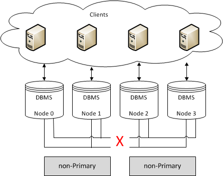

# Tìm hiểu về thuật toán Quorum

- [Tìm hiểu về thuật toán Quorum](#tìm-hiểu-về-thuật-toán-quorum)
  - [Quorum Components](#quorum-components)
  - [Weighted Quorum](#weighted-quorum)
- [Tài liệu tham khảo:](#tài-liệu-tham-khảo)

## Quorum Components

- Ngoài các lỗi node đơn, 1 cluster có thể bị chia thành nhiều thành phần (components) do lỗi mạng.
- A components (Thành phần) là một tập hợp các node được kết nối với nhau, nhưng không kết nối với các thành phần khác hay các node tạo thành các thành phần khác.
- Trong trường hợp này, chỉ có 1 thành phần (components) có thể tiếp tục sửa đổi trạng thái CSDL để tránh phân kỳ lịch sử. Thành phần này được gọi là **Primary Component (thành phần chính)**.
- Trong các hoạt động bình thường, **Primary Component** là cluster. Khi phần vùng theo cụm xảy ra, Galera gọi 1 thuật toán số đại biểu (quorum) đặc biệt  để  chọn 1 thành phần làm Primary Component đảm bảo rằng không bao giờ có nhiều hơn 1 Primary Component trong cluster.

## Weighted Quorum
- Số lượng nude hiện tại trong cụm (cluster) xác định kích thước cụm hiện tại.
- Không có cài đặt cấu hình nào cho phép bạn xác định danh sách tất cả các nút cụm có thể có. 
  - Mỗi khi một node tham gia vào cụm, tổng kích thước cụm sẽ tăng lên. 
  - Khi một nút rời khỏi cụm, một cách duyên dáng, kích thước cụm giảm. 
- Kích thước cụm xác định số phiếu bầu (votes) cần thiết để đạt được **Quorum**.

- Galera Cluster lấy `quorum vote` bất cứ khi nào `một nút không phản hồi` và bị nghi ngờ `không còn là một phần của cụm`. Bạn có thể tinh chỉnh điều này không có thời gian chờ phản hồi bằng cách sử dụng tham số `evs.suspect_timeout` . Cài đặt mặc định là 5 giây.

- Khi cụm lấy `quorum vote`, nếu phần lớn tổng số nút được kết nối từ trước khi ngắt kết nối vẫn còn, thì phân vùng đó vẫn hoạt động. Khi phân vùng mạng xảy ra, có các nút hoạt động ở cả hai phía của ngắt kết nối. 
  - Thành phần có `quorum` một mình tiếp tục hoạt động như `Primary Component` , 
  - Những thành phần không có `quorum` đi vào trạng thái `non-primary` và bắt đầu cố gắng kết nối với `Thành phần chính`.


- Công thức tính quorum (tức số node tối thiểu để cụm hoạt động bình thường): A majority (> 50%) of nodes
```
(Số node hoạt động) > (tổng số node của cụm)/2
```
- Quorum yêu cầu đa số, có nghĩa là bạn không thể có chuyển đổi dự phòng tự động trong **một cụm hai nút**. Điều này là do sự cố của một nút khiến nút còn lại tự động chuyển sang trạng thái `non-primary`.

- Các `cluster` có `số lượng node chẵn` có nguy cơ dẫn đến tình trạng não bị phân chia (**split-brain**). Nếu bạn mất kết nối mạng ở đâu đó giữa các phân vùng theo cách khiến **số lượng node bị chia đôi** chính xác, thì :
  - cả hai phân vùng đều không thể giữ lại `quorum`
  - cả hai đều chuyển sang trạng thái `non-primary`.



- Để bật chuyển đổi dự phòng tự động (**automatic failovers**), bạn cần sử dụng **ít nhất ba nút**. Hãy nhớ rằng điều này mở rộng ra các cấp độ cơ sở hạ tầng khác, vì những lý do tương tự:
  - **Single switch clusters** nên sử dụng **tối thiểu 3 node**.
  - **Clusters spanning switches** nên sử dụng **tối thiểu 3 switches**.
  - **Clusters spanning networks** nên sử dụng tối thiểu **3 networks**.
  - **Clusters spanning data centers** nên sử dụng tối thiểu **3 data centers**.

# Tài liệu tham khảo:
1. https://galeracluster.com/library/documentation/weighted-quorum.html
2. https://galeracluster.com/library/documentation/glossary.html#term-global-transaction-id
3. https://blog.cloud365.vn/linux/tong-quan-ve-quorum-stonith-fencing/