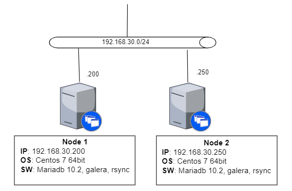

# Tìm hiểu Cluster DB

- [Tìm hiểu Cluster DB](#tìm-hiểu-cluster-db)
  - [I. Tổng quan về Cluster](#i-tổng-quan-về-cluster)
    - [1. Khái niệm](#1-khái-niệm)
    - [2. Đặc trưng](#2-đặc-trưng)
    - [3. Các chế độ hoạt động](#3-các-chế-độ-hoạt-động)
      - [3.1 Active - Active](#31-active---active)
      - [3.2 Active - Passive](#32-active---passive)
  - [II. Ứng dụng: Cluster DB](#ii-ứng-dụng-cluster-db)
    - [1. Khái niệm Database Clustering](#1-khái-niệm-database-clustering)
    - [2. Ưu điểm](#2-ưu-điểm)
      - [2.1. Khả năng chịu lỗi](#21-khả-năng-chịu-lỗi)
      - [2.2. Cân bằng tải](#22-cân-bằng-tải)
    - [3. Kiến trúc](#3-kiến-trúc)
      - [3.1 Shared-Nothing](#31-shared-nothing)
      - [3.2 Shared-Disk](#32-shared-disk)
    - [4. Các thành phần](#4-các-thành-phần)
      - [4.1 Data Node:](#41-data-node)
      - [4.2 SQL Node](#42-sql-node)
      - [4.3 Management Node](#43-management-node)
    - [5. Một số khái niệm khác](#5-một-số-khái-niệm-khác)
      - [Replica - Bản sao](#replica---bản-sao)
      - [Node Group](#node-group)
      - [Partition - Phân vùng](#partition---phân-vùng)
  - [Lab: Cài đặt MariaDB Galera Cluster](#lab-cài-đặt-mariadb-galera-cluster)
    - [1. Mô hình mạng](#1-mô-hình-mạng)
    - [2. Các bước thực hiện](#2-các-bước-thực-hiện)
      - [2.1 Chuẩn bị](#21-chuẩn-bị)
      - [2.2 Cài đặt Mariadb 10.2](#22-cài-đặt-mariadb-102)
      - [2.3 Cấu hình Galera](#23-cấu-hình-galera)
      - [2.4 Khởi động Cluster](#24-khởi-động-cluster)
      - [2.5 Kiểm tra cluster](#25-kiểm-tra-cluster)
- [Tài liệu tham khảo](#tài-liệu-tham-khảo)

## I. Tổng quan về Cluster
### 1. Khái niệm
- Cluster là kiến trúc nâng cao khả năng sẵn sàng cho các hệ thống dịch vụ. Hệ thống Cluster cho phép nhiều máy chủ chạy kết hợp, đồng bộ với nhau. Hệ thống Cluster nâng cao khả năng chịu lỗi của hệ thống, tăng cấp độ tin cậy, tăng tính đảm bảo, nâng cao khả năng mở rộng cho hệ thống. Trong trường hợp có lỗi xảy ra, các dịch vụ bên trong Cluster sẽ tự động loại trừ lỗi, cố gắng khôi phục, duy trì tính ổn định, tính sẵn sàng của dịch vụ
- Cluster thường được tìm thấy ở các hệ thống thanh toán trực tuyến, ngân hàng, các cơ sở dữ liệu, hệ thống lưu trữ ..


### 2. Đặc trưng
- Cân bằng tải của cụm (Load Balancing): Các node bên trong cluster hoạt động song song, chia sẻ các tác vụ để năng cao hiệu năng.
- Tính sẵn sàng cao (High availability): Các tài nguyên bên trong cluster luôn sẵn sàng xử lý yêu cầu, ngay cả khi có vấn đề xảy ra với các thành phần bên trong (hardware, software).
- Khả năng mở rộng (scalability): Khi tài nguyên có thể sử dụng của hệ thống tới giới hạn, ta có thể dễ dàng bổ sung thêm tài nguyên vào cluster bằng các bổ sung thêm các node.
- Độ tin cậy (reliability): Hệ thống Cluster giảm thiểu tần số lỗi có thể xảy ra, giảm thiểu các vấn đề dẫn tới ngừng hoạt động của hệ thống.
### 3. Các chế độ hoạt động
#### 3.1 Active - Active
Active Active cluster được tạo ra từ ít nhất 2 node, cả 2 node chạy đồng thời xử lý cùng 1 loại dịch vụ. Mục đích chính của Active Active Cluster là tối ưu hóa cho hoạt động cân bằng tải (Load balancing). Hoạt động cân bằng tải (Load balancing) sẽ phân phối các tác vụ hệ thống tới tất cả các node bên trong cluster, tránh tình trạng các node xử lý tác vụ không cân bằng dẫn tới tình trạng quả tải. Bên cạnh đó, Active Active Cluster nâng cao thông lượng (thoughput) và thời gian phản hổi

Khuyển cáo cho chế độ Active Active Cluster là các node trong cụm cần được cấu hình giống nhau tránh tình trạng phân mảnh cụm.

#### 3.2 Active - Passive
Giống cấu hình Active - Active, Active Passive Cluster cần ít nhất 2 node, tuy nhiên không phải tất cả các node đều sẵn sàng xử lý yêu cầu. VD: Nếu có 2 node thì 1 node sẽ chạy ở chế độ Active, node còn lại sẽ chạy ở chế độ passive hoặc standby.

Passive Node sẽ hoạt động như 1 bản backup của Active Node. Trong trường hợp Active Node xảy ra vấn đề, Passive Node sẽ chuyển trạng thái thành active, tiếp quản xử lý các yêu cầu

## II. Ứng dụng: Cluster DB
### 1. Khái niệm Database Clustering
Phân cụm cơ sở dữ liệu đề cập đến khả năng của một số máy chủ hoặc phiên bản kết nối với một cơ sở dữ liệu duy nhất.

Một cá thể là tập hợp bộ nhớ và các quy trình tương tác với cơ sở dữ liệu, là tập hợp các tệp vật lý thực sự lưu trữ dữ liệu.

MySQL Cluster là một cơ sở dữ liệu phân tán được thiết kế cho việc mở rộng và tính sẵn sàng cao. Nó cung cấp khả năng truy cập thời gian thực trong bộ nhớ với tính nhất quán giao dịch trên các phân vùng và bộ dữ liệu phân tán. Nó được thiết kế cho các ứng dụng quan trọng.

Hiểu cơ bản MySQL có các chức năng:

- Khả năng mở rộng (scalability) cao
- Khả năng sẵn sàng uptime (availability) 99,999%
- Bảo toàn dữ liệu với khả năng sao lưu giữa các node.
### 2. Ưu điểm
Phân cụm cơ sở dữ liệu cung cấp hai ưu điểm chính, đặc biệt là trong môi trường cơ sở dữ liệu khối lượng lớn:

#### 2.1. Khả năng chịu lỗi
Vì có nhiều hơn một máy chủ hoặc phiên bản để người dùng kết nối, việc phân cụm cung cấp một giải pháp thay thế, trong trường hợp máy chủ riêng lẻ bị lỗi.

#### 2.2. Cân bằng tải
Tính năng phân cụm thường được thiết lập để cho phép người dùng được tự động phân bổ cho máy chủ có tải ít nhất.

Phân cụm cơ sở dữ liệu có các dạng khác nhau, tùy thuộc vào cách dữ liệu được lưu trữ và phân bổ tài nguyên.


### 3. Kiến trúc
#### 3.1 Shared-Nothing
Trong chế độ phân cụm cơ sở dữ liệu này, mỗi nút / máy chủ hoàn toàn độc lập, vì vậy không có điểm tranh chấp nào. Một ví dụ về điều này sẽ là khi một công ty có nhiều trung tâm dữ liệu cho một trang web.

Với nhiều máy chủ trên toàn cầu, không có máy chủ duy nhất nào là “máy chủ”. Shared-nothing còn được gọi là “phân bổ cơ sở dữ liệu”.
#### 3.2 Shared-Disk
Tất cả dữ liệu được lưu trữ tập trung và sau đó được truy cập thông qua các phiên bản được lưu trữ trên các máy chủ hoặc nút khác nhau.

Sự phân biệt giữa hai loại gần đây đã trở nên mờ nhạt với sự ra đời của điện toán lưới hoặc bộ nhớ đệm phân tán. Trong thiết lập này, dữ liệu vẫn được quản lý tập trung nhưng được kiểm soát bởi một “máy chủ ảo” mạnh mẽ bao gồm nhiều máy chủ hoạt động cùng nhau như một.

### 4. Các thành phần
#### 4.1 Data Node:
Data node với vai trò chính là lưu trữ các dữ liệu theo phân vùng của cả cluster, vì cluster có tính phân tán và sao lưu lẫn nhau nên số Data node luôn ít nhất từ 2 nodes trở lên thì mới phát huy tác dụng của MySQL Cluster. Trên các data node này, dữ liệu sẽ được cắt nhỏ ra thành các phân vùng dữ liệu và các phân vùng này sẽ có các bản sao chính và bản sao phụ. Còn về cách chia các phân vùng (partition) và số bản sao (replica) sẽ được nói trong phần sau của bài viết. Service được chạy trên Data Node có tên ndbd.

#### 4.2 SQL Node
SQL Node với vai trò nhận các câu lệnh SQL query từ phần application gửi xuống, từ đó thông qua API với các cổng và giao thức riêng (NDB API) để gửi câu lệnh đến Data Node lấy dữ liệu và trả ngược về cho ứng dụng hoặc người dùng. Service chạy trên SQL Node là mysqld.

#### 4.3 Management Node
Management Node chịu trách nhiệm quản lý các SQL Node và Data Node, quản lý ở đây với các việc như khởi tạo node mới, restart node, backup dữ liệu giữa các node, phân chia Node Group (mình sẽ giải thích phần sau),... Khi một Cluster đã hoạt động ổn định thì Node management mang ý nghĩa đứng giám sát bên ngoài nên nếu Node Management có down thì cluster vẫn hoạt động bình thường. Tất nhiên là lúc đó sẽ không thể quản lý bao gồm: thêm, xóa, sửa node trong cluster.
### 5. Một số khái niệm khác
#### Replica - Bản sao
Trong khi cài đặt MySQL cluster các bạn sẽ phải cấu hình một thông số đó là số bản sao cho 1 phân vùng dữ liệu ở trong cluster, thường giá trị này sẽ là 2. Số bản sao này sẽ ảnh hưởng trực tiếp đến số Node Group. Số bản sao càng cao thì tính toàn vẹn dữ liệu và độ sẵn sàng càng cao, tuy nhiên cái gì cũng có mặt trái, số bản sao nhiều thì sẽ cần nhiều node để lưu dữ liệu hơn.

#### Node Group
Số Node group được tính bằng công thức Số Node Group = Số Data Node / số bản sao trong một trường hợp cơ bản (hình trên) với 2x2 data node và 2 bản sao cho mỗi phân vùng thì ta sẽ có 2 Node Group. Các data node trong 1 node group sẽ lưu các dữ liệu giống nhau.

#### Partition - Phân vùng
Dữ liệu của bạn sẽ không được lưu toàn bộ trên bất cứ 1 node nào cả mà nó sẽ được chia thành các phân vùng nhỏ hơn. Số phân vùng sẽ được tính bằng công thức Số phân vùng = Số Data node * số luồng LDM

Khi sử dụng với Engine là Ndbd mặc định thì số luồng LDM tại mỗi node sẽ là 1 nên => Số phân vùng = Số Data node

Với ví dụ trên ta thấy:

Node Group 0 gồm: Node 1 và Node 2
Node 1 chứa phân vùng 0 (phân vùng chính) và phân vùng 2 (phân vùng phụ)
Node 2 chứa phân vùng 0 (phân vùng phụ) và phân vùng 2 (phân vùng chính)
Node Group 1 gồm: Node 3 và Node 4
Node 3 chứa phân vùng 1 (phân vùng chính) và phân vùng 3 (phân vùng phụ)
Node 4 chứa phân vùng 1 (phân vùng phụ) và phân vùng 3 (phân vùng chính)
Với các chia phân vùng dữ liệu như bên trên thì khi cluster vẫn hoạt động bình thường khi chỉ cần 1 node duy nhất trong các Node Group hoạt động. Điều này giúp đảm bảo tính sẵn sàng dữ liệu của Cluster.

## Lab: Cài đặt MariaDB Galera Cluster
MariaDB Galera Cluster là cơ chế đồng bộ dữ liệu cho multi-master MariaDB. Phục vụ tính sẵn sàng cao cho MariaDB với chế độ Active-Active ( Có thể đồng thời đọc ghi trên tất cả các node MariaDB thuộc Garela Cluster
### 1. Mô hình mạng



### 2. Các bước thực hiện
#### 2.1 Chuẩn bị

**Tại node 1**

Cấu hình Hostname
```
hostnamectl set-hostname node1
echo "192.168.30.200 node1" >> /etc/hosts
echo "192.168.30.250 node2" >> /etc/hosts
```

Cài đặt gói
```
yum install epel-release -y
yum update -y
```

Tắt SELinux, Firewalld
```
sed -i 's/SELINUX=enforcing/SELINUX=disabled/g' /etc/sysconfig/selinux
sed -i 's/SELINUX=enforcing/SELINUX=disabled/g' /etc/selinux/config
systemctl stop firewalld
systemctl disable firewalld
init 6
```

**Tại node 2**

Cấu hình Hostname
```
hostnamectl set-hostname node2
echo "192.168.30.200 node1" >> /etc/hosts
echo "192.168.30.250 node2" >> /etc/hosts
```

Cài đặt gói
```
yum install epel-release -y
yum update -y
```

Tắt SELinux, Firewalld
```
sed -i 's/SELINUX=enforcing/SELINUX=disabled/g' /etc/sysconfig/selinux
sed -i 's/SELINUX=enforcing/SELINUX=disabled/g' /etc/selinux/config
systemctl stop firewalld
systemctl disable firewalld
init 6
```

#### 2.2 Cài đặt Mariadb 10.2
> Thực hiện tương tự trên tất cả các node

Thêm repo
```
echo '[mariadb]
name = MariaDB
baseurl = http://yum.mariadb.org/10.2/centos7-amd64
gpgkey=https://yum.mariadb.org/RPM-GPG-KEY-MariaDB
gpgcheck=1' >> /etc/yum.repos.d/MariaDB.repo
yum -y update
```

Cài đặt Mariadb, galera, rsync
```
yum install -y mariadb mariadb-server

yum install -y galera rsync

systemctl stop mariadb
systemctl disable mariadb
```

Cấu hình Log
```
cp /etc/my.cnf /etc/my.cnf.org

cat > /etc/my.cnf << EOF
[mysqld]
slow_query_log                  = 1
slow_query_log_file             = /var/log/mariadb/slow.log
long_query_time                 = 5
log_error                       = /var/log/mariadb/error.log
general_log_file                = /var/log/mariadb/mysql.log
general_log                     = 1

[client-server]
!includedir /etc/my.cnf.d
EOF

mkdir -p /var/log/mariadb/
chown -R mysql. /var/log/mariadb/
```

#### 2.3 Cấu hình Galera
Tại node 1:
```
cp /etc/my.cnf.d/server.cnf /etc/my.cnf.d/server.cnf.bak

cat > /etc/my.cnf.d/server.cnf << EOF
[server]
[mysqld]

[galera]
wsrep_on=ON
wsrep_provider=/usr/lib64/galera/libgalera_smm.so
#add your node ips here
wsrep_cluster_address="gcomm://192.168.30.200,192.168.30.250"
binlog_format=row
default_storage_engine=InnoDB
innodb_autoinc_lock_mode=2
#Cluster name
wsrep_cluster_name="cong_cluster"
# this server ip, change for each server
wsrep_node_address="192.168.30.200"
# this server name, change for each server
wsrep_node_name="node1"
wsrep_sst_method=rsync
[embedded]
[mariadb]
[mariadb-10.2]
EOF
```

Tại node 2
```
cp /etc/my.cnf.d/server.cnf /etc/my.cnf.d/server.cnf.bak

cat > /etc/my.cnf.d/server.cnf << EOF
[server]
[mysqld]

[galera]
wsrep_on=ON
wsrep_provider=/usr/lib64/galera/libgalera_smm.so
#add your node ips here
wsrep_cluster_address="gcomm://192.168.30.200,192.168.30.250"
binlog_format=row
default_storage_engine=InnoDB
innodb_autoinc_lock_mode=2
#Cluster name
wsrep_cluster_name="cong_cluster"
# this server ip, change for each server
wsrep_node_address="192.168.30.250"
# this server name, change for each server
wsrep_node_name="node2"
wsrep_sst_method=rsync
[embedded]
[mariadb]
[mariadb-10.2]
EOF
```

#### 2.4 Khởi động Cluster

Ta sẽ dùng node mariadb-1 làm node khởi tạo Galera cluster ( Tức là các node khác sẽ đồng bộ dữ liệu từ mariadb-1 )
Thực hiện trên node1
```
galera_new_cluster
systemctl enable mariadb
```

Thực hiện trên node 2 và các node khác nếu có
```
systemctl start mariadb
systemctl enable mariadb
```
#### 2.5 Kiểm tra cluster
Kiểm tra số node thuộc cluster
```
mysql -u root -e "SHOW STATUS LIKE 'wsrep_cluster_size'"
```

Kết quả
```
[root@localhost ~]# mysql -u root -e "SHOW STATUS LIKE 'wsrep_cluster_size'"
+--------------------+-------+
| Variable_name      | Value |
+--------------------+-------+
| wsrep_cluster_size | 2     |
+--------------------+-------+
```

Kiểm tra các thành viên thuộc cluster
```
[root@moodle01 ~]# mysql -u root -e "SHOW STATUS LIKE 'wsrep_incoming_addresses'"
```

Kết quả:
```
[root@localhost ~]# mysql -u root -e "SHOW STATUS LIKE 'wsrep_incoming_addresses'"
+--------------------------+-----------------------------------------+
| Variable_name            | Value                                   |
+--------------------------+-----------------------------------------+
| wsrep_incoming_addresses | 192.168.30.250:3306,192.168.30.200:3306 |
+--------------------------+-----------------------------------------+
```
# Tài liệu tham khảo

1. https://blog.cloud365.vn/linux/tong-quan-ve-cluster-p1/
2. https://www.techopedia.com/definition/17/database-clustering
3. https://dev.mysql.com/doc/refman/8.0/en/mysql-cluster-installation.html
4. https://viblo.asia/p/mysql-cluster-la-cai-gi-4P856QmLlY3
5. https://clusterlabs.org/pacemaker/doc/deprecated/en-US/Pacemaker/1.1/pdf/Clusters_from_Scratch/Pacemaker-1.1-Clusters_from_Scratch-en-US.pdf
6. https://www.youtube.com/watch?v=8BBDxzJL6fY