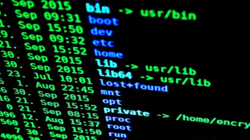

# Basic Linux Networking tips and tricks
---

Tất cả chúng ta đã từng nghe thấy, lúc này hay lúc khác, một quản trị viên hệ thống đổ lỗi cho mạng. Sau đó, các kỹ sư mạng phải chứng minh rằng mạng không phải là nguyên nhân. Để làm được điều này, cần phải có tối thiểu các kỹ năng xử lý sự cố mạng trên hệ thống Linux.

---
## All post in the series

1. [Lệnh ip và nmcli](./ip-and-nmcli-commands.md)
2. [Lệnh mtr](./the-mtr-command.md)
3. [Lệnh ss và netstat](./ss-and-netstat-commands.md)
4. [Lệnh curl](./curl-command.md)
5. [Tcpdump](./tcpdump.md)

---

# Tài liệu tham khảo:

1. https://aboutnetworks.net/linux-networking-part-1/
