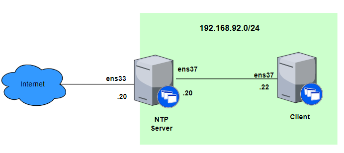
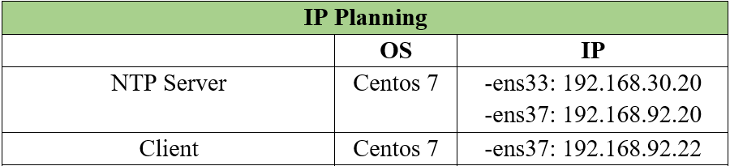
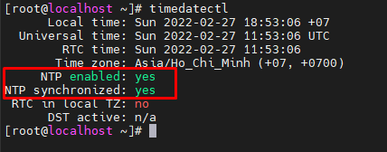
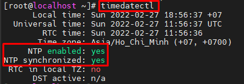

# Cài đặt Chrony trên Centos 7 64bit

Mục lục
- [Cài đặt Chrony trên Centos 7 64bit](#cài-đặt-chrony-trên-centos-7-64bit)
  - [1. Mô hình mạng](#1-mô-hình-mạng)
  - [2. Các bước thực hiện](#2-các-bước-thực-hiện)
    - [2.1 Cài đặt NTP Server](#21-cài-đặt-ntp-server)
    - [2.2 Cài đặt NTP trên Client](#22-cài-đặt-ntp-trên-client)
- [Tài liệu tham khảo](#tài-liệu-tham-khảo)

## 1. Mô hình mạng





## 2. Các bước thực hiện

### 2.1 Cài đặt NTP Server 

Tăng thêm thời gian hệ thốg;
```
date -s '+10 minutes'
```

Cài đặt Chrony:
```
yum -y install chrony
```

Backup file cấu hình:
```
cp /etc/chrony.conf /etc/chrony.conf.bak
```
Chỉnh sửa file cấu hình:

- Xem danh sách máy chủ NTP trên trang : https://www.ntppool.org/


- Thay đổi các server đồng bộ:
```
#
#server 0.centos.pool.ntp.org iburst
#server 1.centos.pool.ntp.org iburst
#server 2.centos.pool.ntp.org iburst
#server 3.centos.pool.ntp.org iburst

server 1.vn.pool.ntp.org iburst
server 0.asia.pool.ntp.org iburst
server 3.asia.pool.ntp.org iburst
```
- Cho phép IP trong dải: 192.168.92.0 truy xuất vào máy chủ để lấy thời gian. 
```
echo 'allow 192.168.92.0/24' >> /etc/chrony.conf
```
Khởi động dịch vụ:
```
systemctl start chronyd
systemctl enable chronyd
```
Cấu hình Firewalld cho phép dịch vụ NTP:
```
firewall-cmd --add-service=ntp --permanent
firewall-cmd --reload
```

Kiểm tra hoạt động:
```
chronyc sources
```

Out:
```
[root@localhost etc]# chronyc sources
210 Number of sources = 3
MS Name/IP address         Stratum Poll Reach LastRx Last sample
===============================================================================
^* time.cloudflare.com           3   6    17    22  +6109us[  +20ms] +/-   58ms
^+ 202.28.116.236                1   6    17    22  -4831us[+8773us] +/-   45ms
^- ip-186.108.123.103.unima>     2   6    17    21    -71ms[  -71ms] +/-  223ms
```


### 2.2 Cài đặt NTP trên Client

Cài đặt chronyd:
```
yum -y install chrony
```

Backup file cấu hình:
```
cp /etc/chrony.conf /etc/chrony.conf.bak
```
Chỉnh sửa file cấu hình, lấy thông tin thời gian từ server ntp:

```
sed -i 's|server 0.centos.pool.ntp.org iburst|server 192.168.92.20 iburst|g' /etc/chrony.conf
sed -i 's|server 1.centos.pool.ntp.org iburst|#|g' /etc/chrony.conf
sed -i 's|server 2.centos.pool.ntp.org iburst|#|g' /etc/chrony.conf
sed -i 's|server 3.centos.pool.ntp.org iburst|#|g' /etc/chrony.conf
```


Khởi động dịch vụ:
```
systemctl start chronyd
systemctl enable chronyd
```
Cấu hình Firewalld cho phép dịch vụ NTP:
```
firewall-cmd --add-service=ntp --permanent
firewall-cmd --reload
```

Kiểm tra hoạt động:
```
[root@localhost ~]# chronyc sources
210 Number of sources = 1
MS Name/IP address         Stratum Poll Reach LastRx Last sample
===============================================================================
^* 192.168.92.20                 2   6    17    39  +2736ns[-5588ns] +/-   46ms

```



# Tài liệu tham khảo

1. https://www.server-world.info/en/note?os=CentOS_7&p=ntp&f=3

