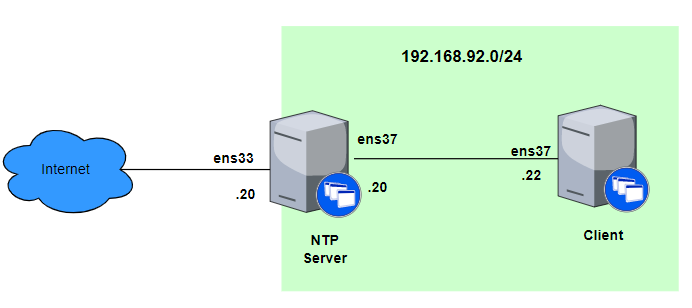
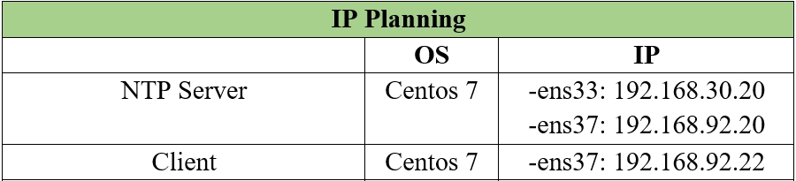
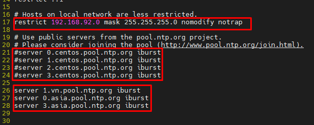
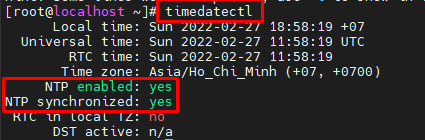
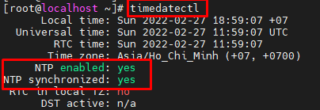

# Cài đặt NTP trên Centos 7 64bit

## 1. Mô hình mạng





## 2. Các bước thực hiện

### 2.1 Cài đặt NTP Server


Cài đặt NTPd:
```
yum -y install ntp
```

Backup file cấu hình:
```
cp /etc/ntp.conf /etc/ntp.conf.bak
```
Chỉnh sửa file cấu hình:

- Xem danh sách máy chủ NTP trên trang : https://www.ntppool.org/


- Thay đổi các server đồng bộ:
```
#
#server 0.centos.pool.ntp.org iburst
#server 1.centos.pool.ntp.org iburst
#server 2.centos.pool.ntp.org iburst
#server 3.centos.pool.ntp.org iburst

server 1.vn.pool.ntp.org iburst
server 0.asia.pool.ntp.org iburst
server 3.asia.pool.ntp.org iburst
```
- Cho phép IP trong dải: 192.168.92.0 truy xuất vào máy chủ để lấy thời gian.
```
restrict 192.168.92.0 mask 255.255.255.0 nomodify notrap
```



- Thêm nhật ký vào cuối file
```
echo 'logfile /var/log/ntp.log' >> /etc/ntp.conf
```

Khởi động dịch vụ:
```
systemctl start ntpd
systemctl enable ntpd
```
Cấu hình Firewalld cho phép dịch vụ NTP:
```
firewall-cmd --add-service=ntp --permanent
firewall-cmd --reload
```

Kiểm tra hoạt động:
```
[root@localhost etc]# ntpq -p
     remote           refid      st t when poll reach   delay   offset  jitter
==============================================================================
+time.cloudflare 10.177.8.4       3 u   66   64  377    3.689    6.279   2.042
*210.23.25.77    .GPS.            1 u   62   64  377   37.529   13.763   2.243
```



### 2.2 Cài đặt NTP trên Client

Cài đặt NTPd:
```
yum -y install ntp
```

Backup file cấu hình:
```
cp /etc/ntp.conf /etc/ntp.conf.bak
```
Chỉnh sửa file cấu hình:

```
sed -i 's|server 0.centos.pool.ntp.org iburst|server 192.168.92.20 iburst|g' /etc/ntp.conf
sed -i 's|server 1.centos.pool.ntp.org iburst|#|g' /etc/ntp.conf
sed -i 's|server 2.centos.pool.ntp.org iburst|#|g' /etc/ntp.conf
sed -i 's|server 3.centos.pool.ntp.org iburst|#|g' /etc/ntp.conf
```
- Thêm nhật ký vào cuối file
```
echo 'logfile /var/log/ntp.log' >> /etc/ntp.conf
```

Khởi động dịch vụ:
```
systemctl start ntpd
systemctl enable ntpd
```
Cấu hình Firewalld cho phép dịch vụ NTP:
```
firewall-cmd --add-service=ntp --permanent
firewall-cmd --reload
```

Kiểm tra hoạt động:
```
[root@localhost ~]# ntpq -p
     remote           refid      st t when poll reach   delay   offset  jitter
==============================================================================
 192.168.92.20   210.23.25.77     2 u   41   64    1    0.391  12715.4   0.000
```



# Tài liệu tham khảo

1. https://www.server-world.info/en/note?os=CentOS_7&p=ntp&f=1
2. https://www.liquidweb.com/kb/how-to-install-and-configuring-ntp-on-centos-and-ubuntu/

