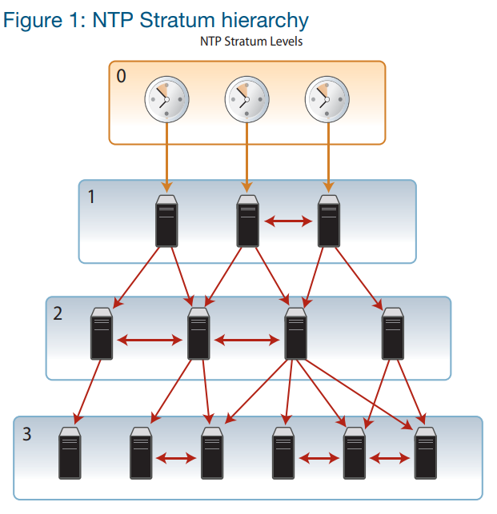
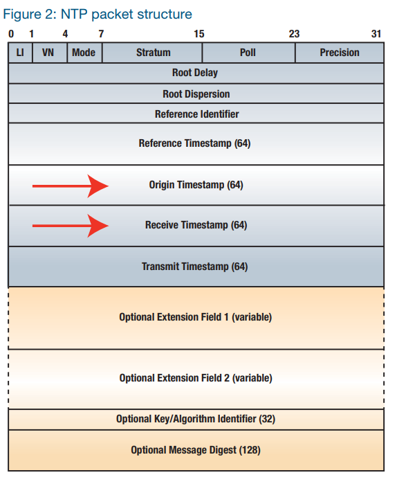
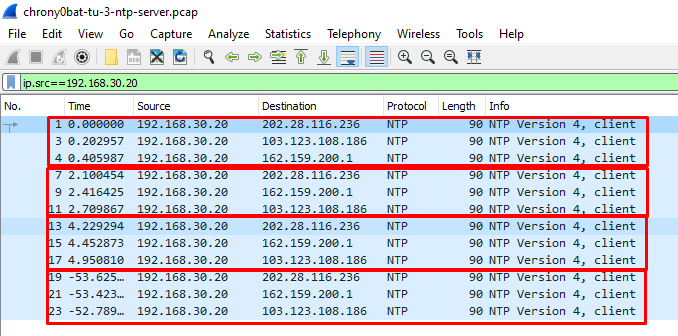
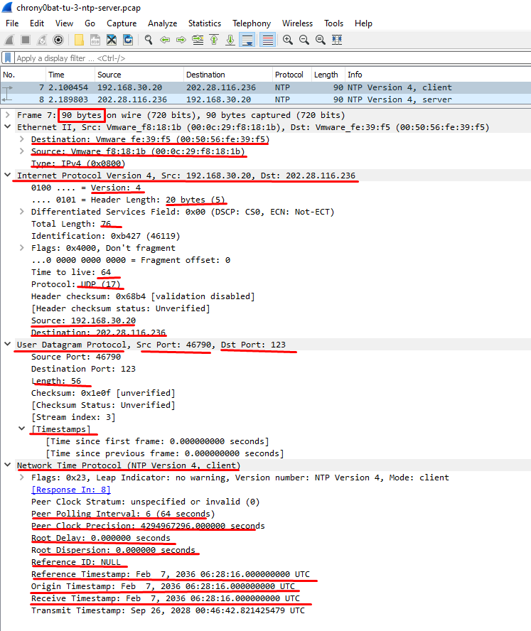
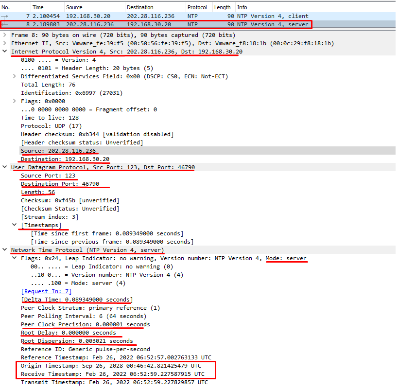
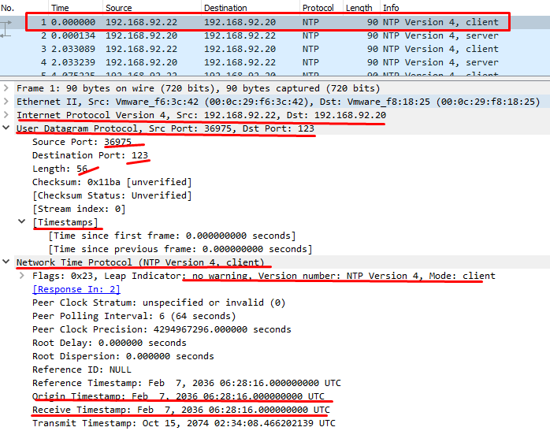
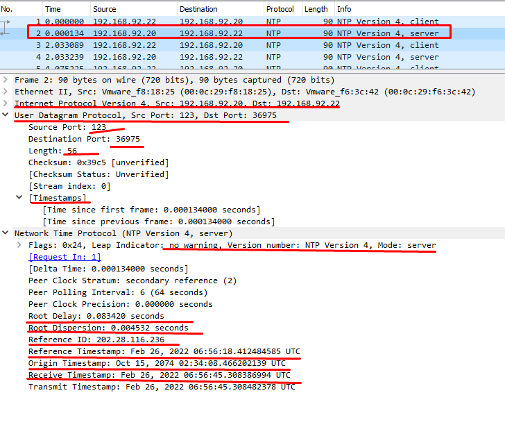

# Network Time Protocol (NTP)

Mục lục
- [Network Time Protocol (NTP)](#network-time-protocol-ntp)
  - [I. Tổng quan về NTP](#i-tổng-quan-về-ntp)
    - [1. Một số khái niệm cơ bản](#1-một-số-khái-niệm-cơ-bản)
      - [1.1 Clock strata levels và đồng hồ tham chiếu.](#11-clock-strata-levels-và-đồng-hồ-tham-chiếu)
      - [1.2 NTP Timestamps](#12-ntp-timestamps)
      - [1.3 NTP timekeeping metrics](#13-ntp-timekeeping-metrics)
      - [1.4 Servers và clients](#14-servers-và-clients)
    - [2. Cách hoạt động](#2-cách-hoạt-động)
    - [3. Các chế độ hoạt động](#3-các-chế-độ-hoạt-động)
  - [II. Phân tích gói tin](#ii-phân-tích-gói-tin)
    - [1. Bắt gói tin](#1-bắt-gói-tin)
    - [2. Phân tích](#2-phân-tích)
- [Tài liệu tham khảo](#tài-liệu-tham-khảo)

## I. Tổng quan về NTP
- NTP là 1 giao thức được thiết kế để đồng bộ hoá thời gian của các máy tính qua mạng.
- Mục đích: cho phép client đồng bộ hoá đồng hồ với giờ **Coordinated Universal Time** (UTC) với độ chính xác và ổn định cao. Nó có thể đọc thời gian từ một nguồn tham chiếu, sau đó truyền kết quả đến 1 hoặc nhiều client và điều chỉnh thời gian của từng máy client.
- **NTP server listen** các gói NTP của **client** trên **port 123**. NTP server là stateless và phản hồi các gói NTP client bằng cách thêm các trường: timestamps vào gói đã nhận và chuyển trở lại client gửi.
- NTP là 1 trong những giao thức Internet lâu đời nhất đang được sử dụng hiện nay đã hoạt động từ trước năm 1985.
- NTP ban đầu được thiết kế bởi David L. Mills của Đại học Delaware, NTP phiên bản 0 đã được triển khai và ghi trong RFC 958.
_ NTP rất quan trọng vìe việc quản lý, bảo mật, lập kế hoạch và gỡ lỗi mạng liên quan đến việc xác định khi nào các event xảy ra.
### 1. Một số khái niệm cơ bản
Một số khái niệm cơ bản cần biết: Clock strata levels và đồng hồ tham chiếu (reference clock), NTP Timestamps, server và client.
#### 1.1 Clock strata levels và đồng hồ tham chiếu.
- NTP là một giao thức phân cấp và được phân chia thành các tầng gọi là Stratum, được gán số với cấp bắt đầu từ 0 và là cấp cao nhất.
- Các thiết bị stratum 1  lấy thời gian từ stratum 0. Các thiết bị ở stratum 2 lấy thời gian ở stratum 1,... Sơ đồ càng đi xuống thì thời gian đồng hồ càng có khả năng kém chính xác hơn.



**Stratum 0**
- Nguồn thời gian **stratum 0** là những đồng hồ có độ chính xác cao như **đồng hồ nguyên tử (atomic clock)**. Chúng được gọi là `primary reference clocks` và được đồng bộ với UTC.
- Các thiết bị tầng **stratum 0** không thể được sử dụng trên mạng, chúng được kết nối trực tiếp với máy tính (qua backbone gateways hoặc switches) tầng **stratum 1**

**Stratum 1**
- Thiết bị tầng Stratum 1 (**primary time servers**), thời gian hệ thống được đồng bộ (microseconds - micro giây) với thiết bị của tầng Stratum 0.
- Thời gian của các server tầng Stratum 1 kiểm tra chéo đồng hồ bằng NTP, để giảm thiểu lỗi do thiết bị hoặc đường truyền và để phân phối thông tin thời gian tới các **local secondary time server** (Stratum 2).
**Stratum 2**
- Thiết bị tầng **Stratum 2** đồng bộ hoá thời gian hệ thống thông qua gói request NTP từ tầng **Stratum 1** (Thường thì 1 máy tính tầng Stratum 2 sẽ query 1 số server tầng 1).
- Thiết bị tầng có thể được sử dụng làm **nguồn thời gian (time source)**  và làm thiết bị kết với tầng khác (trừ các thiết bị tầng 2).
**Stratum 3 trở lên**
- Thiết bị tầng 3 được đồng bộ hoá với server **stratum 2**. Cũng sử dụng các thuật toán giống nhau cho việc kiểm tra chéo và lấy dữ liệu từ **stratum 2**.
- Tương tự chúng cũng là nguồn tham chiếu cho các cấp thấp hơn.

**Có bao nhiêu Stratum level**
- Có thể có tối đa **15 tầng**.
- Mỗi tầng thường cần sử dụng các server dự phòng và đường dẫn mạng đa dạng để tránh việc hỏng phần mềm, phần cứng, lỗi mạng và các cuộc tấn công tiềm ẩn.
**Stratum level thường được sử dụng ở các tổ chức**
- Thông thường, Quy trình NTP trong mạng của 1 tổ chức sẽ đồng bộ hoá với nguồn thời gian Stratum 3 hoặc 4 để cung cấp thời gian tham chiếu cho các thiết bị trong mạng.
- Để hệ thống đáng tin cậy, mỗi client có thể nhận nguồn thời gian từ nhiều server. Thiết bị Stratum 2 trở xuống cũng có thể đồng bộ với nhau.
- NTP liên tục theo dõi độ ổn định, độ chính xác của tất cả các server và chọn cái chính xác nhất.

#### 1.2 NTP Timestamps
Đồng bộ hoá thời gian giữa client với server cặp gói tin NTP: request và reply.
- Khi gửi 1 request, client lưu trữ thời gian của chính nó (timestamp gốc) vào gói được gửi đi. Khi một server nhận được nó sẽ lưu trữ thời gian của nó (receive timestamp - Nhãn thời gian nhận) vào gói tin và gói tin sẽ được trả về client.
- Client sẽ ghi lại thời gian tại thời điểm nhận được gói reply để ước tính thời gian di chuyển (travelling time) của gói tin. Thời gian di chuyển (delay)= 1/2*(Tổng delay - remote processing time). Giả sử độ trễ (delay) đối xứng.

Các gói NTP sử dụng 1 format chung. Có 2 format thời gian: timestamp 64-bit và timestamp 128-bit.

Có thể xem Timestamp gốc (**Origin Timestamp**) và Nhận (**Receive Timestamp**) trong gói tin NTP bên dưới:



#### 1.3 NTP timekeeping metrics
Các tham số quan trọng của NTP:
- Độ lệch (**offset or phase**) của đồng hồ cục bộ với đồng hồ tham chiếu. Độ lệch là sự khác biệt thời gian của đồng hồ giữa các đồng hồ ngang hàng (cùng tầng) hoặc giữa đồng hồ tham chiếu (reference clock) và đồng hồ cục bộ (local clock). Giá trị này được sử dụng để điều chỉnh client clock.
- Độ trễ khứ hồi (**round-trip delay**) của đường truyền giữa máy tính cục bộ và reference clock server.
- **Jitter** (or dispersion-độ phân tán) của local clock, là sai số tối đa của local clock với reference clock.

=> Từ đó có thể xác định độ chính xác và chất lượng thời gian trong 1 mạng.

#### 1.4 Servers và clients

- NTP server là nguồn của time information và NTP client là 1 hệ thống/thiết bị đồng bộ với đồng hồ với 1 server.
- Servers gồm:
  - **Primary server**: Nhận tín hiệu thời gian UTC trực tiếp từ 1 nguồn chính xác (atomic clock or 1 GPS signal source).
  - **Secondary server**: Nhận time signal từ 1 hoặc nhiều server tầng trên và phân phối thời gian đến 1 hoặc nhiều server và client tầng dưới.
- **Client peer** với servers để đồng bộ hoá đòng hồ nội bộ của nó với NTP time signal.
   
### 2. Cách hoạt động
NTP hoạt động dựa trên giao thức UDP (User Datagram Protocol).
Quá trình hoạt động:
1. Client gửi gói tin request, chứa timestamp thời gian lúc gửi đi.
2. Server nhận request và trả lời bằng các gói tin chứa timestamp là thời gian gửi gói tin đó đi.
3. Client nhận được gói tin, tính toán độ trễ dựa vào timestamp nhận được cùng với trễ đường truyền và đặt lại thời gian của nó.
4. Quá trình này được lặp đi lặp lại để loại bỏ ảnh hưởng chập chờn mạng để đạt được giá trị  chính xác. (Quá trình này được thiết kế để cung cấp tỷ lệ cập nhật đủ để tối đa hoá độ chính xác đồng thời giảm trí phí mạng).
### 3. Các chế độ hoạt động
NTP sử dụng 2 mode cơ bản:
- **Client/Server** mode: Client yêu cầu và Server phản hồi. Server là thiết bị ở higher-stratum so với client. Do đó thời gian client được đồng bộ theo server.
- **Peer-to-peer** mode (ở cùng trên 1 tầng):  Cả hai thiết bị đều là người yêu câu và đều là người trả lời lẫn nhau. Thời gian của các thiết bị tụ lại (converge) với nhau.

Tóm lại, 1 thiết bị NTP có thể thuộc 1 hoặc nhiều vai trò sau:
- Client
- Server
- Peer

## II. Phân tích gói tin
### 1. Bắt gói tin
Bắt gói tin đồng bộ giữa local server với ntp server: sử dụng kết quả của bài lab: [Cài đặt Chrony trên Centos 7 64bit](Cai-dat-chrony.md)

> Trên NTP server:
```
tcpdump -i ens33 port 123 -w chrony0bat-tu-3-ntp-server.pcap
```

Bắt gói tin đồng bộ giữa local server và client:
> Trên server:
```
tcpdump -i ens37 port 123 -w chrony1client.pcap
```

Để tải 2 gói tin ở trên [tại đây](./Tcpdump-ntp/)

### 2. Phân tích
**Phân tích gói tin đồng bộ giữa local server với ntp server:**
Dùng wireshark mở gói tin:`chrony0bat-tu-3-ntp-server.pcap`
- Server đồng bộ với 3 NTP server:



- Phân tích gói tin request thứ 7:



- Phân tích gói tin reply thứ 8:



**Phân tích gói tin đồng bộ giữa local server và client:**
Dùng wireshark mở gói tin:`chrony1client.pcap`
- Phân tích gói tin request thứ 1:



- Phân tích gói tin reply thứ 2:




# Tài liệu tham khảo

1. https://endruntechnologies.com/pdf/NTP-Intro.pdf
2. https://vi.wikipedia.org/wiki/NTP