# Tìm hiểu về Network File System

**Mục lục**

- [Tìm hiểu về Network File System](#tìm-hiểu-về-network-file-system)
  - [1.Network File System](#1network-file-system)
    - [1.1 NFS là gì](#11-nfs-là-gì)
    - [1.2 Phiên bản NFS](#12-phiên-bản-nfs)
    - [1.3 Cách hoạt động](#13-cách-hoạt-động)
    - [1.4 Ưu, nhược điểm](#14-ưu-nhược-điểm)
  - [Cài đặt và cấu hình NFS trên Centos 7 64bit](#cài-đặt-và-cấu-hình-nfs-trên-centos-7-64bit)
    - [Mô hình mạng](#mô-hình-mạng)
    - [Cài đặt NFS](#cài-đặt-nfs)
      - [Trên Server Centos 7 64bit](#trên-server-centos-7-64bit)
      - [Trên Client Centos 7 64bit](#trên-client-centos-7-64bit)
    - [Kiểm tra kết quả:](#kiểm-tra-kết-quả)
  - [Tài liệu tham khảo](#tài-liệu-tham-khảo)

## 1.Network File System
### 1.1 NFS là gì
- NFS (Network File System ) là một giao thức để truy cập từ xa vào hệ thống tệp.
- Được phát triển bởi SunMicrosystems vào năm 1984
- Cho phép các client kết nối đến phân vùng chia sẻ (Phân vùng server chia sẻ) và sử dụng như một phân vùng cục bộ

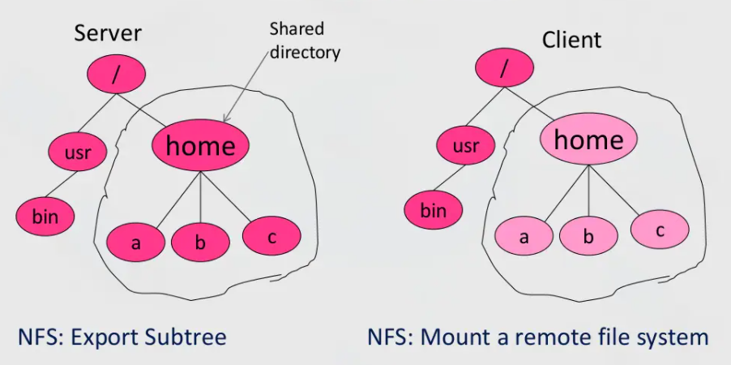

- Sử dụng mô hình Client/ Server, sử dụng RPC (Remote Procedure Call) để định tuyến request từ Client đến Server.


- Sử dụng TCP và UDP tuỳ vào phiên bản sử dụng
- Do sử dụng RPC để định tuyến nên NFS sử dụng các port 2049 và 111 cả trên client và server.


Note:
- RPC viết tắt của Remote Procedure Call là giao thức hoạt động ở tầng Session.

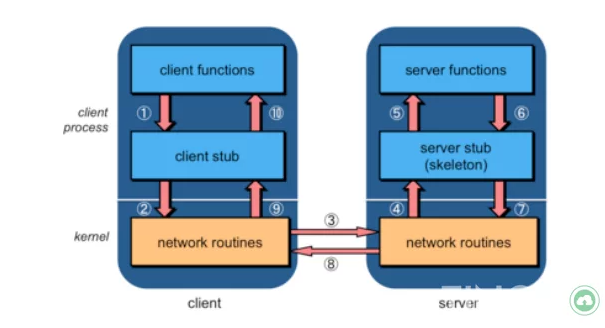
- Hoạt động:
  - ***Phần Client** là một quá trình người dùng, nơi khởi tạo một lời gọi thủ tục từ xa. Mỗi lời gọi thủ tục ở xa trên phần Client sẽ kích hoạt một thủ tục cục bộ tương ứng nằm trong phần Stub của Client.*

  - ***Phần Client Stub** cung cấp một bộ các hàm cục bộ mà phần Client có thể gọi. Mỗi một hàm của **Client Stub** đại diện cho một hàm ở xa được cài đặt và thực thi trên server.*

  - Mỗi khi một hàm nào đó của **Client Stub** được gọi bởi **Client**, **Client Stub** sẽ gửi thông điệp để mô tả thủ tục ở xa tương ứng mà **Client** muốn thực thi **cùng với các tham số** nếu có. Sau đó nó sẽ nhờ hệ thống **RPC Runtime cục bộ** gửi thông điệp này đến phần **Server Stub** của Server.

  - ***Phần RPC Runtime** quản lý việc truyền thông điệp thông qua mạng giữa máy Client và máy Server. Nó đảm nhận việc **truyền lại, báo nhận, chọn đường gói tin và mã hóa thông tin**.*

  - **RPC Runtime** trên máy **Client** nhận thông điệp yêu cầu từ **Client Stub**, gửi nó cho **RPC Runtime** trên máy **Server** bằng lệnh **send()**. Sau đó gọi lệnh **wait()** để chờ kết quả trả về từ **Server**. Khi nhận được thông điệp từ **RPC Runtime** của **Client** gửi sang, **RPC Runtime** bên phía **server** chuyển thông điệp lên phần **Server Stub**.

  - **Server Stub** mở thông điệp ra xem, xác định **hàm từ xa** mà **Client** muốn thực hiện cùng với các **tham số** của nó. **Server Stub** gọi một lệnh tương ứng nằm trên phần **Server**. Khi nhận được yêu cầu của **Server Stub**, Server cho **thực thi lệnh được yêu cầu** và gửi kết quả thực thi được cho **Server Stub**.

  - **Server Stub** đưa kết quả thực vào một gói tin trả lời, chuyển cho phần **RPC Runtime** cục bộ để nó gửi sang **RPC Runtime** của **Client**

  - **Runtime cục bộ** để nó gửi sang **RPC Runtime** của **Client**. **RPC Runtime** bên phía **Client** chuyển gói tin trả lời nhận được cho phần **Client Stub**. **Client Stub** mở thông điệp chứa kết quả thực thi về cho **Client** tại vị trí phát ra lời gọi thủ tục xa.

### 1.2 Phiên bản NFS
NFSv1 (1984)
- Phát triển với mục đích thử nghiệm trong nội bộ


NFSv2(Tháng 3 năm 1989)
- Bản phát hành cho mục đích thương mại.
- Sử dụng UDP, Stateless(Không trạng thái- nghĩa là không lưu dữ liệu của client trên server, trạng thái ở đây được hiểu là dữ liệu).


NFSv3 (Tháng 6 năm 1995)
- Phát triển từ v2
- Sử dụng UDP và TCP, stateless.


NFSv4 (Tháng 4 năm 2003)
- Phát triển từ v2,v3
- Statefull server(Máy chủ trạng thái) 
- Sử dụng TCP
- Tập trung vào hiệu suất, khả năng truy cập, khả năng mở rộng, bảo mật mạnh, quốc tế hoá.
- NFSv4.1 - 2010
- NFSv4.2 -~ 2016

Note:
Stateless Server:
- Không duy trì thông tin về quyền truy cập từ client
- Thông tin cần thiết được cung cấp từ client


Statefull Server:
- Duy trì thông tin về quyền truy cập của máy client
- Rút ngắn request messages
### 1.3 Cách hoạt động
- Để truy cập dữ liệu được lưu trữ trên 1 máy chủ, server sẽ triển khai cài đặt và cấu hình NFS để cung cấp dữ liệu cho khách hàng.
- Từ client, yêu cầu quyền truy cập vào dữ liệu đã xuất.
- Server NFS tham chiếu tệp cấu hình /etc/export để xác minh quyền truy cập của client. 
- Sau khi xác minh, tất cả hoạt động tập tin và thư mục được phép sử dụng trên Client
**Mô hình hoạt động**


- VFS để xử lý các tệp cục bộ và từ xa.
- RPC để truyền dữ liệu


Phía client:

- Client truy cập file system bằng các cuộc gọi hệ thống (system call)
- Ở đây, Giao diện hệ thống UNIX được thay thế bằng giao diện cho hệ thống tệp ảo (VFS) (các hệ điều hành hiện đại đều cung cấp VFS)
- Các hoạt động trên giao diện VFS được chuyển đến hệ thống tệp cục bộ (Local file) hoặc được chuyển đến 1 thành phần riêng biệt gọi là NFS Client.
- Mỗi khi một hàm nào đó của **Client Stub** được gọi bởi **Client**, **Client Stub** sẽ gửi thông điệp để mô tả thủ tục ở xa tương ứng mà **Client** muốn thực thi **cùng với các tham số** nếu có. Sau đó nó sẽ nhờ hệ thống **RPC Runtime cục bộ** gửi thông điệp này đến phần **Server Stub** của Server.
- NFS client đảm nhiệm việc xử lý quyền truy cập vào các tệp được lưu trữ tại máy chủ từ xa
- Trong NFS, tất cả giao tiếp giữa máy khách và máy chủ được thực hiện thông qua RPC (cuộc gọi thủ tục)

Phía Server:
- NFS server xử lý các yêu cầu từ client
- **Server Stub** mở thông điệp ra xem, xác định **hàm từ xa** mà **Client** muốn thực hiện cùng với các **tham số** của nó. **Server Stub** gọi một lệnh tương ứng nằm trên phần **Server**. Khi nhận được yêu cầu của **Server Stub**, Server cho **thực thi lệnh được yêu cầu** và gửi kết quả thực thi được cho **Server Stub*
- VFS chịu trách nhiệm triển khai 1 hệ thống tệp cục bộ.
### 1.4 Ưu, nhược điểm
Ưu điểm :
- NFS là 1 giải pháp chi phí thấp để chia sẻ tệp mạng.
- Dễ cài đặt
- Cho phép quản lý tập trung, giảm dung lượng ổ đĩa trên máy người dùng.

Nhược điểm :
- NFS không an toàn, nên chỉ sử dụng trên mạng LAN sau Firewall
- NFS bị chậm trong khi lưu lượng mạng lớn
- Máy chủ lỗi thì tất cả các máy 

## Cài đặt và cấu hình NFS trên Centos 7 64bit
### Mô hình mạng

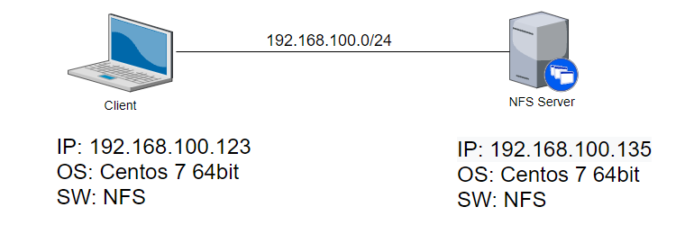

### Cài đặt NFS
#### Trên Server Centos 7 64bit
- Cài đặt:

`yum install nfs-utils -y`

- Tạo thư mục chia sẻ:

`#mkdir /Public`

- Cấu hình file `/etc/exports`


`/Public 192.168.100.0/24(rw,no_root_squash)`

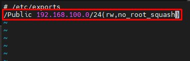

Trong đó:

`dir host1(options) host2(options) hostN(options) …`

`dir` : thư mục hoặc file system muốn chia sẻ.
`host` : một hoặc nhiều host được cho phép mount dir. Có thể được định nghĩa là một tên hoặc một nhóm sử dụng 1 dải địa chỉ mạng/subnetmask…
`options` : định nghĩa 1 hoặc nhiều options khi mount.

- Khởi động dịch vụ:

```
#systemctl start rpcbind nfs-server
#systemctl enable rpcbind nfs-server
```

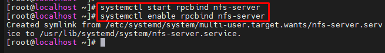

- Cấu hình firewall để NFS client được phép truy cập:

Cho phép NFSv4

`#firewall-cmd --add-service=nfs --permanent`

Nếu cũng cho phép NFSv3, cài đặt:

`# firewall-cmd --add-service={nfs3,mountd,rpc-bind} --permanent`

Cuối cùng, reload firewall:

`# firewall-cmd --reload`


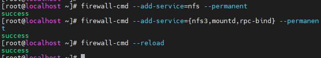

- Kiểm tra mountpoint trên server:


`# showmount -e `

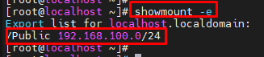

#### Trên Client Centos 7 64bit

- Cài đặt:

`#yum -y install nfs-utils`

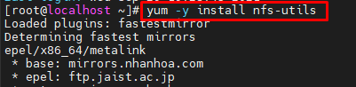

- Khởi động dịch vụ:

```
#systemctl start rpcbind
#systemctl enable rpcbind
```

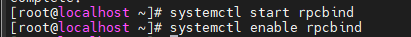

- Mount thư mục chia sẻ với thu mục trên Client

`#mount -t nfs 192.168.100.135:/Public /Public`

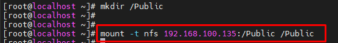

### Kiểm tra kết quả:

`#df -hT`

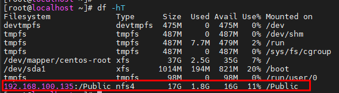

## Tài liệu tham khảo
1. http://nfs.sourceforge.net/nfs-howto/index.html
2. https://www.slideshare.net/udamale/nfsnetwork-file-system
3. https://www.server-world.info/en/note?os=CentOS_7&p=nfs&f=1
4. https://www.slideshare.net/udamale/nfsnetwork-file-system?next_slideshow=1
5. https://en.wikipedia.org/wiki/Network_File_System
6. https://cseweb.ucsd.edu//classes/fa05/cse120/lectures/120-l15.pdf
7. http://csis.pace.edu/~marchese/CS865/Lectures/Chap11/Chapter11.htm