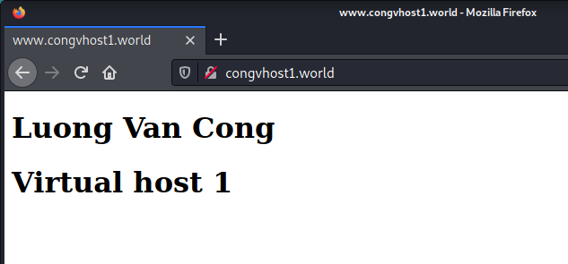
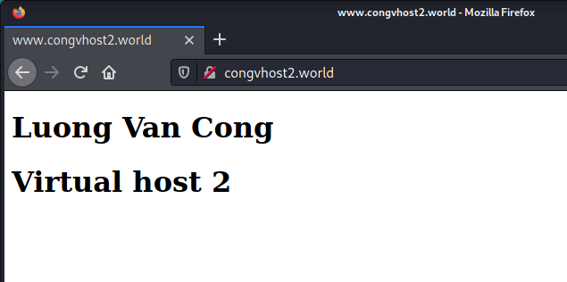

# Cấu hình Virtual host

Mục lục
- [Cấu hình Virtual host](#cấu-hình-virtual-host)
  - [I.Virtual host](#ivirtual-host)
  - [II. Lab:](#ii-lab)
    - [1. Mô hình mạng](#1-mô-hình-mạng)
    - [2. Các bước thực hiện](#2-các-bước-thực-hiện)
      - [Bước 1: Cài đặt Nginx](#bước-1-cài-đặt-nginx)
      - [Bước 2: Cấu hình tạo ra các Virtual host](#bước-2-cấu-hình-tạo-ra-các-virtual-host)
      - [Bước 3: Kiểm tra](#bước-3-kiểm-tra)
- [Tài liệu tham khảo](#tài-liệu-tham-khảo)

## I.Virtual host

+ *Virtual Host* là một kỹ thuật cho phép nhiều website có thể dùng chung một địa chỉ ip. Thuật ngữ này được sử dụng với các website sử dụng Apache server. Trong các website sử dụng Nginx server thì nó được gọi là *Server Block*
+ Đây là kỹ thuật dùng để cấu hình cho web server khi bạn muốn có nhiều nhiều website với các tên miền khác nhau được sử dụng chung trên cùng một máy chủ.

- Block Directive sử dụng để tạo Virtual host là:
```
server_name <danh sách tên miền>;
```
- Block Directive này nằm trong Server Blocks
## II. Lab:

### 1. Mô hình mạng


### 2. Các bước thực hiện

#### Bước 1: Cài đặt Nginx

Install the prerequisites:
```
yum install yum-utils -y
```
Thêm repo:

```
echo '[nginx-stable]
name=nginx stable repo
baseurl=http://nginx.org/packages/centos/$releasever/$basearch/
gpgcheck=1
enabled=1
gpgkey=https://nginx.org/keys/nginx_signing.key
module_hotfixes=true

[nginx-mainline]
name=nginx mainline repo
baseurl=http://nginx.org/packages/mainline/centos/$releasever/$basearch/
gpgcheck=1
enabled=0
gpgkey=https://nginx.org/keys/nginx_signing.key
module_hotfixes=true' >> /etc/yum.repos.d/nginx.repo
```
use mainline nginx packages:
```
yum-config-manager --enable nginx-mainline
```
install nginx:
```
yum install nginx -y
```

Cấu hình firewall:
```
firewall-cmd --zone=public --permanent --add-port=80/tcp
firewall-cmd --zone=public --permanent --add-port=443/tcp
firewall-cmd --reload
```
Khởi động dịch vụ:
```
systemctl start nginx
systemctl enable nginx
```

#### Bước 2: Cấu hình tạo ra các Virtual host

> Tạo virtual host congvhost1.world

Tạo Server Block cho congvhost1.world:
```
echo '#/etc/nginx/conf.d/congvhost1.world.conf
server {
    listen      80;
    server_name     congvhost1.world www.congvhost1.world;

    access_log      /var/log/nginx/access-congvhost1.world.log;
    error_log       /var/log/nginx/error-congvhost1.world.log;

    root    /usr/share/nginx/congvhost1.world;
    index   index.html;
}' > /etc/nginx/conf.d/congvhost1.world.conf
```

Tạo thư mục chứa website cho virtual host này:
```
mkdir /usr/share/nginx/congvhost1.world
chown nginx:nginx -R /usr/share/nginx/congvhost1.world
```

Tạo một file index.html để kiểm tra kết quả:
```
echo '<DOCTYPE html>
<html>
<head>
<title>www.congvhost1.world</title>
</head>
<body>
<h1>Luong Van Cong</h1>
<h1>Virtual host 1</h1>
</body>
</html>' > /usr/share/nginx/congvhost1.world/index.html
```

> Tạo virtual host congvhost2.world

Tạo Server Block cho congvhost2.world:
```
echo '#/etc/nginx/conf.d/congvhost2.world.conf
server {
    listen      80;
    server_name     congvhost2.world www.congvhost2.world;

    access_log      /var/log/nginx/access-congvhost2.world.log;
    error_log       /var/log/nginx/error-congvhost2.world.log;

    root    /usr/share/nginx/congvhost2.world;
    index   index.html;
}' > /etc/nginx/conf.d/congvhost2.world.conf
```

Tạo thư mục chứa website cho virtual host này:
```
mkdir /usr/share/nginx/congvhost2.world
chown nginx:nginx -R /usr/share/nginx/congvhost2.world
```

Tạo một file index.html để kiểm tra kết quả:
```
echo '<DOCTYPE html>
<html>
<head>
<title>www.congvhost2.world</title>
</head>
<body>
<h1>Luong Van Cong</h1>
<h1>Virtual host 2</h1>
</body>
</html>' > /usr/share/nginx/congvhost2.world/index.html
```
#### Bước 3: Kiểm tra
> Trên Client Kali

Thêm tên miền vào /etc/hosts
```
sudo vi /etc/hosts
```
Them 2 dòng sau vào cuối file:
```
192.168.92.21 congvhost2.world www.congvhost2.world
192.168.92.21 congvhost1.world www.congvhost1.world
```

Truy cập: congvhost1.world hoặc www.congvhost1.world



Truy cập: congvhost2.world hoặc www.congvhost2.world



# Tài liệu tham khảo

1. https://github.com/hocchudong/ghichep-nginx/blob/master/docs/nginx-virtualhost.md