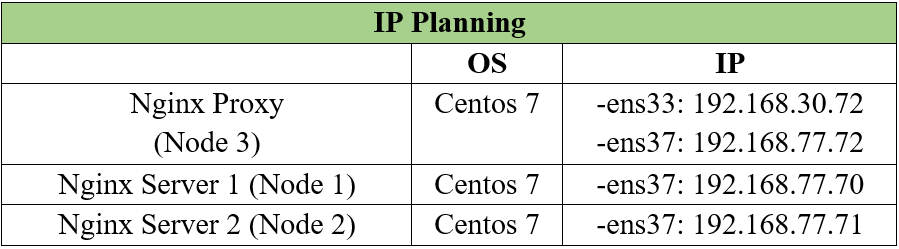

<h1> Cấu hình chuyển hướng truy cập HTTP sang HTTPS</h1>

Bài này thực hiện chuyển hướng các kết nối đến đường link HTTP sẽ tự động chuyển sang HTTPS.

<h2> Mục lục </h2>

- [I. Note](#i-note)
- [II. Example](#ii-example)
  - [1. Mô hình mạng](#1-mô-hình-mạng)
  - [2. Cấu hình](#2-cấu-hình)
  - [3. Kiểm tra kết quả](#3-kiểm-tra-kết-quả)
- [Tài liệu tham khảo](#tài-liệu-tham-khảo)

# I. Note

Ở block server dành cho kết nối HTTP "listen 80" của tên miền muốn redirect, thêm dòng:
```
return 301 $scheme://$host$request_uri;
```

Sau khi chỉnh sửa, tất cả lưu lượng truy cập cho máy chủ mặc định HTTP sẽ chuyển hướng đến HTTPS.

`301 redirect` là một phương pháp chuyển tiếp thông báo các trình duyệt rằng website đã được chuyển dời tới một địa chỉ mới, không cần đến sự can thiệp của người dùng.
`$scheme://$host$request_uri` là url được viết lại (rewritten URL)
- Lệnh `return` yêu cầu NGINX ngừng xử lý yêu cầu và ngay lập tức gửi mã 301 (Moved Permanently) và url được viết lại cho client.
- `rewritten URL` sử dụng 3 [biến NGINX](https://nginx.org/en/docs/varindex.html?_ga=2.206714007.507550558.1646032305-319433364.1644219864&_gac=1.57395800.1646115905.CjwKCAiAgvKQBhBbEiwAaPQw3GcwyKFSsqWz0z3mM3ADaRzk2opfcAdTuWYME_OK9HvZ9OwZtTiguxoCSscQAvD_BwE) để bắt và sao chép các giá trị từ URL yêu cầu gốc của client:
  - `$scheme` là giao thức (`http` hoặc `https`)
  - `$host` là tên miền máy chủ mới, tên miền máy chủ được chuyển đến.
  - `$request_uri` là URI đầy đủ (ví dụ `hostcong.world/cong` thì `/cong` là phần request_uri). Nếu không có có thể bỏ đi.

**Lý do chuyển hướng truy cập:**
- Buộc 1 kết nối mã hoá, an toàn hơn
- Gửi lưu lượng truy cập vĩnh viễn từ trang web này sang trang web khác.
# II. Example

Ví dụ: Thực hiện chuyển hướng các kết nối HTTP tự động chuyển sang HTTPS.
Các cấu hình sử dụng từ bài lab: [Cấu hình ssl self-signed](nginx-ssl.md).
## 1. Mô hình mạng




## 2. Cấu hình

> Trên Nginx Proxy

Tiến hành thêm đoạn mã sau vào file cấu hình chính: `/etc/nginx/nginx.conf`
```
server {
    listen 80;
    server_name hostcong.world www.hostcong.world;
    return 301 https://$host$request_uri;
}
```

Trong đó:
- `listen 80`: Hướng dẫn nginx bắt tất cả traffic HTTP trên port 80.
- `server_name hostcong.world www.hostcong.world;` : tên miền máy chủ cũ.
- `Return 301`: Điều này cho trình duyệt (và các công cụ tìm kiếm) biết rằng đây là 1 chuyển hướng vĩnh viễn (**permanent redirect**)
- `https://$host$request_uri` : 

Kiểm tra và Reload file cấu hình:
```
nginx -t && nginx -s reload
```

## 3. Kiểm tra kết quả

> Trên Client Centos 7

Thêm tên miền của nginx proxy vào file: `/etc/hosts`
```
echo '192.168.30.72 hostcong.world www.hostcong.world' >> /etc/hosts
```

Kiểm tra bằng công cụ `curl`:
```
curl -I http://hostcong.world/
```

Out:
```
[root@localhost ~]# curl -I http://hostcong.world/
HTTP/1.1 301 Moved Permanently
Server: nginx/1.21.6
Date: Wed, 02 Mar 2022 09:37:45 GMT
Content-Type: text/html
Content-Length: 169
Connection: keep-alive
Location: https://hostcong.world/
```

Ta thấy có dòng `HTTP/1.1 301 Moved Permanently` và `Location: https://hostcong.world/` có nghĩa là đã chuyển hướng thành công.


# Tài liệu tham khảo


1. https://www.nginx.com/blog/creating-nginx-rewrite-rules/
2. https://phoenixnap.com/kb/redirect-http-to-https-nginx
3. https://nginx.org/en/docs/http/ngx_http_core_module.html