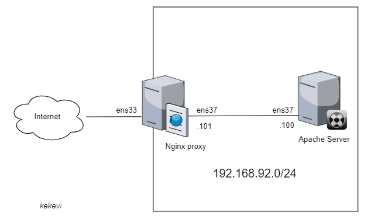
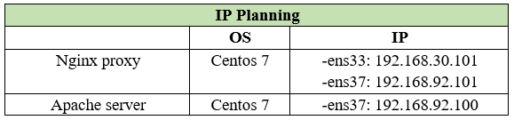
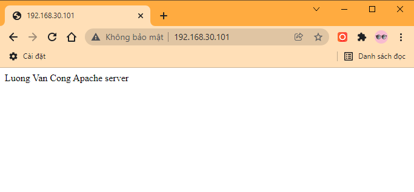

# Cấu hình Nginx làm Reverse Proxy cho Apache


- [Cấu hình Nginx làm Reverse Proxy cho Apache](#cấu-hình-nginx-làm-reverse-proxy-cho-apache)
  - [1.Mô hình mạng](#1mô-hình-mạng)
  - [2.Cài đặt Nginx server](#2cài-đặt-nginx-server)
  - [3. Cài đặt Apache Server](#3-cài-đặt-apache-server)
  - [4. Kiểm tra:](#4-kiểm-tra)
- [Tài liệu tham khảo:](#tài-liệu-tham-khảo)

## 1.Mô hình mạng



Mô hình IP:


## 2.Cài đặt Nginx server

Install the prerequisites:
```
yum install yum-utils -y
```
Thêm repo:

```
echo '[nginx-stable]
name=nginx stable repo
baseurl=http://nginx.org/packages/centos/$releasever/$basearch/
gpgcheck=1
enabled=1
gpgkey=https://nginx.org/keys/nginx_signing.key
module_hotfixes=true

[nginx-mainline]
name=nginx mainline repo
baseurl=http://nginx.org/packages/mainline/centos/$releasever/$basearch/
gpgcheck=1
enabled=0
gpgkey=https://nginx.org/keys/nginx_signing.key
module_hotfixes=true' >> /etc/yum.repos.d/nginx.repo
```
use mainline nginx packages:
```
yum-config-manager --enable nginx-mainline
```
install nginx:
```
yum install nginx -y
```

Cấu hình firewall:
```
firewall-cmd --zone=public --permanent --add-port=80/tcp
firewall-cmd --zone=public --permanent --add-port=443/tcp
firewall-cmd --reload
```
Khởi động dịch vụ:
```
systemctl start nginx
systemctl enable nginx
```

Backup file cấu hình `/etc/nginx/nginx.conf`
```
cp /etc/nginx/nginx.conf /etc/nginx/nginx.conf.bak
```
Cấu hình proxy, tạo tệp `test.conf` trong `/etc/nginx/conf.d/`
```
echo 'server {
        listen      80 default_server;
        #listen      [::]:80 default_server;

        proxy_redirect           off;
        proxy_set_header         X-Real-IP $remote_addr;
        proxy_set_header         X-Forwarded-For $proxy_add_x_forwarded_for;
        proxy_set_header         Host $http_host;

        location / {
            proxy_pass http://192.168.92.100/;
        }
    }' >> /etc/nginx/conf.d/test.conf
```

Trong đó: 
- **Chuyển request tới máy chủ được uỷ quyền:**
```
location /some/path/ {
    proxy_pass http://www.example.com/link/;
}
```

- Trong ví dụ  ở trên, địa chỉ của máy chủ được ủy quyền được theo sau bởi một URI `/link/`,. Nếu URI được chỉ định cùng với địa chỉ, nó sẽ thay thế một phần của URI yêu cầu phù hợp với tham số vị trí. Ví dụ, ở đây yêu cầu với /some/path/page.htmlURI sẽ được ủy quyền http://www.example.com/link/page.html. 

```
location / {
            proxy_pass http://192.168.92.100/;
        }
```
=> người dùng truy cập: http://192.168.30.101/ (location ở đây là `/`) sẽ được chuyển đến đỉa chỉ http://192.168.92.100/

- `proxy_set_header X-Real-IP`: Truyền Real IP của client vào header khi gửi request đến Backend Apache.
- `proxy_set_header X-Forwarded-For`: Mặc định client request thì thông tin sẽ chỉ giao tiếp với reverse proxy, vì vậy mà thông tin log của Backend server (Apache web server) sẽ chỉ nhận được là địa chỉ IP của Nginx proxy. Để ghi nhận địa chỉ IP thực của client vào backend web server, chúng ta sử dụng tham số: “proxy_set_header X-Forwarded-For”
- `proxy_set_header Host $host`: Dùng để định nghĩa lại trường Host request header mà truyền đến backend khi mà cached được enable trên nginx . $host bằng giá trị server_name trong trường Host request header.

Kiểm tra cú pháp (syntax) cấu hình:
```
nginx -t
```
Kết quả:
```
[root@node2 ~]# nginx -t
nginx: the configuration file /etc/nginx/nginx.conf syntax is ok
nginx: configuration file /etc/nginx/nginx.conf test is successful
```
Khởi động lại dịch vụ:
```
systemctl restart nginx
```

## 3. Cài đặt Apache Server


Cài đặt Httpd:
```
yum install -y httpd
```
Cấu hình firewall:
```
firewall-cmd --zone=public --permanent --add-port=80/tcp
firewall-cmd --zone=public --permanent --add-port=443/tcp
firewall-cmd --reload
```

Khởi động dịch vụ:
```
systemctl start httpd
systemctl enable httpd
```

Tạo trang test đơn giản:
```
echo 'Luong Van Cong
Apache server' >> /var/www/html/index.html
```

## 4. Kiểm tra:
- Truy cập: http://192.168.30.101
- Kết quả:




# Tài liệu tham khảo:

1. https://www.server-world.info/en/note?os=CentOS_7&p=nginx&f=6