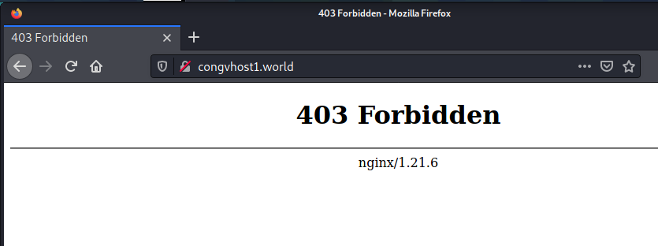
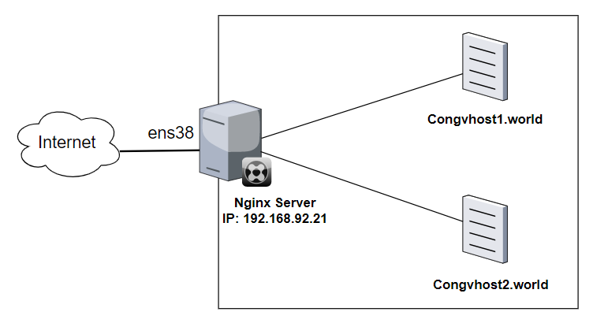
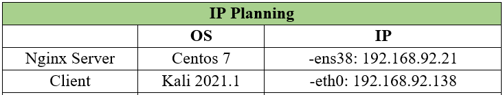
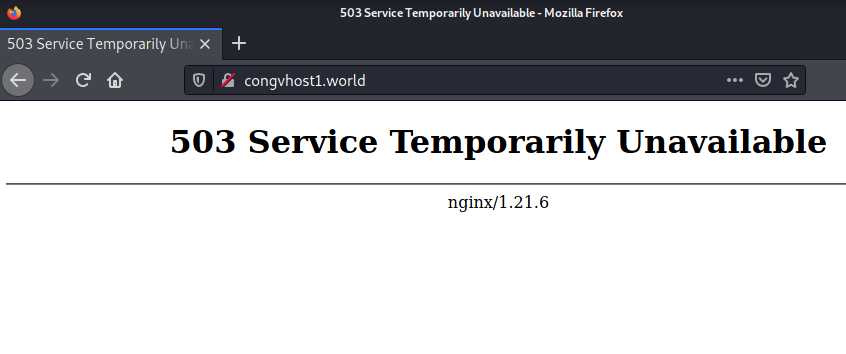

# Chặn IP và giới hạn số request trong một khoảng thời gian Nginx

Mục lục
- [Chặn IP và giới hạn số request trong một khoảng thời gian Nginx](#chặn-ip-và-giới-hạn-số-request-trong-một-khoảng-thời-gian-nginx)
  - [I. Đặt vấn đề](#i-đặt-vấn-đề)
  - [II.Biện pháp](#iibiện-pháp)
    - [1. Chặn địa chỉ IP](#1-chặn-địa-chỉ-ip)
    - [2. Giới hạn số request trong một khoảng thời gian](#2-giới-hạn-số-request-trong-một-khoảng-thời-gian)
      - [Bước 1: Cài đặt nginx (Tham khảo tại đây).](#bước-1-cài-đặt-nginx-tham-khảo-tại-đây)
      - [Bước 2: Cấu hình giới hạn tốc độ](#bước-2-cấu-hình-giới-hạn-tốc-độ)
- [Tài liệu tham khảo](#tài-liệu-tham-khảo)

---
Trong bài này thực hiện:
1. Chặn IP
2. Giới hạn số request trong một khoảng thời gian

Cho bài lab: [Cấu hình Virtual host](./Cau-hinh-virtual-host.md).

---

## I. Đặt vấn đề
Website hay bị tấn công DOS, DDOS,… Đó là 1 vấn đề có thể xảy ra khi public website trên Internet.

Vì vậy bài viết này sẽ thực hiện:
1. Chặn 1 địa chỉ IP hoặc 1 dải địa chỉ IP trên Nginx Web Server.
2. Giới hạn số request trong một khoảng thời gian

## II.Biện pháp
### 1. Chặn địa chỉ IP
Để chặn / block 1 địa chỉ IP chúng ta cần sửa file Virtual Hosts, các file Virtual Host của Nginx Server trên Linux được đặt ở thư mục:

Chặn 1 địa chỉ IP

```
http{
    . . .
    deny 192.168.92.138;
    . . .
}
```
Chặn 1 dải địa chỉ IP:
```
http{
    . . .
    deny 192.168.92.0/24;
    . . .
}
```
Chặn toàn bộ nhưng chỉ cho phép 1 địa chỉ IP được phép truy cập
```
http{
    . . .
    allow 192.168.92.138;
    deny all;
    . . .
}
```
- `deny` và `allow` có thể nằm trong Block: http, server, location, limit_except
Kết quả sau khi chặn:


### 2. Giới hạn số request trong một khoảng thời gian


#### Bước 1: Cài đặt nginx (Tham khảo [tại đây](Cau-hinh-virtual-host.md)).
**Mô hình mạng**




#### Bước 2: Cấu hình giới hạn tốc độ
**Cấu hình giới hạn tốc độ cơ bản**
Sử dụng 2 Directive `limit_req_zone` và `limit_req` (Trong Block: http, server, location):
Ví dụ sử dụng 2 cấu hình:
```
limit_req_zone $binary_remote_addr zone=congvhost1:10m rate=10r/s;
```
và
```
limit_req zone=congvhost1;
```
Trong đó:
- `limit_req_zone`: để định nghĩa các tham số cho việc giới hạn tốc độ.
- `limit_req`: chỉ vị trí sẽ áp dụng giới hạn. Có thể khai báo ở các phần khác nhau: ví dụ http{} để dùng ở nhiều phạm vị; server{} để áp dụng cho từng server.
- `limit_req_zone` có 3 tham số:
  - Key - Định nghĩa thuộc tính của truy cập mà sẽ được áp dụng giới hạn. Ở đây là `$binary_remote_addr` đại diện cho IP của người dùng ở dạng nhị phân.
  - Zone- Định nghĩa một vùng bộ nhớ chia sẻ để lưu trạng thái của mỗi địa chỉ IP và số lần nó truy cập đến địa chỉ URL bị giới hạn. Tên vùng nhớ xác định bằng từ khoá `zone=`< tên zone>, và dung lượng được định nghĩa theo sau dấu `:`. Ở đây là 10MB. Nếu vùng nhớ đầy, IP cũ sẽ bị xoá đi. Nếu vẫn không đáp ứng được sẽ trả về mã lỗi `503 (Service Temporarily Unavailable)` - nghĩa là dịch vụ tạm thời không khả dụng.
  - Rate - Đặt tốc độ truy cập lớn nhất, ở ví dụ, tốc độ lớn nhất không vượt quá 10 truy cập 1s. Cũng có thể đặt là 10r/m tức là không vượt quá 10 truy cập 1 phút.
- Directive `limit_req_zone` đặt tham số cho việc giới hạn tốc độ và vùng nhớ chung, nhưng nó không thực hiện việc giới hạn. Để áp dụng cần sử dụng `limit_req` trong một **Block** cụ thể ở đây là `server` hoặc `http`,...

- Trong `limit_req`, sử dụng tham số:
  - `bust` - định nghĩa số lượng truy cập người dùng có thể vượt so với giới hạn đã định. Nhưng có thể làm trang web chậm đi. Ví dụ: `limit_req zone=mylimit burst=20;` khi đó 20 truy cập sẽ vào hàng đợi, sau 20*100ms=2s mới đến lượt. Khi đó thêm tham số `nodelay`
  - `nodelay` - xếp hàng không có độ trễ (hông hạn chế khoảng cách cho phép giữa các yêu cầu.)


**Thực hiện cấu hình:**

Đầu tiên, Mở file Virtual host `/etc/nginx/conf.d/congvhost1.world.conf`:
```
vi /etc/nginx/conf.d/congvhost1.world.conf
```
Cấu hình  như sau:
```
#/etc/nginx/conf.d/congvhost1.world.conf

limit_req_zone $binary_remote_addr zone=congvhost1:10m rate=5r/m;

server {
    listen 80;
    server_name     congvhost1.world www.congvhost1.world;

    limit_req zone=congvhost1 burst=5 nodelay;
    access_log      /var/log/nginx/access-congvhost1.world.log;
    error_log       /var/log/nginx/error-congvhost1.world.log;

    root    /usr/share/nginx/congvhost1.world;
    index   index.html;
}
```
Trong ví dụ này:
- `zone` là:`congvhost1` , bộ nhớ= 10MB, giới hạn tốc độ là 5 request mỗi phút.
- `burst` là 5, có 5 request có thể vượt so với giới hạn
- `nodelay` là không có thời gian chờ giữa các truy cập

Kiểm tra và khởi động lại cấu hình:
```
nginx -t && nginx -s reload
```
**Kiểm tra**:

Trong ví dụ này, khi truy cập thành công vào trang web: http://congvhost1.world:
- Thực hiện F5 `5` lần liên tục trong 5s thì lần request thứ **5** bị lỗi:

.

- Bỏ `burst=5` và `nodelay` thì F5 lần thứ **2** thì bị lỗi.
# Tài liệu tham khảo

1. https://ubiq.co/tech-blog/block-ip-address-nginx/
2. http://nginx.org/en/docs/http/ngx_http_limit_req_module.html
3. http://sbin.xyz/2018/01/30/Nginx-gioi-han-toc-do-truy-cap-cua-nguoi-dung/
4. http://nginx.org/en/docs/http/ngx_http_access_module.html