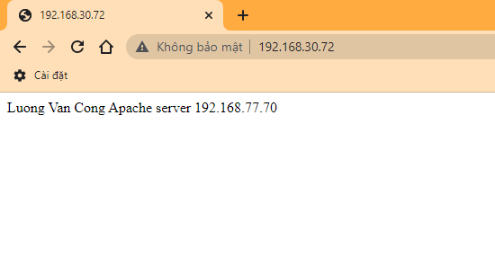
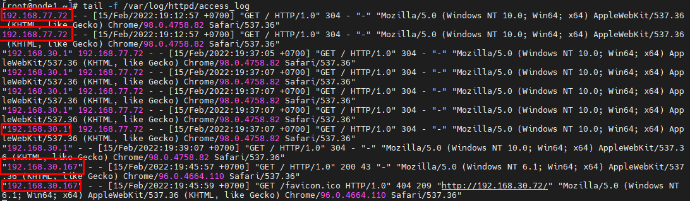

# Cấu hình Nginx làm Reverse Proxy cho Nginx. 


## 1. Mô hình mạng
## 2. Các bước thực hiện

### 1. Cài đặt Web server: Nginx

> Thực hiện trên node 1 và node 2

Install the prerequisites:
```
yum install yum-utils -y
```
Thêm repo:

```
echo '[nginx-stable]
name=nginx stable repo
baseurl=http://nginx.org/packages/centos/$releasever/$basearch/
gpgcheck=1
enabled=1
gpgkey=https://nginx.org/keys/nginx_signing.key
module_hotfixes=true

[nginx-mainline]
name=nginx mainline repo
baseurl=http://nginx.org/packages/mainline/centos/$releasever/$basearch/
gpgcheck=1
enabled=0
gpgkey=https://nginx.org/keys/nginx_signing.key
module_hotfixes=true' >> /etc/yum.repos.d/nginx.repo
```
use mainline nginx packages:
```
yum-config-manager --enable nginx-mainline
```
install nginx:
```
yum install nginx -y
```

Cấu hình firewall:
```
firewall-cmd --zone=public --permanent --add-port=80/tcp
firewall-cmd --zone=public --permanent --add-port=443/tcp
firewall-cmd --reload
```
Khởi động dịch vụ:
```
systemctl start nginx
systemctl enable nginx
```


### 3.Cài đặt Nginx

> Trên node 3

Install the prerequisites:
```
yum install yum-utils -y
```
Thêm repo:

```
echo '[nginx-stable]
name=nginx stable repo
baseurl=http://nginx.org/packages/centos/$releasever/$basearch/
gpgcheck=1
enabled=1
gpgkey=https://nginx.org/keys/nginx_signing.key
module_hotfixes=true

[nginx-mainline]
name=nginx mainline repo
baseurl=http://nginx.org/packages/mainline/centos/$releasever/$basearch/
gpgcheck=1
enabled=0
gpgkey=https://nginx.org/keys/nginx_signing.key
module_hotfixes=true' >> /etc/yum.repos.d/nginx.repo
```
use mainline nginx packages:
```
yum-config-manager --enable nginx-mainline
```
install nginx:
```
yum install nginx -y
```

Cấu hình firewall:
```
firewall-cmd --zone=public --permanent --add-port=80/tcp
firewall-cmd --zone=public --permanent --add-port=443/tcp
firewall-cmd --reload
```
Khởi động dịch vụ:
```
systemctl start nginx
systemctl enable nginx
```
Backup file cấu hình `/etc/nginx/nginx.conf`
```
cp /etc/nginx/nginx.conf /etc/nginx/nginx.conf.bak
```
Tạo 1 file `cong1.world.conf` trong thư mục : `/etc/nginx/conf.d/`
```
echo 'server {
        listen      80;
        #listen      [::]:80;
        server_name cong1.world www.cong1.world;

        proxy_redirect           off;
        proxy_set_header         X-Real-IP $remote_addr;
        proxy_set_header         X-Forwarded-For $proxy_add_x_forwarded_for;
        proxy_set_header         Host $http_host;

        location / {
            proxy_pass http://192.168.77.70/;
        }

    }' >> /etc/nginx/conf.d/cong1.world.conf
```

Kiểm tra cú pháp (syntax) cấu hình:
```
nginx -t
```

Kết quả:
```
[root@node3 ~]# nginx -t
nginx: the configuration file /etc/nginx/nginx.conf syntax is ok
nginx: configuration file /etc/nginx/nginx.conf test is successful
```

Khởi động lại dịch vụ:
```
nginx -s reload
```
hoặc
```
systemctl restart nginx
```

Câu lệnh kết hợp:
```
nginx -t && nginx -s reload
```

### 5. Kiểm tra:
**Truy cập:** http://

- Kết quả:


- Log:



**Truy cập:** http://

# Tài liệu tham khảo:

1. https://www.server-world.info/en/note?os=CentOS_7&p=nginx&f=6
2. https://docs.nginx.com/nginx/admin-guide/web-server/reverse-proxy/