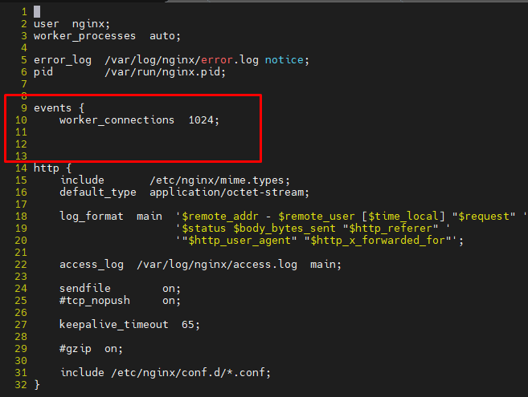
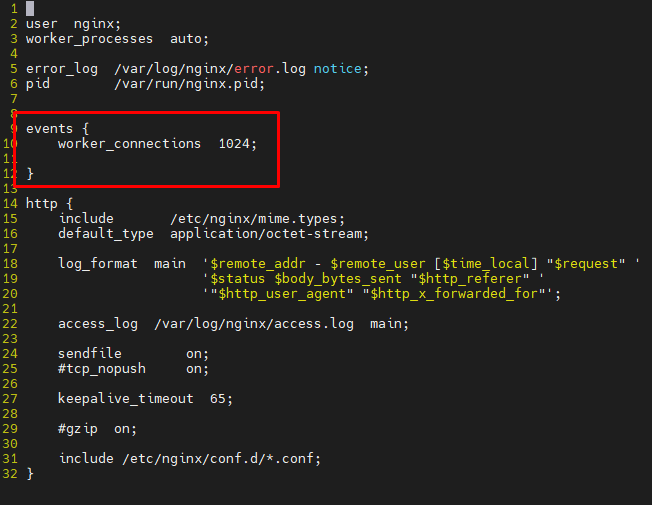
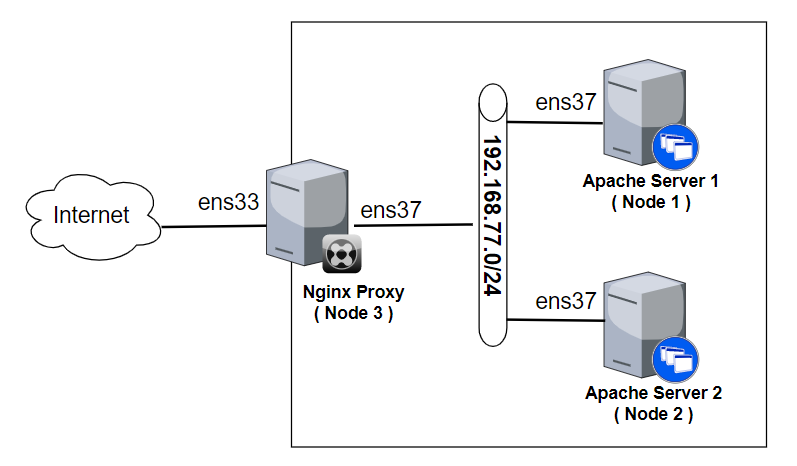
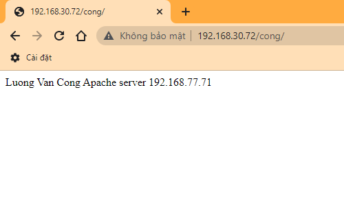
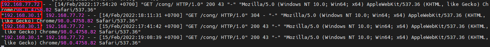

# Cấu hình Nginx làm Reverse Proxy cho Apache. Kiểm chứng `location`


- [Cấu hình Nginx làm Reverse Proxy cho Apache. Kiểm chứng `location`](#cấu-hình-nginx-làm-reverse-proxy-cho-apache-kiểm-chứng-location)
  - [I. Tổng quan](#i-tổng-quan)
    - [1. Kiểm soát các quá trình Nginx trong thời gian chạy:](#1-kiểm-soát-các-quá-trình-nginx-trong-thời-gian-chạy)
    - [2. Lệnh kiểm tra cú pháp (syntax) cấu hình:](#2-lệnh-kiểm-tra-cú-pháp-syntax-cấu-hình)
    - [3. Các biến đại diện cho các trường header trong request của client](#3-các-biến-đại-diện-cho-các-trường-header-trong-request-của-client)
  - [II. Lab](#ii-lab)
    - [1.Mô hình mạng](#1mô-hình-mạng)
    - [2. Cài đặt Apache Server](#2-cài-đặt-apache-server)
    - [3.Cài đặt Nginx](#3cài-đặt-nginx)
    - [4. Cấu hình log Apache Server](#4-cấu-hình-log-apache-server)
    - [5. Kiểm tra:](#5-kiểm-tra)
- [Tài liệu tham khảo:](#tài-liệu-tham-khảo)
## I. Tổng quan
### 1. Kiểm soát các quá trình Nginx trong thời gian chạy:
**Các lệnh kiểm soát (Controlling NGINX):**
Để tải lại cấu hình của mình,ta có thể:
- khởi động (restart) lại Nginx
    ```
    systemctl restart nginx
    ```
- gửi tín hiệu (signal) tới quy trình chính (master).


Một signal có thể được gửi bằng lệnh `nginx` với đối số `-s`
- Cú pháp:
```
nginx -s <SIGNAL>
```
- Trong đó: `<SIGNAL>` có thể là:
    - `quit` - Shut down gracefully (signal `SIGQUIT`)
    - `reload` - tải lại tệp cấu hình (signal `SIGHUP`)
    - `reopen` - Reopen log files (signal SIGUSR1)
    - `stop` - Shut down immediately (hoặc tắt nhanh, signal SIGTERM )


Thực hiện lệnh:
```
nginx -s reload
```
Khi đó trong tệp log sẽ có dòng:
```
2022/02/19 20:27:22 [notice] 7904#7904: signal process started

2022/02/19 20:27:22 [notice] 7598#7598: signal 1 (SIGHUP) received from 7904, reconfiguring
2022/02/19 20:27:22 [notice] 7598#7598: reconfiguring
2022/02/19 20:27:22 [notice] 7598#7598: using the "epoll" event method
2022/02/19 20:27:22 [notice] 7598#7598: start worker processes
2022/02/19 20:27:22 [notice] 7598#7598: start worker process 7905
2022/02/19 20:27:22 [notice] 7903#7903: gracefully shutting down
2022/02/19 20:27:22 [notice] 7903#7903: exiting
2022/02/19 20:27:22 [notice] 7903#7903: exit
2022/02/19 20:27:22 [notice] 7598#7598: signal 17 (SIGCHLD) received from 7903
2022/02/19 20:27:22 [notice] 7598#7598: worker process 7903 exited with code 0
2022/02/19 20:27:22 [notice] 7598#7598: signal 29 (SIGIO) received
```
### 2. Lệnh kiểm tra cú pháp (syntax) cấu hình:
- Cú pháp:
```
nginx -t
```

Ví dụ:
- Lỗi thiếu `}` trong 


- Kiểm tra có lỗi syntax không:
```
[root@node3 nginx]# nginx -t
nginx: [emerg] "http" directive is not allowed here in /etc/nginx/nginx.conf:14
nginx: configuration file /etc/nginx/nginx.conf test failed
```
- Sửa lỗi:


- Kiểm tra lại:
```
[root@node3 nginx]# nginx -t
nginx: the configuration file /etc/nginx/nginx.conf syntax is ok
nginx: configuration file /etc/nginx/nginx.conf test is successful
```
### 3. Các biến đại diện cho các trường header trong request của client

- `$remote_addr` : chứa địa chỉ của client
- `$remote_port` : chứa port của client

Để xem thêm các biến khác: https://nginx.org/en/docs/http/ngx_http_core_module.html#variables
## II. Lab
### 1.Mô hình mạng



Mô hình IP:


Đặt tên host:
```
hostnamectl set-hostname node1
```
```
hostnamectl set-hostname node2
```
```
hostnamectl set-hostname node3
```

### 2. Cài đặt Apache Server

> Trên node 1

Cài đặt Httpd:
```
yum install -y httpd
```
Cấu hình firewall:
```
firewall-cmd --zone=public --permanent --add-port=80/tcp
firewall-cmd --reload
```

Khởi động dịch vụ:
```
systemctl start httpd
systemctl enable httpd
```

Tạo trang test đơn giản:
```
echo 'Luong Van Cong
Apache server 192.168.77.70 ' >> /var/www/html/index.html
```

>Trên node 2

Cài đặt Httpd:
```
yum install -y httpd
```
Cấu hình firewall:
```
firewall-cmd --zone=public --permanent --add-port=80/tcp
firewall-cmd --reload
```

Khởi động dịch vụ:
```
systemctl start httpd
systemctl enable httpd
```

Tạo trang test đơn giản:
```
mkdir /var/www/html/cong

echo 'Luong Van Cong
Apache server 192.168.77.71 ' >> /var/www/html/cong/index.html
```

### 3.Cài đặt Nginx

> Trên node 3

Install the prerequisites:
```
yum install yum-utils -y
```
Thêm repo:

```
echo '[nginx-stable]
name=nginx stable repo
baseurl=http://nginx.org/packages/centos/$releasever/$basearch/
gpgcheck=1
enabled=1
gpgkey=https://nginx.org/keys/nginx_signing.key
module_hotfixes=true

[nginx-mainline]
name=nginx mainline repo
baseurl=http://nginx.org/packages/mainline/centos/$releasever/$basearch/
gpgcheck=1
enabled=0
gpgkey=https://nginx.org/keys/nginx_signing.key
module_hotfixes=true' >> /etc/yum.repos.d/nginx.repo
```
use mainline nginx packages:
```
yum-config-manager --enable nginx-mainline
```
install nginx:
```
yum install nginx -y
```

Cấu hình firewall:
```
firewall-cmd --zone=public --permanent --add-port=80/tcp
firewall-cmd --zone=public --permanent --add-port=443/tcp
firewall-cmd --reload
```
Khởi động dịch vụ:
```
systemctl start nginx
systemctl enable nginx
```
Backup file cấu hình `/etc/nginx/nginx.conf`
```
cp /etc/nginx/nginx.conf /etc/nginx/nginx.conf.bak
```
Tạo 1 file test.conf trong thư mục : `/etc/nginx/conf.d/`
```
echo 'server {
        listen      80 default_server;
        #listen      [::]:80 default_server;

        proxy_redirect           off;
        proxy_set_header         X-Real-IP $remote_addr;
        proxy_set_header         X-Forwarded-For $proxy_add_x_forwarded_for;
        proxy_set_header         Host $http_host;

        location / {
            proxy_pass http://192.168.77.70/;
        }

        location /cong {
            proxy_pass http://192.168.77.71/cong/;
        }
    }' >> /etc/nginx/conf.d/test.conf
```

Trong đó: 
```
location / {
    proxy_pass http://192.168.77.70/;
}
```
- Người dùng truy cập `http://192.168.30.72/`, URI sẽ được chuyển đến máy chủ Apache: `http://192.168.77.70/index.html`
```
location /cong {
    proxy_pass http://192.168.77.71/cong/;
}
```
- Người dùng truy cập `http://192.168.30.72/cong/`, request của client sẽ được chuyển đến máy chủ Apache: `http://192.168.77.71/cong/index.html`

```
proxy_set_header         X-Real-IP $remote_addr;
```
- Real IP của client sẽ được gán vào biến `$remote_addr`, sau đó được gửi tới server Apache.

```
proxy_set_header         X-Forwarded-For $proxy_add_x_forwarded_for;
```
- `proxy_set_header X-Forwarded-For`: Để ghi nhận địa chỉ IP thực của client vào backend web server, chúng ta sử dụng tham số: “proxy_set_header X-Forwarded-For”

```
proxy_set_header Host $host
```
- Dùng để định nghĩa lại trường Host request header mà truyền đến backend khi mà cached được enable trên nginx . $host bằng giá trị server_name trong trường Host request header.


- `proxy_redirect off;` : tắt chức năng proxy_redirect. Xem chi tiết tại: http://nginx.org/en/docs/http/ngx_http_proxy_module.html#proxy_redirect


Kiểm tra cú pháp (syntax) cấu hình:
```
nginx -t
```

Kết quả:
```
[root@node3 ~]# nginx -t
nginx: the configuration file /etc/nginx/nginx.conf syntax is ok
nginx: configuration file /etc/nginx/nginx.conf test is successful
```

Khởi động lại dịch vụ:
```
nginx -s reload
```
hoặc
```
systemctl restart nginx
```

Câu lệnh kết hợp:
```
nginx -t && nginx -s reload
```
### 4. Cấu hình log Apache Server
> Trên cả node 1 và node 2

```
vi /etc/httpd/conf/httpd.conf
```
- Để hiển thị IP người dùng truy cập qua Nginx Proxy. Sửa dòng 196:
```
LogFormat "\"%{X-Forwarded-For}i\" %l %u %t \"%r\" %>s %b \"%{Referer}i\" \"%{User-Agent}i\"" combined
```

- Để che IP người dùng truy cập qua Nginx Proxy. Sửa dòng 196 thành:
```
LogFormat "%h %l %u %t \"%r\" %>s %b \"%{Referer}i\" \"%{User-Agent}i\"" combined
```

Trong đó:
- %h: địa chỉ của máy client
- %l: nhận dạng người dùng được xác định bởi identd (thường không SD vì không tin cậy)
- %u: tên người dung được xác định bằng xác thức HTTP
- %t: thời gian yêu cầu được nhận
- %r: là yêu cầu từ người sử dụng (client)
- %>s: mã trạng thái được gửi từ máy chủ đến máy khách
- %b: kích cỡ phản hồi đối với client
- Refer: tiêu đề Refeer của yêu cầu HTTP (chứa URL của trang mà yêu cầu này được khởi tạo)
- User_agent: chuỗi xác định trình duyệt
### 5. Kiểm tra:
**Truy cập:** http://192.168.30.72

- Kết quả:


- Log:


**Truy cập:** http://192.168.30.72/cong

- Kết quả:


- Log: `tail -f /var/log/httpd/access_log`
  


# Tài liệu tham khảo:

1. https://www.server-world.info/en/note?os=CentOS_7&p=nginx&f=6
2. https://docs.nginx.com/nginx/admin-guide/web-server/reverse-proxy/