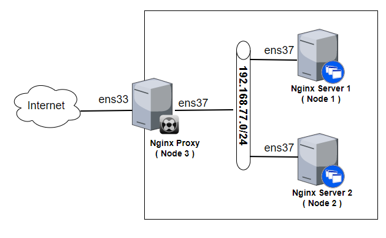
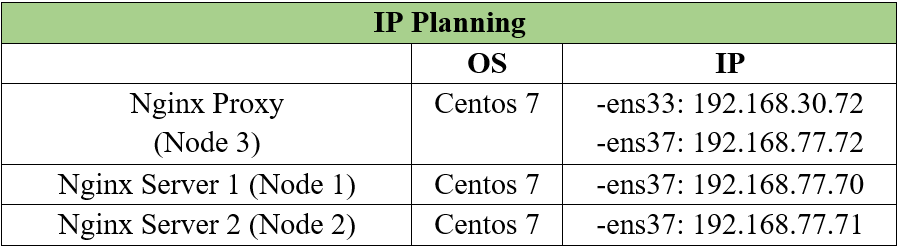
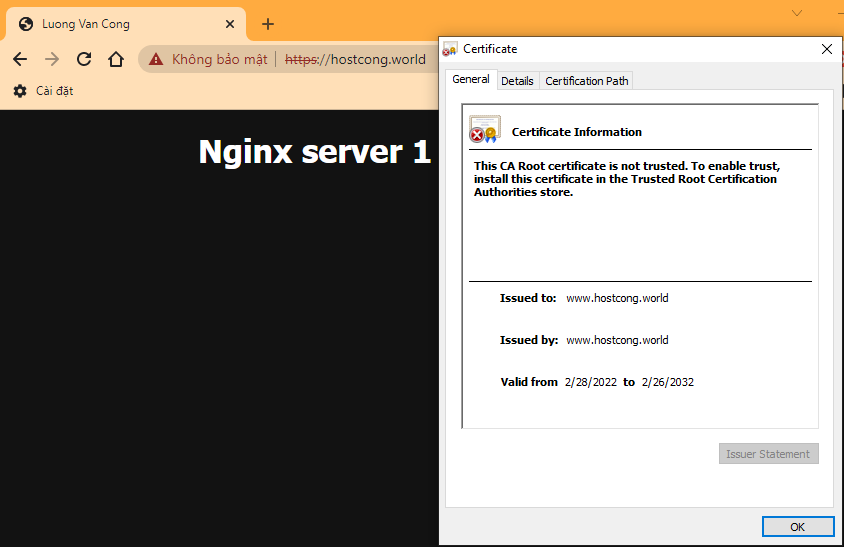

# Cấu hình ssl self-signed cho nginx


Bài này tiếp tục thực hiện từ bài lab: [Cấu hình nginx proxy](./nginx-proxy-2.md)

Mục lục

- [Cấu hình ssl self-signed cho nginx](#cấu-hình-ssl-self-signed-cho-nginx)
  - [Mô hình mạng](#mô-hình-mạng)
  - [Tạo chứng chỉ ssl self-signed](#tạo-chứng-chỉ-ssl-self-signed)
  - [Cấu hình Nginx sử dụng SSL](#cấu-hình-nginx-sử-dụng-ssl)
  - [Kiểm tra kết quả](#kiểm-tra-kết-quả)
- [Tài liệu tham khảo](#tài-liệu-tham-khảo)


## Mô hình mạng





## Tạo chứng chỉ ssl self-signed

> Trên nginx proxy

Di chuyển đến nơi lưu chứng chỉ:
```
cd /etc/pki/tls/certs
```

Tạo khoá bí mật cho nginx:
```
make server.key
```
Out:
```
[root@node3 certs]# make server.key
umask 77 ; \
/usr/bin/openssl genrsa -aes128 2048 > server.key
Generating RSA private key, 2048 bit long modulus
.+++
.............................+++
e is 65537 (0x10001)
Enter pass phrase: #đặt cụm mật khẩu bảo mật cho key
Verifying - Enter pass phrase: #nhập lại
```

Xoá  passphrase vừa nhập khỏi private:
```
openssl rsa -in server.key -out server.key
```

Out:
```
[root@node3 certs]# openssl rsa -in server.key -out server.key
Enter pass phrase for server.key: #nhâp passphrase
writing RSA key
```

Tạo csr:
```
make server.csr
```

Out:
```
[root@node3 certs]# make server.csr
umask 77 ; \
/usr/bin/openssl req -utf8 -new -key server.key -out server.csr
You are about to be asked to enter information that will be incorporated
into your certificate request.
What you are about to enter is what is called a Distinguished Name or a DN.
There are quite a few fields but you can leave some blank
For some fields there will be a default value,
If you enter '.', the field will be left blank.
-----
Country Name (2 letter code) [XX]:VN 
State or Province Name (full name) []:Ha Noi
Locality Name (eg, city) [Default City]:Thanh Tri
Organization Name (eg, company) [Default Company Ltd]:KMA
Organizational Unit Name (eg, section) []:AT14
Common Name (eg, your name or your server's hostname) []:www.hostcong.world
Email Address []:luongvancong070129@gmail.com

Please enter the following 'extra' attributes
to be sent with your certificate request
A challenge password []: #Enter
An optional company name []: #Enter
```
Tạo và ký chứng chỉ:
```
openssl x509 -in server.csr -out server.crt -req -signkey server.key -days 3650
```

Out:
```
[root@node3 certs]# openssl x509 -in server.csr -out server.crt -req -signkey server.key -days 3650
Signature ok
subject=/C=VN/ST=Ha Noi/L=Thanh Tri/O=KMA/OU=AT14/CN=www.hostcong.world/emailAddress=luongvancong070129@gmail.com
Getting Private key
```

Trong đó:
- **openssl** : Đây là câu lệnh lệnh cơ bản để tạo và quản lý chứng chỉ OpenSSL, khóa và các tệp khác.
- **-x509** : Đây là tiêu chuẩn cơ sở hạ tầng khóa công khai mà SSL và TLS tuân thủ để quản lý khóa và chứng chỉ của nó.
- **-days 3650** : Tùy chọn đặt khoảng thời gian mà chứng chỉ sẽ được coi là hợp lệ. Ở đây là 10 năm.
- **rsa** :  yêu cầu nó tạo một khóa **RSA**
- **-keyout** : Nơi đặt tệp khóa riêng private đã tạo.
- **-out** : Nơi đặt chứng chỉ đang tạo.


Khoá riêng và chứng chỉ đã được đặt trong thư mục con của thư mục:`/etc/pki/tls/certs`

## Cấu hình Nginx sử dụng SSL

Cấu hình trong file config : `/etc/nginx/nginx.conf`

```
vi /etc/nginx/nginx.conf
```

Sửa Server Block:
```
    server {
        server_name www.hostcong.world hostcong.world;
        #listen      [::]:80;
        #listen      80;
        listen 443 ssl;

        #config ssl
        ssl_certificate      /etc/pki/tls/certs/server.crt;
        ssl_certificate_key  /etc/pki/tls/certs/server.key;
        ssl_prefer_server_ciphers on;
        ssl_protocols           TLSv1 TLSv1.1 TLSv1.2;
        ssl_ciphers             HIGH:!aNULL:!MD5;

        include /etc/nginx/conf.d/*.conf;
}
```
Trong đó:
- Nơi lưu trữ của khoá riêng và chứng chỉ:
``` 
ssl_certificate      /etc/pki/tls/certs/server.crt;
ssl_certificate_key  /etc/pki/tls/certs/server.key;
```
- Yêu cầu client sử dụng các phiên bản:TLSv1 TLSv1.1 TLSv1.2 và mật mã của ssl/tls khi thiết lập kết nối
```
ssl_protocols           TLSv1 TLSv1.1 TLSv1.2;
ssl_ciphers             HIGH:!aNULL:!MD5;
```

Kiểm tra và khởi động lại file cấu hình:
```
nginx -t && nginx -s reload
```

Cấu hình Firewalld cho phép dịch vụ HTTPS:
```
firewall-cmd --add-service=https --permanent
firewall-cmd --reload
```

## Kiểm tra kết quả
Truy cập: https://hostcong.world




# Tài liệu tham khảo
1. https://www.server-world.info/en/note?os=CentOS_7&p=ssl
2. https://www.server-world.info/en/note?os=CentOS_7&p=nginx&f=4
3. https://docs.nginx.com/nginx/admin-guide/security-controls/terminating-ssl-http/