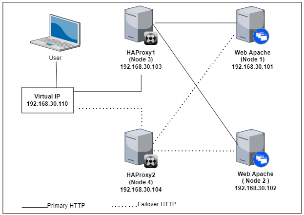
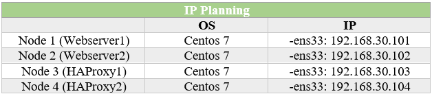

# Haproxy Keepalive cho Apache trên CentOS 7

- [Haproxy Keepalive cho Apache trên CentOS 7](#haproxy-keepalive-cho-apache-trên-centos-7)
  - [I.Tổng quan](#itổng-quan)
  - [II. Triển khai](#ii-triển-khai)
    - [1. Mô hình](#1-mô-hình)
    - [2. Cài đặt Apache](#2-cài-đặt-apache)
    - [3. Cài đặt Keepalive](#3-cài-đặt-keepalive)
    - [4. Cài đặt HAProxy](#4-cài-đặt-haproxy)
  - [Tài liệu tham khảo](#tài-liệu-tham-khảo)

## I.Tổng quan
Bài này cấu hình cho bộ cân bằng tải, trong trường hợp này là HAProxy. Bộ cân bằng tải được gắn 1 địa chỉ IP ảo cho Webserver Apache và được trỏ đến 1 trong nhiều thiết bị Webserver đằng sau bộ cân bằng tải theo kiểu vòng tròn.

Ngoài ra, cấu hình 2 máy chủ HAProxy ở chế độ active-passive, trong đó 1 máy chủ dự phòng. Quá trình chuyển đổi được thực hiện bởi keepalived deamon. Keepalived giám sát tình trạng hoạt động của bộ cân bằng tải và trong trường hợp bị lỗi, IP ảo sẽ được chuyển đến cân bằng tải thụ passive, sau đó sẽ trờ thành active.
=> Virtual IP được định bởi cấu hình `keepalived`.

Virtual IP là địa chỉ IP duy nhất được sử dụng làm điểm truy cập vào giao diện người dùng của thiết bị Webserver Apache và được cấu hình trong cấu hình của HAProxy cũng với cấu hình cân bằng tải. Khi người dùng cuối truy cập vào IP ảo, IP đó sẽ chuyển hướng lưu lượng truy cập đến thiết bị webserver Apache thích hợp dựa trên chính sách HAProxy đã cấu hình.
## II. Triển khai
Cấu hình này sử dụng 2 máy chủ HAProxy vào 1 Virtual IP (được cấu hình bởi `keepalive`).
### 1. Mô hình



Địa chỉ IP: VIP: `192.168.30.110`


### 2. Cài đặt Apache

Trên node1:
```
yum install httpd -y
echo '<h1>Web server 1</h1>' > /var/www/html/index.html

systemctl start httpd
systemctl enable httpd
```
Trên node2:
```
yum install httpd -y
echo '<h1>Web server 2</h1>' > /var/www/html/index.html

systemctl start httpd
systemctl enable httpd
```

Kiểm tra trên 2 máy chủ web:


### 3. Cài đặt Keepalive
Trên node 3:
```
yum install keepalived -y

cp /etc/keepalived/keepalived.conf /etc/keepalived/keepalived.conf.bak

echo 'vrrp_script chk_haproxy {
script "killall -0 haproxy" # check the haproxy process
interval 2 # every 2 seconds
weight 2 # add 2 points if OK
}
vrrp_instance VI_1 {
interface ens33             # interface to monitor
state MASTER             # MASTER on haproxy1, BACKUP on haproxy2
virtual_router_id 51
priority 101             # 101 on haproxy1, 100 on haproxy2
virtual_ipaddress {
192.168.30.110/24 # virtual ip address
}
track_script {
chk_haproxy
}
}' > /etc/keepalived/keepalived.conf
```

Trên node 4:
```
yum install keepalived -y

cp /etc/keepalived/keepalived.conf /etc/keepalived/keepalived.conf.bak

echo 'vrrp_script chk_haproxy {
script "killall -0 haproxy" # check the haproxy process
interval 2 # every 2 seconds
weight 2 # add 2 points if OK
}
vrrp_instance VI_1 {
interface ens33             # interface to monitor
state BACKUP             # MASTER on haproxy1, BACKUP on haproxy2
virtual_router_id 51
priority 100             # 101 on haproxy1, 100 on haproxy2
virtual_ipaddress {
192.168.30.110/24 # virtual ip address
}
track_script {
chk_haproxy
}
}' > /etc/keepalived/keepalived.conf
```

Trên cả hai máy chủ, hãy định cấu hình chuyển tiếp IP (IP forwarding) và liên kết không cục bộ (non-local binding) bằng cách thêm phần sau vào tệp `sysctl.conf`. Để dịch vụ keepalived chuyển tiếp các gói mạng đúng cách đến các máy chủ thực, mỗi nút bộ định tuyến phải được bật chuyển tiếp IP trong nhân (kernel).

> Thực hiện trên cả node 3 và node 4

```
echo 'net.ipv4.ip_forward = 1
net.ipv4.ip_nonlocal_bind = 1' >> /etc/sysctl.conf
```

Kiểm tra cài đặt `sysctl.conf` đã đưỢc lưu trên server:

```
sysctl -p
```
Kết quả:
```
[root@node3 ~]# sysctl -p
net.ipv4.ip_forward = 1
net.ipv4.ip_nonlocal_bind = 1
```

Khởi động dịch vụ keepalived
```
systemctl start keepalived
systemctl enable keepalived
```

### 4. Cài đặt HAProxy

> Thực hiện trên node 3 và node 4


```
yum install haproxy -y

cp /etc/haproxy/haproxy.cfg /etc/haproxy/haproxy.cfg.bak

echo 'global
    log                 127.0.0.1 local0
    chroot              /var/lib/haproxy
    pidfile             /var/run/haproxy.pid
    maxconn         4000
    user                haproxy
    group               haproxy
    daemon
defaults
    mode                        http
    log                         global
    option                      httplog
    option                      dontlognull
    option             http-server-close
    option     forwardfor       except 127.0.0.0/8
    option                      redispatch
    retries                     3
    timeout http-request    10s
    timeout queue           1m
    timeout connect         10s
    timeout client              1m
    timeout server          1m
    timeout http-keep-alive     10s
    timeout check           10s

# define frontend ( set any name for "http-in" section )
frontend http-in
      # listen 80
    bind *:80
      # set default apache
    default_backend    apache_servers
      # send X-Forwarded-For header
    option             forwardfor

# define apache
backend apache_servers
      # balance with roundrobin
    balance            roundrobin
      # define apache servers
    server             node1 192.168.30.101:80 check
    server             node2 192.168.30.102:80 check' > /etc/haproxy/haproxy.cfg
```
Khởi động dịch vụ HAProxy:
```
systemctl start haproxy
systemctl enable haproxy
```
Cấu hình Rsyslg để lấy nhật ký cho HAProxy
```
cp /etc/rsyslog.conf /etc/rsyslog.conf.bak

sed -i "s/#\$ModLoad imudp/\$ModLoad imudp/g" /etc/rsyslog.conf
sed -i "s/#\$UDPServerRun 514/\$UDPServerRun 514/g" /etc/rsyslog.conf
echo '$AllowedSender UDP, 127.0.0.1' >> /etc/rsyslog.conf

sed -i "s/*.info;mail.none;authpriv.none;cron.none/*.info;mail.none;authpriv.none;cron.none,local2.none/g" /etc/rsyslog.conf
echo 'local2.*                                                /var/log/haproxy.log' >> /etc/rsyslog.conf
```

Khởi động dịch vụ
```
systemctl restart rsyslog
```


> Thực hiện trên node 1 và node 2

```
vi /etc/httpd/conf/httpd.conf
```

Thay dòng 196 thành:
```
LogFormat "\"%{X-Forwarded-For}i\" %l %u %t \"%r\" %>s %b \"%{Referer}i\" \"%{User-Agent}i\"" combined
```

Khởi động lại dịch vụ:
```
systemctl restart httpd
```

## Tài liệu tham khảo
1. https://viblo.asia/p/trien-khai-dich-vu-high-available-voi-keepalived-haproxy-tren-server-ubuntu-jOxKdqWlzdm
2. https://blog.cloud365.vn/linux/haproxy-keepalived-apache/#phan-1-chuan-bi
3. https://www.server-world.info/en/note?os=CentOS_7&p=haproxy&f=1
4. https://access.redhat.com/documentation/en-us/red_hat_cloudforms/4.5/html/high_availability_guide/configuring_haproxy