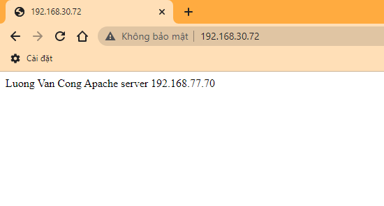

# Cấu hình Nginx làm Reverse Proxy cho Apache. Cấu hình log Apache IP cho phép nhận IP user truy cập qua Nginx Proxy.


- [Cấu hình Nginx làm Reverse Proxy cho Apache. Cấu hình log Apache IP cho phép nhận IP user truy cập qua Nginx Proxy.](#cấu-hình-nginx-làm-reverse-proxy-cho-apache-cấu-hình-log-apache-ip-cho-phép-nhận-ip-user-truy-cập-qua-nginx-proxy)
  - [1.Mô hình mạng](#1mô-hình-mạng)
  - [2. Cài đặt Apache Server](#2-cài-đặt-apache-server)
  - [3.Cài đặt Nginx](#3cài-đặt-nginx)
  - [4. Cấu hình log Apache Server](#4-cấu-hình-log-apache-server)
  - [5. Kiểm tra:](#5-kiểm-tra)
- [Tài liệu tham khảo:](#tài-liệu-tham-khảo)

## 1.Mô hình mạng


Mô hình IP:


Đặt tên host:
```
hostname set-hostname node1
```
```
hostname set-hostname node2
```
```
hostname set-hostname node3
```

## 2. Cài đặt Apache Server

> Trên node 1

Cài đặt Httpd:
```
yum install -y httpd
```
Cấu hình firewall:
```
firewall-cmd --zone=public --permanent --add-port=80/tcp
firewall-cmd --reload
```

Khởi động dịch vụ:
```
systemctl start httpd
systemctl enable httpd
```

Tạo trang test đơn giản:
```
echo 'Luong Van Cong
Apache server 192.168.77.70 ' >> /var/www/html/index.html
```

>Trên node 2

Cài đặt Httpd:
```
yum install -y httpd
```
Cấu hình firewall:
```
firewall-cmd --zone=public --permanent --add-port=80/tcp
firewall-cmd --reload
```

Khởi động dịch vụ:
```
systemctl start httpd
systemctl enable httpd
```

Tạo trang test đơn giản:
```
mkdir /var/www/html/cong

echo 'Luong Van Cong
Apache server 192.168.77.71 ' >> /var/www/html/index.html
```

## 3.Cài đặt Nginx

> Trên node 3

Install the prerequisites:
```
yum install yum-utils -y
```
Thêm repo:

```
echo '[nginx-stable]
name=nginx stable repo
baseurl=http://nginx.org/packages/centos/$releasever/$basearch/
gpgcheck=1
enabled=1
gpgkey=https://nginx.org/keys/nginx_signing.key
module_hotfixes=true

[nginx-mainline]
name=nginx mainline repo
baseurl=http://nginx.org/packages/mainline/centos/$releasever/$basearch/
gpgcheck=1
enabled=0
gpgkey=https://nginx.org/keys/nginx_signing.key
module_hotfixes=true' >> /etc/yum.repos.d/nginx.repo
```
use mainline nginx packages:
```
yum-config-manager --enable nginx-mainline
```
install nginx:
```
yum install nginx -y
```

Cấu hình firewall:
```
firewall-cmd --zone=public --permanent --add-port=80/tcp
firewall-cmd --zone=public --permanent --add-port=443/tcp
firewall-cmd --reload
```
Khởi động dịch vụ:
```
systemctl start nginx
systemctl enable nginx
```
Backup file cấu hình `/etc/nginx/nginx.conf`
```
cp /etc/nginx/nginx.conf /etc/nginx/nginx.conf.bak
```
Tạo 1 file test.conf trong thư mục : `
```
echo 'server {
        listen      80 default_server;
        listen      [::]:80 default_server;

        proxy_redirect           off;
        proxy_set_header         X-Real-IP $remote_addr;
        proxy_set_header         X-Forwarded-For $proxy_add_x_forwarded_for;
        proxy_set_header         Host $http_host;

        location / {
            proxy_pass http://192.168.77.70/;
        }

        location /cong {
            proxy_pass http://192.168.77.71/cong/;
        }
    }' >> /etc/nginx/conf.d/test.conf
```

Trong đó: 
- **Chuyển request tới máy chủ được uỷ quyền:**
```
location /some/path/ {
    proxy_pass http://www.example.com/link/;
}
```

- Cấu hình ví dụ này dẫn đến việc chuyển tất cả các yêu cầu được xử lý ở vị trí này đến máy chủ được ủy quyền tại địa chỉ được chỉ định. Địa chỉ này có thể được chỉ định dưới dạng tên miền hoặc địa chỉ IP. Địa chỉ cũng có thể bao gồm một cổng.
- **Lưu ý** rằng trong ví dụ đầu tiên ở trên, địa chỉ của máy chủ được ủy quyền được theo sau bởi một URI `/link/`,. Nếu URI được chỉ định cùng với địa chỉ, nó sẽ thay thế một phần của URI yêu cầu phù hợp với tham số vị trí. Ví dụ, ở đây yêu cầu với /some/path/page.htmlURI sẽ được ủy quyền http://www.example.com/link/page.html. 

- `proxy_set_header X-Real-IP`: Truyền Real IP của client vào header khi gửi request đến Backend Apache.
- `proxy_set_header X-Forwarded-For`: Mặc định client request thì thông tin sẽ chỉ giao tiếp với reverse proxy, vì vậy mà thông tin log của Backend server (Apache web server) sẽ chỉ nhận được là địa chỉ IP của Nginx proxy. Để ghi nhận địa chỉ IP thực của client vào backend web server, chúng ta sử dụng tham số: “proxy_set_header X-Forwarded-For”
- `proxy_set_header Host $host`: Dùng để định nghĩa lại trường Host request header mà truyền đến backend khi mà cached được enable trên nginx . $host bằng giá trị server_name trong trường Host request header.

Kiểm tra cấu hình:
```
nginx -t
```
hoặc
```
nginx -T
```
Kết quả:
```
[root@node3 ~]# nginx -t
nginx: the configuration file /etc/nginx/nginx.conf syntax is ok
nginx: configuration file /etc/nginx/nginx.conf test is successful
```

Khởi động lại dịch vụ:
```
nginx -s reload
```

## 4. Cấu hình log Apache Server
> Trên cả node 1 và node 2

```
vi /etc/httpd/conf/httpd.conf
```
- Để hiển thị IP người dùng truy cập qua Nginx Proxy. Sửa dòng 196:
```
LogFormat "\"%{X-Forwarded-For}i\" %l %u %t \"%r\" %>s %b \"%{Referer}i\" \"%{User-Agent}i\"" combined
```

- Để che IP người dùng truy cập qua Nginx Proxy. Sửa dòng 196 thành:
```
LogFormat "%h %l %u %t \"%r\" %>s %b \"%{Referer}i\" \"%{User-Agent}i\"" combined
```
## 5. Kiểm tra:
- Truy cập: http://192.168.30.72
- Kết quả:



- Truy cập: http://192.168.30.72/cong
- Kết quả:


# Tài liệu tham khảo:

1. https://www.server-world.info/en/note?os=CentOS_7&p=nginx&f=6