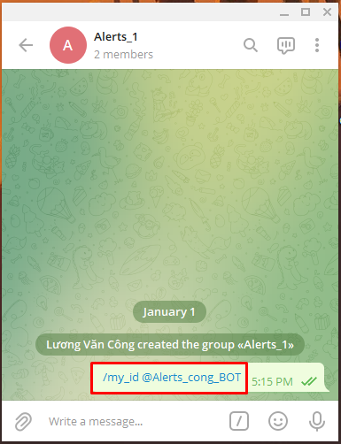

# [Bash Shell] Viết chương trình gửi tin nhắn tới Telegram

## 1. Tạo bot Telegram

Bước 1: Login vào Telegram thông qua số điện thoại

Bước 2: Tìm BotFather
Tại ô search của Telegram tìm BotFather:


Bước 3: Tạo Bot
Chat /newbot vào khung chat với BotFather để tạo:
- Đặt tên cho bot
- Đặt username cho bot

    
- Nhận được mã token:
    

## 2. Thêm Bot vào 1 Group
- Tạo group mới:

    
- Đặt tên group:

    
- Thêm bot vào group:

    

- Khởi động bot bằng cách chat: /my_id @Alerts_cong_BOT



## 3. Lấy Chat ID của group
Để gửi thông báo về Group bạn cần phải có thêm Chat ID. Sử dụng URL sau:

Bước 1:  Truy cập đường dẫn  :https://web.telegram.org

Bước 2: Truy cập vào Group mà bạn muốn lấy ID và mở đường dẫn của Group  ở trình duyệt .
Trên thanh URL hiện giống như sau: https://web.telegram.org/z/#-604968007

Bước 3: Lấy ID Group Telegram của bạn. Ở đây là: **-604968007**( đây chính là ID group )

## 4. Gửi thông báo tới Telegram
Để gửi thông báo tới Telegram bạn có thể sử dụng method GET
- Trên trình duyệt web:
```
https://api.telegram.org/bot<token>/sendMessage?chat_id=<chat_id>&text=<noi_dung>
```
Hoặc sử dụng cURL (Trên Centos 7)
```
curl -d chat_id=<chat_id> -d text="noi_dung"  https://api.telegram.org/bot<token>/sendMessage
```
## 5. Tạo script gửi tin nhắn tới 1 Group

Tạo 1 script backup có đường dẫn: **/scripts/message.sh**

```
#!/bin/bash

clear
printf "=========================================================================\n"
printf "Gui tin toi group Telegram \n"
printf "=========================================================================\n"
echo "Nhap noi dung:"
read noidung

token=5074962515:AAFkjHSKmX2nfQ6_Ge2y2c8Zvv-3LUfU5Og
ID=-604968007
url=https://api.telegram.org/bot${token}/sendMessage

curl -d chat_id=$ID -d text="$noidung" $url

clear
printf "=========================================================================\n"
printf "Gui:$noidung toi group Telegram thanh cong \n"
printf "=========================================================================\n"
```

Phân quyền thực thi cho script backup:
```
chmod +x /scripts/message.sh
```

Chạy script:
```
cd /scripts
bash message.sh
```