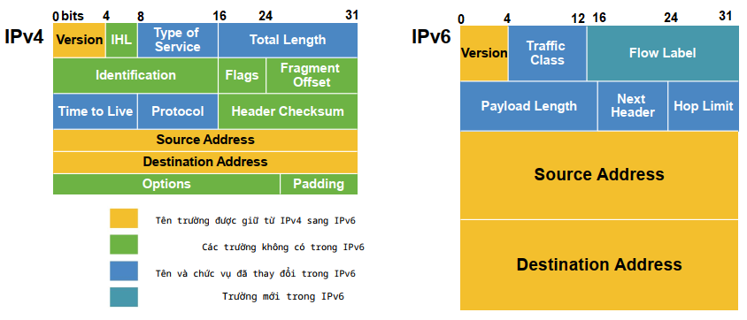
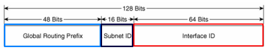
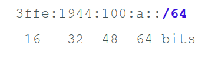
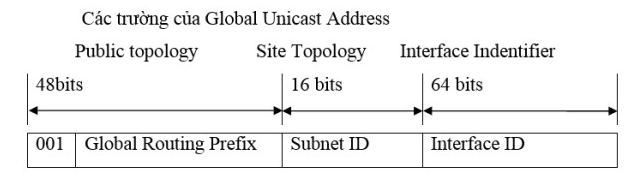
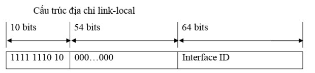

# Tìm hiểu địa chỉ IPv6

- [Tìm hiểu địa chỉ IPv6](#tìm-hiểu-địa-chỉ-ipv6)
  - [Tổng quan](#tổng-quan)
  - [Cấu trúc địa chỉ IPv6](#cấu-trúc-địa-chỉ-ipv6)
  - [Quy tắc biểu diễn:](#quy-tắc-biểu-diễn)
  - [Network Prefixes](#network-prefixes)
  - [Địa chỉ IPv6 đặc biệt](#địa-chỉ-ipv6-đặc-biệt)
    - [1. Địa chỉ IPv6 tất cả là số 0](#1-địa-chỉ-ipv6-tất-cả-là-số-0)
    - [2. IPv6 Loopback Address](#2-ipv6-loopback-address)
  - [Phân loại](#phân-loại)
    - [1. Unicast](#1-unicast)
      - [1.1. Global Unicast Address](#11-global-unicast-address)
      - [1.2 Link-local Addresses](#12-link-local-addresses)
      - [1.3 Unique Local Address](#13-unique-local-address)
    - [2. Multicast](#2-multicast)
    - [3. Anycast](#3-anycast)
  - [Tài liệu tham khảo](#tài-liệu-tham-khảo)

## Tổng quan
- Pv6, viết tắt Internet Protocol version 6", là "Giao thức liên mạng thế hệ 6", một phiên bản của giao thức IP
- Cấu trúc header của gói tin IPv6 đơn giản hơn IPv4. 

- Một số trường giữ lại, 1 số trường bỏ đi hoặc thay đổi tên:
  - Trường bỏ:IHL, Flags, Identification, Fragment Offset, Header Checksum (Kiểm tra lỗi), Options(Trường thêm thông tin về các dịch vụ tuỳ chọn khác), Padding.
  - Trường mới: Flow Label.
  - Trường tương tự: Type of Service = Traffic Class (Mức độ ưu tiên của gói tin), Payload Length, Next Header, Hop Limit.
- Điểm khác nhau:
  - Không gian địa chỉ IPv6 rất lớn (128 bit nhị phân): 2^128.
  - Sử dụng giao thức **NDP** (**N**eighbor **D**iscovery **P**rotocol) để tìm kiếm: prefix, subnetmask, phân giải địa chỉ MAC, default gateway và tìm kiếm IP trùng lặp.
  - Tự động cấu hình địa chỉ IP mà không cần sử dụng DHCP (DHCPv6 is still an option)
  - Địa chỉ IPv6 không bị phân mảnh (No en route fragmentation: only the source node can fragment)

- Các trường trong IPv6 Header
  - Version: 4 bits giúp xác định phiên bản của giao thức (mang giá trị 6).

  - Traffic Class: 8 bits giúp xác định loại lưu lượng.

  - Flow label: 20 bits giá mỗi luồng dữ liệu.

  - Payload Length: 16 bits (số dương). Giúp xác định kích thước phần tải theo sau IPv6 Header.

  - Next-Header: 8 bits giúp xác định Header tiếp theo trong gói tin.

  - Hop Limit: 8 bits (số dương). Qua mỗi node, giá trị này giảm 1 đơn vị (giảm đến 0 thì gói bị loại bỏ).

  - Source Address: mang địa chỉ IPv6 nguồn của gói tin.

  - Destination Address: mang địa chỉ IPv6 đích của gói tin.

## Cấu trúc địa chỉ IPv6
- Địa chỉ IPv6 dài 128 bit:
  - Hiển thị dưới dạng Hexadecimal (không phân biệt chữ hoa chữ thường ) từ 0000 đến FFFF.
  - Chia làm 8 octet (16bit/ octet)
  - Mỗi octet cách nhau bởi dấu hai chấm `:`;

                                X:X:X:X:X:X:X:X

  - Trong đó:
    - X: là 2 byte ở dạng hexadecimal
    - Ví dụ:
  
        `3ffe: 1944: 0100: 000a: 0000: 00bc: 2500: 0d0b`

Địa chỉ IPv6 được chia làm 3 phần:

- GRP (Global Routing Prefix): /48 được cấp cho nhà cung cấp dịch vụ (48bit) và được định tuyến toàn cầu.
- 16 Bit [Subnet ID] được nhà mạng cung cấp cho từng khác hàng.
- 64 Bit [Interface ID]: cấp cho từng host
## Quy tắc biểu diễn:
- Có 2 quy tắc để giảm kích thước địa chỉ IPv6
  -  Rule 1: Leading 0's
     -  Các bit 0 ở bên trái mõi octet sẽ bị lược bỏ
     -  Ví dụ:

        `3ffe : 1944 : 0100 : 000a : 0000 : 00bc : 2500 : 0d0b`

        ->        `3ffe : 1944 : 100 : a : 0 : bc : 2500 : d0b`

    - Rule 2: Double colon :: equals 0000...0000
      - Nếu 2 octet liên tiếp trở lên bằng 0 thì viết gọn thành 2 dấu `::` (2 dấu `::` chỉ được xuất hiện 1 lần trong địa chỉ IPv6) .

       - Ví dụ 1: 

            `ff02 : 0000 : 0000 : 0000 : 0000 : 0000 : 0000 : 0005`

            =>`ff02 : 0 : 0 : 0 : 0 : 0 : 0 : 5`

            =>      `ff02 : : 5`

      - Ví dụ 2:

        `2031 : 0517 : 0000 : 0000 : A5C7 : 0000 : 0000 : 130B`

        =>      `2031:517::A5C7:0:0:130B`

## Network Prefixes
- Tiền tố IPv6 được xác định bằng số bit:
- Ký hiệu:

## Địa chỉ IPv6 đặc biệt
### 1. Địa chỉ IPv6 tất cả là số 0
- Địa chỉ IPv6 bao gồm tất cả các số 0 có thể được viết bằng dấu `::`.

- Là dạng địa chỉ không xác định (**Unspecified address**), được sử dụng để xác nhận rằng hiện tại node không có địa chỉ, không bao giờ địa chỉ này được gắn cho giao diện hoặc sử dụng làm địa chỉ đích.

### 2. IPv6 Loopback Address
- Tương đương với 127.0.0.1 trong IPv4.
- Địa chỉ này được sử dụng khi 1 host nói chuyện với chính nó(Phạm vi node).
- Loopback or Local Host Address:
  - `0:0:0:0:0:0:0:1/128`
  or
  - `::1/128`

## Phân loại
- Địa chỉ IPv6 có 3 loại:
  - Unicast (truyền thông 1-1)
  - Multicast (truyền thông 1-nhiều)
  - Anycast (truyền thông 1-gần nhất)

### 1. Unicast
- có 3 loại:
#### 1.1. Global Unicast Address 
Tương ứng với địa chỉ public của IPv4. Nó có thể định tuyến toàn cầu trong Internet. Ipv6 được thiết kế từ nền móng của nó là hỗ trợ cho việc định tuyến và đánh địa chỉ phân cấp.

- Phần cố định có giá trị là 001. (2000::/3 đến 3FFF::/3)

- Global Routing Prefix (45 bit). Các tổ chức sẽ phân cấp quản lý vùng địa chỉ này, phân cấp chuyển giao lại cho các tổ chức khác.

- Subnet ID (16 bit). Các tổ chức có thể tự quản lý, phân bổ, cấp phát và tổ chức định tuyến bên trong mạng của mình. Với 16 bit, có thể tạo nên 65535 mạng con (subnet) hoặc nhiều cấp định tuyến phân cấp hiệu quả trong mạng của tổ chức.

- Interface ID gồm 64 bits. Là địa chỉ của Interface trong Subnet. Các địa chỉ Unicast trong nội bộ (Local Use Unicast Address):

- Link-Local Addresses : gồm các địa chỉ dùng cho các Host trong cùng Link và Neighbor Discovery Process(quy trình xác định các Nodes trong cùng Link).

- Site-Local Addresses : gồm các địa chỉ dùng để các Nodes trong cùng Site liên lạc với nhau.

#### 1.2 Link-local Addresses
Sử dụng bởi các node khi giao tiếp với các node lân cận (neighbor node). Phạm vi của dạng địa chỉ unicast này là trên một đường kết nối (phạm vi link). Địa chỉ link-local luôn được cấu hình một cách tự động,

- Địa chỉ link-local bắt đầu bởi 10 bit prefix là FE80::/10, tiếp theo là 54 bit 0, 64 bit còn lại là phần định danh giao diện (interface ID).

#### 1.3 Unique Local Address
- bắt đầu từ FC00::/7
- Giống địa chỉ IP private, chỉ sử dụng trong mạng nội bộ, không quảng bá ra ngoài internet, có thể dùng lặp lại bởi nhiều tổ chức.
### 2. Multicast
- Là địa chỉ đại diện cho 1 nhóm
- Địa chỉ multicast được cấu hình trong một nhóm multicast. Nhiều node có thể được gắn cho một nhóm multicast nhất định, và nhóm này được gắn một địa chỉ multicast. Do vậy, node thực hiện truyền dữ liệu sẽ chỉ cần xác định địa chỉ multicast này, để gửi gói tin đến mọi node trong nhóm multicast này.

- Địa chỉ multicast cũng có phạm vi: toàn cầu (global), tổ chức (organization-local), một site (site-local), link (link-local) và trong node (node-local). Phạm vi tổ chức và node là hai dạng địa chỉ mới, không có trong dạng địa chỉ unicast. Một node IPv6 có thể được gắn rất nhiều địa chỉ.

- 8 bit đầu tiên trong địa chỉ multicast luôn là 1111 1111 (FF)
- Ví dụ: FF02::1
### 3. Anycast
- Anycast là một dạng địa chỉ hoàn toàn mới trong IPv6. Dạng địa chỉ này không được gắn cho node hay giao diện, mà cho những chức năng cụ thể. Thay vì thực hiện truyền dữ liệu đến mọi node trong một nhóm như địa chỉ multicast, anycast gửi gói tin đến node gần nhất (tính theo thủ tục định tuyến) trong nhóm. Anycast không có không gian địa chỉ riêng gắn cho nó
- Nó được lấy trong vùng của địa chỉ unicast. Bởi vậy, địa chỉ anycast cũng có ba phạm vi như địa chỉ unicast. Nhưng việc sử dụng của địa chỉ anycast cũng không rõ ràng. 
## Tài liệu tham khảo

1. https://www.redbooks.ibm.com/redpapers/pdfs/redp4776.pdf
2. https://vnpro.vn/thu-vien/icmpv6-neighbor-discovery-va-mtu-path-discovery-trong-ipv6-2401.html
3. https://www.slideserve.com/errol/introduction-to-routing-ipv6-rick-graziani-computer-networking-instructor-cabrillo-college
4. https://www.rediris.es/conectividad/IPv6_addr_plan4.pdf
5. https://vnpro.vn/tin-tuc/dia-chi-unicast-trong-ipv6-1004.html