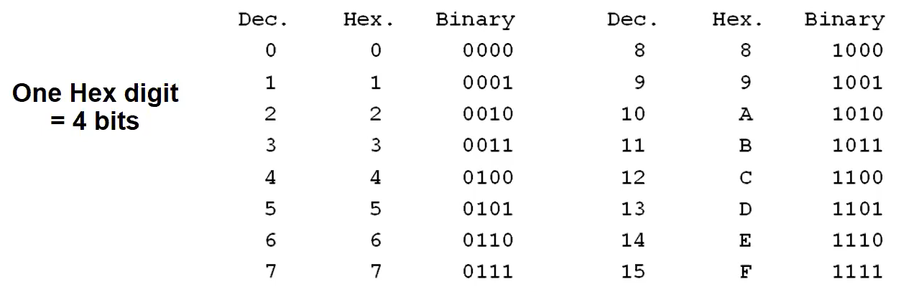
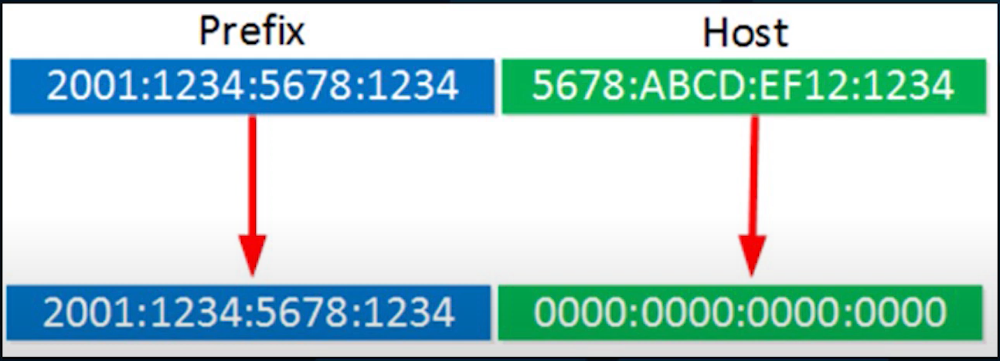
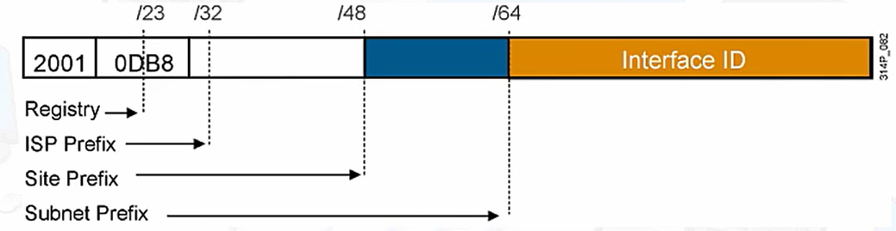
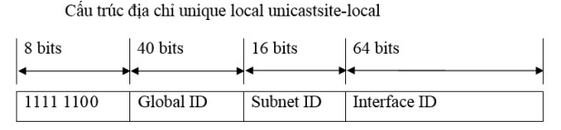
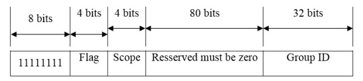

# Tìm hiểu địa chỉ IPv6

- [Tìm hiểu địa chỉ IPv6](#tìm-hiểu-địa-chỉ-ipv6)
  - [I. Tổng quan IPv6](#i-tổng-quan-ipv6)
  - [II. Cấu trúc địa chỉ IPv6](#ii-cấu-trúc-địa-chỉ-ipv6)
    - [2.1 Biểu diễn địa chỉ IPv6](#21-biểu-diễn-địa-chỉ-ipv6)
    - [2.2 Quy tắc thu gọn địa chỉ IPv6:](#22-quy-tắc-thu-gọn-địa-chỉ-ipv6)
    - [2.3 Network Prefixes](#23-network-prefixes)
    - [2.4 Quy hoạch IPv6](#24-quy-hoạch-ipv6)
  - [III. Các loại địa chỉ IPv6:](#iii-các-loại-địa-chỉ-ipv6)
    - [1. Unicast](#1-unicast)
      - [1.1. Global Unicast](#11-global-unicast)
      - [1.2 Link-local](#12-link-local)
      - [1.3 Unique Local](#13-unique-local)
      - [1.4 Địa chỉ IPv6 đặc biệt](#14-địa-chỉ-ipv6-đặc-biệt)
        - [1.4.1 Địa chỉ IPv6 tất cả là số 0](#141-địa-chỉ-ipv6-tất-cả-là-số-0)
        - [1.4.2 IPv6 Loopback Address](#142-ipv6-loopback-address)
    - [2. Multicast](#2-multicast)
    - [3. Anycast](#3-anycast)
  - [Tài liệu tham khảo](#tài-liệu-tham-khảo)

## I. Tổng quan IPv6
Internet Protocol version 6 – Phiên bản 6 của thủ tục Internet, được phát triển nhằm thay thế IPv4, khắc phục những hạn chế của phiên bản IPv4 và cải thiện thêm nhiều đặc tính mới:
  - Không gian địa chỉ lớn, 128 bit địa chỉ (2^128= 3.4*10^38 địa chỉ), nên các host có thể truy nhập được trên toàn cầu
  - End - to -end không cần NAT (NAT sẽ giúp chuyển đổ từ IP private sang IP public khi chuyển từ Vùng Private sang vùng Public. NAT cũng tốt nhưng nó sẽ làm chậm quá trình truyền tin (đọc vào tận lớp 4))
  - Tích hợp IP Sec (Nếu IPv4 hỗ trợ cần có hệ điều hành hỗ trợ tính năng IP Security)
  - không có địa chỉ broadcast
  - Cấu trúc header của gói tin IPv6 đơn giản hơn IPv4. 

- Một số trường giữ lại, 1 số trường bỏ đi hoặc thay đổi tên:
  - Trường bỏ:IHL, Flags (k bị phân mảnh), Identification, Fragment Offset, Header Checksum (Kiểm tra lỗi), Options(Trường thêm thông tin về các dịch vụ tuỳ chọn khác), Padding.
  - Trường mới: Flow Label.
  - Trường tương tự: Type of Service = Traffic Class (Mức độ ưu tiên của gói tin), Payload Length, Next Header= Protocal, Hop Limit= Time to Live.
- Điểm khác nhau:
  - Không gian địa chỉ IPv6 rất lớn (128 bit nhị phân): 2^128.
  - Đối với IPv4 nó có các giao thức để phân giải địa chỉ IP, IP trùng. Còn IPv6 sử dụng giao thức **NDP** (**N**eighbor **D**iscovery **P**rotocol) để tìm kiếm: prefix, phân giải địa chỉ MAC, default gateway và tìm kiếm IP trùng lặp.
  - Địa chỉ IPv6 không bị phân mảnh (No en route fragmentation: only the source node can fragment)

- Các trường trong IPv6 Header
  - Version: 4 bits giúp xác định phiên bản của giao thức (mang giá trị 6).

  - Traffic Class: 8 bits giúp xác định loại lưu lượng.

  - Flow label: 20 bits giá trị của mỗi luồng dữ liệu.

  - Payload Length: 16 bits (số dương). Giúp xác định kích thước phần tải theo sau IPv6 Header.

  - Next-Header: 8 bits giúp xác định Header tiếp theo trong gói tin.

  - Hop Limit: 8 bits (số dương). Qua mỗi node, giá trị này giảm 1 đơn vị (giảm đến 0 thì gói bị loại bỏ).

  - Source Address:128 bít mang địa chỉ IPv6 nguồn của gói tin.

  - Destination Address:bít mang địa chỉ IPv6 đích của gói tin.

## II. Cấu trúc địa chỉ IPv6
### 2.1 Biểu diễn địa chỉ IPv6

- Địa chỉ IPv6 là 1 dãy nhị phân dài 128 bit, được:
  - Hiển thị dưới dạng Hexadecimal (không phân biệt chữ hoa chữ thường ) từ 0000 đến FFFF (Vì cứ 4bit nhị phân đổi thành 1 số hexa nên 1 địa chỉ IPv6 sẽ gồm 32 số hexa).
  - Chia làm 8 octet (16bit/ octet tương đương với 4 số hexa)
  - Mỗi octet cách nhau bởi dấu hai chấm `:`;

                                X:X:X:X:X:X:X:X

  - Trong đó:
    - X: là 2 byte ở dạng hexadecimal
    - Ví dụ:
  
        `3ffe: 1944: 0100: 000a: 0000: 00bc: 2500: 0d0b`

### 2.2 Quy tắc thu gọn địa chỉ IPv6:
Có 2 quy tắc để giảm kích thước địa chỉ IPv6
-  Rule 1: Leading 0's
   - Các bit 0 ở bên trái mõi octet sẽ bị lược bỏ
   - Ví dụ:
      - Ban đầu: `3ffe : 1944 : 0100 : 000a : 0000 : 00bc : 2500 : 0d0b`
      - Thu gọn: `3ffe : 1944 : 100 : a : 0 : bc : 2500 : d0b`

- Rule 2: Double colon :: equals 0000...0000
  - Nếu 2 octet liên tiếp trở lên bằng 0 thì viết gọn thành 2 dấu `::` (2 dấu `::` chỉ được xuất hiện 1 lần trong địa chỉ IPv6) .

  - Ví dụ 1: 

    - Ban đầu: `ff02 : 0000 : 0000 : 0000 : 0000 : 0000 : 0000 : 0005`

    - Thu gọn: `ff02 : 0 : 0 : 0 : 0 : 0 : 0 : 5`

    - Cuối cùng: `ff02 : : 5`

  - Ví dụ 2:

    - Ban đầu: `2031 : 0517 : 0000 : 0000 : A5C7 : 0000 : 0000 : 130B`

    - Thu gọn: `2031:517::A5C7:0:0:130B`

### 2.3 Network Prefixes
Giống như IPv4, IPv6 cũng gồm 2 phần: Phần mạng (nhưng sử dụng tên gọi khác là Prefix) và Phần host (interface - id)

- Địa chỉ IPv6 không dùng subnetmask trong khai báo địa chỉ mà chỉ sử dụng `/prexfix_lengh` để phân biệt phần mạng và phần host địa chỉ IPv6.
- Trong hình: `2001:1234:5678:1234::/64` tức là 64 bit đầu tiên là thuộc về phần Prefix, 64 bit còn lại thuộc phần host.
### 2.4 Quy hoạch IPv6

- Không gian IPv6 được quy hoạch theo khối ngay từ đầu. Các khối IP lớn sẽ được cấp cho các cơ quan quản lý IP cấp vùng (các Registry, như ARIN hay APNIC,...); Các cơ quan này lại chia thành các khối nhỏ hơn và cấp xuống cho các ISP;
- Các ISP lại tiếp tục thực hiện chia nhỏ và cấp xuống cho các doanh nghiệp;
- Cuối cùng, doanh nghiệp sẽ chia nhỏ khối IP được cấp thành các subnet của mình

## III. Các loại địa chỉ IPv6:
- Theo cách thức gói tin được gửi đến đích, địa chỉ IPv6 có 3 loại:
  - Unicast (Sử dụng trong giao tiếp 1-1)
  - Multicast (Sử dụng trong giao tiếp 1-nhiều)
  - Anycast (truyền thông 1-gần nhất)
Địa chỉ IPv6 không còn sử dụng khái niệm broadcast.
### 1. Unicast
- Unicast là địa chỉ sử dụng trên host, được sử dụng để trao đổi dữ liệu từ 1 điểm này đến 1 điểm khác
- Dải địa chỉ IPv6 Unicast được chia thành 3 loại:
#### 1.1. Global Unicast
- Được cấp phát và sử dụng cho các host trên Internet, tương ứng với địa chỉ public của IPv4.

- Phần cố định có giá trị là 001. ( đều thuộc dải 2000::/3 đến 3FFF::/3)

- Global Routing Prefix (45 bit). Các tổ chức sẽ phân cấp quản lý vùng địa chỉ này, phân cấp chuyển giao lại cho các tổ chức khác.

- Subnet ID (16 bit). Các tổ chức có thể tự quản lý, phân bổ, cấp phát và tổ chức định tuyến bên trong mạng của mình. Với 16 bit, có thể tạo nên 65535 mạng con (subnet) hoặc nhiều cấp định tuyến phân cấp hiệu quả trong mạng của tổ chức.

- Interface ID gồm 64 bits. Là địa chỉ của Interface trong Subnet. Các địa chỉ Unicast trong nội bộ (Local Use Unicast Address):

#### 1.2 Link-local
- Tức là IP local trong 1 link (Chỉ sử dụng trên nội bộ 1 đường link, các gói tin với địa chỉ link-local không thể đi ra khỏi 1 đường link).
- Các địa chỉ link-local có thể trùng nhau miễn chúng đặt trên các link khác nhau
- - Địa chỉ link-local được sử dụng bởi hoạt động trao đổi thông tin trên nội bộ đường link của các giao thức control-plane của router. Ví dụ như các giao thức định tuyến.
- Địa chỉ link-local luôn được cấu hình một cách tự động (Khi 1 interface được bật IPv6, 1 địa chỉ link-local sẽ tự động phát sinh ra trên interface đấy.).
- Ví dụ: Khi lấy 2 máy tính cắm trực tiếp vào với nhau thì mỗi máy tính sẽ tự sinh ra 1 địa chỉ link-local để 2 máy tính trao đổi dữ liệu với nhau (không cần cấu hình gì mà vẫn có thể trao đổi được với nhau thông qua IPv6)

- Địa chỉ link-local thuộc dải FE80::/10, tiếp theo là 54 bit 0, 64 bit còn lại là phần định danh giao diện (interface ID).

#### 1.3 Unique Local
- Giống địa chỉ IP private trong IPv4, chỉ sử dụng trong mạng nội bộ, không quảng bá ra ngoài internet, có thể dùng lặp lại bởi nhiều tổ chức.
- Là toàn bộ dải FC00::/7

#### 1.4 Địa chỉ IPv6 đặc biệt
##### 1.4.1 Địa chỉ IPv6 tất cả là số 0
- Địa chỉ IPv6 bao gồm tất cả các số 0 (0:0:0:0:0:0:0:0) có thể được viết bằng dấu `::`.

- Là dạng địa chỉ không xác định (**Unspecified address**), được sử dụng để xác nhận rằng hiện tại node không có địa chỉ, không bao giờ địa chỉ này được gắn cho giao diện hoặc sử dụng làm địa chỉ đích: `::`
##### 1.4.2 IPv6 Loopback Address
- Tương đương với 127.0.0.1 trong IPv4.
- Địa chỉ này được sử dụng khi 1 host nói chuyện với chính nó(Phạm vi node).
- Loopback or Local Host Address:
  - `0:0:0:0:0:0:0:1/128`
  or
  - `::1/128`
### 2. Multicast
Công nghệ cho phép gửi một gói tin IP đồng thời tới một nhóm xác định các thiết bị mạng. Các thiết bị mạng này có thể thuộc nhiều tổ chức và định vị ở các vị trí địa lý khác nhau.
- Là địa chỉ nhóm
- Địa chỉ multicast được cấu hình trong một nhóm multicast. Nhiều node có thể được gắn cho một nhóm multicast nhất định, và nhóm này được gắn một địa chỉ multicast. Do vậy, node thực hiện truyền dữ liệu sẽ chỉ cần xác định địa chỉ multicast này, để gửi gói tin đến mọi node trong nhóm multicast này.

- 8 bit đầu tiên trong địa chỉ multicast luôn là 1111 1111 (FF), nằm trong dải FF00::/8
- Dải IP này tương đương với các IP lớp D của IPv4.
- Flag (4 bits) chỉ ra đây có phải là dạng địa chỉ multicast được định nghĩa trước (well-known). Nếu có là well-known, mọi bít sẽ là 0.

- Scope (4 bits) .

- Group ID được sử dụng để xác định một nhóm multicast. Có những group ID được định nghĩa từ trước (predefined group ID), như Group ID =1 tức là mọi node.
- Ví dụ: FF00::5 cho router chạy OSPF,...
- Ví dụ: FF02::1 có nghĩa Scope ID = 2 và Group ID =1, chỉ định mọi node trong phạm vi một link (link-scope).
### 3. Anycast
- Anycast là một dạng địa chỉ hoàn toàn mới trong IPv6, phục vụ cho kiểu truyền thông gần nhất. 
- Dạng địa chỉ này không được gắn cho node hay giao diện, mà cho những chức năng cụ thể. Thay vì thực hiện truyền dữ liệu đến mọi node trong một nhóm như địa chỉ multicast, anycast gửi gói tin đến node gần nhất (tính theo thủ tục định tuyến) trong nhóm. Anycast không có không gian địa chỉ riêng gắn cho nó. Tức là những gói tin có địa chỉ đích là 1 địa chỉ Anycast sẽ được gửi đến host gần nhất mang địa chỉ này.
- Nó được lấy trong vùng của địa chỉ unicast (2000::/3) nhưng mỗi địa chỉ trên dải này được phép đặt trên nhiều host đồng thời. Bởi vậy, địa chỉ anycast cũng có ba phạm vi như địa chỉ unicast.
- Lợi ích:
  - Tiết kiệm thời gian (do giao tiếp với máy gần nhất)
  - cân bằng tải, tiết kiệm được băng thông.

## Tài liệu tham khảo

1. https://www.redbooks.ibm.com/redpapers/pdfs/redp4776.pdf
2. https://vnpro.vn/thu-vien/icmpv6-neighbor-discovery-va-mtu-path-discovery-trong-ipv6-2401.html
3. https://www.slideserve.com/errol/introduction-to-routing-ipv6-rick-graziani-computer-networking-instructor-cabrillo-college
4. https://www.rediris.es/conectividad/IPv6_addr_plan4.pdf
5. https://vnpro.vn/tin-tuc/dia-chi-unicast-trong-ipv6-1004.html
6. https://thaibinh.gov.vn/upload/80571/20190426/VNNIC_TaiLieuHuongDanQuiHoachQuanLySuDungIPv6.pdf