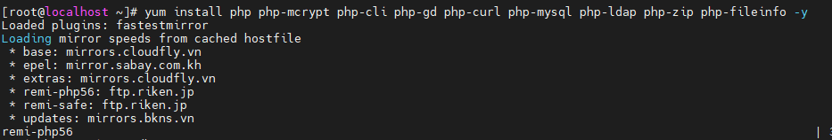

# Triển khai Wordpress Mariadb Galera Cluster

- [Triển khai Wordpress Mariadb Galera Cluster](#triển-khai-wordpress-mariadb-galera-cluster)
  - [Mô hình](#mô-hình)
  - [I. Cài đặt Mariadb Galera](#i-cài-đặt-mariadb-galera)
    - [1. Chuẩn bị](#1-chuẩn-bị)
    - [2. Cài đặt MariaDB Galera](#2-cài-đặt-mariadb-galera)
  - [II. Cài đặt Wordpress](#ii-cài-đặt-wordpress)
    - [1. Cài đặt Apache](#1-cài-đặt-apache)
    - [2. Cài đặt PHP](#2-cài-đặt-php)
    - [3 Cài đặt WordPress](#3-cài-đặt-wordpress)
    - [4. Kiểm tra](#4-kiểm-tra)

## Mô hình


**IP planning:**


## I. Cài đặt Mariadb Galera
### 1. Chuẩn bị
**Cấu hình**
```
HOSTNAME    node1
Network     ens33: network internal (192.168.30.200)
            ens37: 192.168.92.128


HOSTNAME    node2
Network     ens33: network internal (192.168.30.250)
            ens37: 192.168.92.129

HOSTNAME    node3
Network     ens33: network internal (192.168.30.210)
            ens37: 192.168.91.130
```
**Tại node 1**

Cấu hình Hostname
```
hostnamectl set-hostname node1
echo "192.168.92.128 node1" >> /etc/hosts
echo "192.168.92.129 node2" >> /etc/hosts
echo "192.168.92.130 node3" >> /etc/hosts
```

Cài đặt gói
```
yum install epel-release -y
yum update -y
```

Tắt SELinux, Firewalld
```
sed -i 's/SELINUX=enforcing/SELINUX=disabled/g' /etc/sysconfig/selinux
sed -i 's/SELINUX=enforcing/SELINUX=disabled/g' /etc/selinux/config
systemctl stop firewalld
systemctl disable firewalld
init 6
```

**Tại node 2**

Cấu hình Hostname
```
hostnamectl set-hostname node2
echo "192.168.92.128 node1" >> /etc/hosts
echo "192.168.92.129 node2" >> /etc/hosts
echo "192.168.92.130 node3" >> /etc/hosts
```

Cài đặt gói
```
yum install epel-release -y
yum update -y
```

Tắt SELinux, Firewalld
```
sed -i 's/SELINUX=enforcing/SELINUX=disabled/g' /etc/sysconfig/selinux
sed -i 's/SELINUX=enforcing/SELINUX=disabled/g' /etc/selinux/config
systemctl stop firewalld
systemctl disable firewalld
init 6
```

**Tại node 3**

Cấu hình Hostname
```
hostnamectl set-hostname node3
echo "192.168.92.128 node1" >> /etc/hosts
echo "192.168.92.129 node2" >> /etc/hosts
echo "192.168.92.130 node3" >> /etc/hosts
```

Cài đặt gói
```
yum install epel-release -y
yum update -y
```

Tắt SELinux, Firewalld
```
sed -i 's/SELINUX=enforcing/SELINUX=disabled/g' /etc/sysconfig/selinux
sed -i 's/SELINUX=enforcing/SELINUX=disabled/g' /etc/selinux/config
systemctl stop firewalld
systemctl disable firewalld
init 6
```

### 2. Cài đặt MariaDB Galera

**Bước 1: Cài đặt MariaDB 10.2**
>Thực hiện trên tất cả các node

- Thêm Repo:
```
echo '[mariadb]
name = MariaDB
baseurl = http://yum.mariadb.org/10.2/centos7-amd64
gpgkey=https://yum.mariadb.org/RPM-GPG-KEY-MariaDB
gpgcheck=1' >> /etc/yum.repos.d/MariaDB.repo
yum -y update
```

- Cài đặt Mariadb, galera, rsync
```
yum install -y mariadb mariadb-server

yum install -y galera rsync

systemctl stop mariadb
systemctl disable mariadb
```

- Cấu hình Log
```
cp /etc/my.cnf /etc/my.cnf.org

cat > /etc/my.cnf << EOF
[mysqld]
slow_query_log                  = 1
slow_query_log_file             = /var/log/mariadb/slow.log
long_query_time                 = 5
log_error                       = /var/log/mariadb/error.log
general_log_file                = /var/log/mariadb/mysql.log
general_log                     = 1

[client-server]
!includedir /etc/my.cnf.d
EOF

mkdir -p /var/log/mariadb/
chown -R mysql. /var/log/mariadb/
```

**Bước 2: Cấu hình Galera**

**Tại node1**
```
cp /etc/my.cnf.d/server.cnf /etc/my.cnf.d/server.cnf.bak

cat > /etc/my.cnf.d/server.cnf << EOF
[server]
[mysqld]
bind-address=192.168.92.128

[galera]
wsrep_on=ON
wsrep_provider=/usr/lib64/galera/libgalera_smm.so
#add your node ips here
wsrep_cluster_address="gcomm://192.168.92.128,192.168.92.129,192.168.92.130"
binlog_format=row
default_storage_engine=InnoDB
innodb_autoinc_lock_mode=2
#Cluster name
wsrep_cluster_name="cong_cluster"
# this server ip, change for each server
wsrep_node_address="192.168.92.128"
# this server name, change for each server
wsrep_node_name="node1"
wsrep_sst_method=rsync
bind-address=192.168.92.128
[embedded]
[mariadb]
[mariadb-10.2]
EOF
```

**Tại node 2**
```
cp /etc/my.cnf.d/server.cnf /etc/my.cnf.d/server.cnf.bak

cat > /etc/my.cnf.d/server.cnf << EOF
[server]
[mysqld]
bind-address=192.168.92.129

[galera]
wsrep_on=ON
wsrep_provider=/usr/lib64/galera/libgalera_smm.so
#add your node ips here
wsrep_cluster_address="gcomm://192.168.92.128,192.168.92.129,192.168.92.130"
binlog_format=row
default_storage_engine=InnoDB
innodb_autoinc_lock_mode=2
#Cluster name
wsrep_cluster_name="cong_cluster"
# this server ip, change for each server
wsrep_node_address="192.168.92.129"
# this server name, change for each server
wsrep_node_name="node2"
wsrep_sst_method=rsync
bind-address=192.168.92.129
[embedded]
[mariadb]
[mariadb-10.2]
EOF
```

**Tại node 3**
```
cp /etc/my.cnf.d/server.cnf /etc/my.cnf.d/server.cnf.bak

cat > /etc/my.cnf.d/server.cnf << EOF
[server]
[mysqld]
bind-address=192.168.92.130

[galera]
wsrep_on=ON
wsrep_provider=/usr/lib64/galera/libgalera_smm.so
#add your node ips here
wsrep_cluster_address="gcomm://192.168.92.128,192.168.92.129,192.168.92.130"
binlog_format=row
default_storage_engine=InnoDB
innodb_autoinc_lock_mode=2
#Cluster name
wsrep_cluster_name="cong_cluster"
# this server ip, change for each server
wsrep_node_address="192.168.92.130"
# this server name, change for each server
wsrep_node_name="node3"
wsrep_sst_method=rsync
bind-address=192.168.92.130
[embedded]
[mariadb]
[mariadb-10.2]
EOF
```

Trong đó:
- `wsrep_cluster_address="gcomm://192.168.92.128,192.168.92.129,192.168.92.130"` : danh sách các node thuộc Cluster.
- `wsrep_cluster_name="cong_cluster"`: tên của Cluster.
- `wsrep_node_address="192.168.92.128"` địa chỉ IP của node đang thực hiện.
- `wsrep_node_name="node2"` : tên node.

Các file cấu hình:
- Cấu hình log: /etc/my.cnf
- Cấu hình kết nối: /etc/my.cnf.d/server.cnf


**Bước 3: Khởi động Cluster**

Ở đây, dùng node1 làm node khởi tạo Galera cluster ( Tức là các node khác sẽ đồng bộ dữ liệu từ node1 )

- Thực hiện trên node1
```
galera_new_cluster
systemctl enable mariadb
```

- Thực hiện join node 2 và node 3 vào cụm:
```
systemctl start mariadb
systemctl enable mariadb
```

- Cài đặt bảo mật:
```
[root@node1 ~]# mysql_secure_installation

NOTE: RUNNING ALL PARTS OF THIS SCRIPT IS RECOMMENDED FOR ALL MariaDB
      SERVERS IN PRODUCTION USE!  PLEASE READ EACH STEP CAREFULLY!

In order to log into MariaDB to secure it, we'll need the current
password for the root user.  If you've just installed MariaDB, and
you haven't set the root password yet, the password will be blank,
so you should just press enter here.

Enter current password for root (enter for none):
OK, successfully used password, moving on...

Setting the root password ensures that nobody can log into the MariaDB
root user without the proper authorisation.

Set root password? [Y/n] y
New password:
Re-enter new password:
Password updated successfully!
Reloading privilege tables..
 ... Success!


By default, a MariaDB installation has an anonymous user, allowing anyone
to log into MariaDB without having to have a user account created for
them.  This is intended only for testing, and to make the installation
go a bit smoother.  You should remove them before moving into a
production environment.

Remove anonymous users? [Y/n] y
 ... Success!

Normally, root should only be allowed to connect from 'localhost'.  This
ensures that someone cannot guess at the root password from the network.

Disallow root login remotely? [Y/n] n
 ... skipping.

By default, MariaDB comes with a database named 'test' that anyone can
access.  This is also intended only for testing, and should be removed
before moving into a production environment.

Remove test database and access to it? [Y/n] y
 - Dropping test database...
 ... Success!
 - Removing privileges on test database...
 ... Success!

Reloading the privilege tables will ensure that all changes made so far
will take effect immediately.

Reload privilege tables now? [Y/n] y
 ... Success!

Cleaning up...

All done!  If you've completed all of the above steps, your MariaDB
installation should now be secure.

Thanks for using MariaDB!
```

- Tạo Database cho wordpress

Đăng nhập vào MySQL với user root
```
mysql -u root -p
```

- Tạo user và database để sử dụng cho wordpress

```
create database tên-database;
create user 'user'@'IP' identified by 'pass';
grant all privileges on tên-database to 'user'@'IP';
flush privileges;
```

Trong đó:

- **tên-database** là tên database sử dụng cho wordpress.
- **user** là tên user sử dụng để wordpress kết nối vào MySQL.
- **IP** là địa chỉ của máy Web Server để truy cập MySQL.

Trong bài này:
```
create database wordpressdb;
create user 'wpuser'@'192.168.92.131' identified by '123456';
grant all privileges on wordpressdb to 'wpuser'@'192.168.92.131';
flush privileges;
```

## II. Cài đặt Wordpress
### 1. Cài đặt Apache
Trên máy web server:
- Cài apache:
```
yum install httpd -y
```

- Khởi động Apache và cho phép khởi động cùng hệ thống
```
systemctl start httpd
systemctl enable httpd
```


### 2. Cài đặt PHP
- Cài đặt kho lưu trữ EPLE và Remi

```
# yum install https://dl.fedoraproject.org/pub/epel/epel-release-latest-7.noarch.rpm
# yum install http://rpms.remirepo.net/enterprise/remi-release-7.rpm
```

- Cài đặt yum-utils

```# yum install yum-utils -y```


- Cài đặt PHP 5.6
  - Kích hoạt PHP 5.6 trên Remi:
  
```# yum-config-manager --enable remi-php56```


- Cài đặt PHP 5.6

```# yum install php php-mcrypt php-cli php-gd php-curl php-mysql php-ldap php-zip php-fileinfo```



- Kiểm tra version:
```
[root@localhost ~]# php -v
PHP 5.6.40 (cli) (built: Nov 15 2021 11:30:01)
Copyright (c) 1997-2016 The PHP Group
Zend Engine v2.6.0, Copyright (c) 1998-2016 Zend Technologies
```

### 3 Cài đặt WordPress

- Cài đặt Wordpress từ internet:

    ```wget https://wordpress.org/latest.tar.gz```


Note: Nếu chưa có wget, có thể tải bằng lệnh yum sau:
    ```yum -y install wget```

- Giải nén tệp:

```tar -xzvf latest.tar.gz```


- Di chuyển file giải nén tới `/var/www/html` và tạo file backup:
```
[root@localhost ~]# mv wordpress/* /var/www/html
mv: overwrite ‘/var/www/html/index.php’? y
[root@localhost ~]# cd /var/www/html
[root@localhost html]# ls
index.php    wp-activate.php     wp-comments-post.php  wp-cron.php        wp-load.php   wp-settings.php   xmlrpc.php
license.txt  wp-admin            wp-config-sample.php  wp-includes        wp-login.php  wp-signup.php
readme.html  wp-blog-header.php  wp-content            wp-links-opml.php  wp-mail.php   wp-trackback.php
[root@localhost html]#
[root@localhost html]# cp wp-config-sample.php wp-config.php
```
- Tạo tệp cấu hình từ tệp mẫu:

    ```cp wp-config-sample.php wp-config.php```


- Chỉnh sửa tệp cấu hình:

    ```# vi wp-config.php```

```
     23 define( 'DB_NAME', 'wordpressdb' );
     24
     25 /** MySQL database username */
     26 define( 'DB_USER', 'wpuser' );
     27
     28 /** MySQL database password */
     29 define( 'DB_PASSWORD', '123456' );
     30
     31 /** MySQL hostname */
     32 define( 'DB_HOST', '192.168.92.130' );
```

### 4. Kiểm tra
Trên Client: Truy cập  Wordpress bằng trình duyệt

