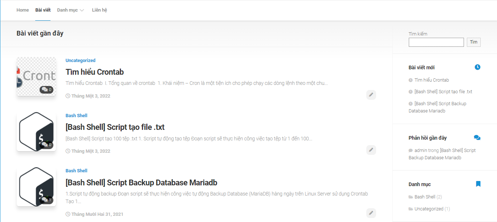
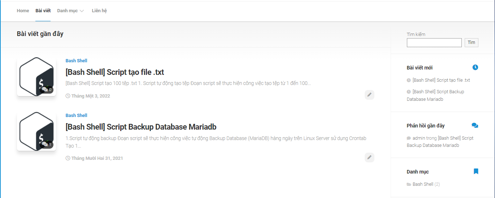

# Backup và Restore database trên Wordpress

Mục lục
- [Backup và Restore database trên Wordpress](#backup-và-restore-database-trên-wordpress)
- [I. Viết bài lên wordpress](#i-viết-bài-lên-wordpress)
  - [1. Cài đặt trình soạn thảo](#1-cài-đặt-trình-soạn-thảo)
  - [2. Viết bài mới](#2-viết-bài-mới)
- [II. Backup dữ liệu](#ii-backup-dữ-liệu)
- [III. Restore dữ liệu database wordpress](#iii-restore-dữ-liệu-database-wordpress)
  - [1. Giải nén file gz](#1-giải-nén-file-gz)
  - [2. Khôi phục dữ liệu](#2-khôi-phục-dữ-liệu)
- [IV. Kết quả](#iv-kết-quả)

# I. Viết bài lên wordpress
## 1. Cài đặt trình soạn thảo

- Thêm Plugin mới:

  

- Tìm Plugin: Classic Editor
  
  

- Sau khi cài đặt xong, nhấn kích hoạt để sử dụng:
  
  

## 2. Viết bài mới

- Chọn Post > Add New:
  
  

- Viết tiêu đề, nội dung, Chọn Danh mục, Thẻ,... cho bài viết:
  
  

- Sau khi viết xong có thể chọn:
  - **Preview** để xem trước nội dung của bài viết
  - **Save Draft** để lưu bản nháp bài viết khi chưa muốn đăng.
  - **Publish** để đăng bài viết công khai.

# II. Backup dữ liệu
- Bài viết trước khi backup:


- Sử dụng lệnh:
```
mysqldump -u userwp -p  wordpressdb | gzip > /backup/wordpress/backup.sql.gz
```
- Output:
```
[root@localhost wordpress]# pwd
/backup/wordpress
[root@localhost wordpress]# ls
backup.sql.gz
```

- Viết thêm bài viết trước khi Restore:



Để khôi phục dữ liệu ta thực hiện

# III. Restore dữ liệu database wordpress
## 1. Giải nén file gz
```
cd /backup/wordpress
gunzip backup.sql.gz
```
## 2. Khôi phục dữ liệu
```
mysql -u userwp -p wordpressdb < backup.sql
```
# IV. Kết quả
Dữ liệu khôi phục đến thời điểm backup dữ liệu



Bài viết sau lệnh backup dữ liệu bị mất đi sau khi Restore.