# Tìm hiểu về Logical Volume Manager

- [Tìm hiểu về Logical Volume Manager](#tìm-hiểu-về-logical-volume-manager)
- [I. Giới thiệu Logical Volume Manager](#i-giới-thiệu-logical-volume-manager)
  - [1. Logical Volume Manager](#1-logical-volume-manager)
  - [2. Mục đích sử dụng](#2-mục-đích-sử-dụng)
  - [3.Ưu nhược điểm](#3ưu-nhược-điểm)
  - [4.Mô hình LVM](#4mô-hình-lvm)
  - [5.Tạo LVM](#5tạo-lvm)
    - [5.1 Thêm ổ cứng ảo](#51-thêm-ổ-cứng-ảo)
    - [5.2 Tạo Partition](#52-tạo-partition)
    - [5.3 Tạo Physical Volume](#53-tạo-physical-volume)
    - [5.4 Tạo Volume Group](#54-tạo-volume-group)
    - [5.5 Tạo Logical Volume](#55-tạo-logical-volume)
    - [5.6 Định dạng Logical Volume](#56-định-dạng-logical-volume)
    - [5.7 Mount và sử dụng](#57-mount-và-sử-dụng)
  - [6. Các thao tác trên LVM](#6-các-thao-tác-trên-lvm)
    - [6.1 Thay đổi dung lượng Logical Volume trên LVM](#61-thay-đổi-dung-lượng-logical-volume-trên-lvm)
    - [6.2 Thay đổi dung lượng Volume Group trên LVM](#62-thay-đổi-dung-lượng-volume-group-trên-lvm)
    - [6.3 Xoá Logical Volume, Volume Group, Physical Volume](#63-xoá-logical-volume-volume-group-physical-volume)
- [II. Snapshots và Restoring snapshot](#ii-snapshots-và-restoring-snapshot)
  - [1. Giới thiệu](#1-giới-thiệu)
  - [2. Tạo Snapshots và restoring](#2-tạo-snapshots-và-restoring)
  - [3. Cách sử dụng Snapshot](#3-cách-sử-dụng-snapshot)
- [III. Tìm hiểu về LVM Thin Provisioning](#iii-tìm-hiểu-về-lvm-thin-provisioning)
  - [1. Giới thiệu](#1-giới-thiệu-1)
  - [2. Cách thức thực hiện](#2-cách-thức-thực-hiện)
    - [2.1 Tạo Virtual Volume](#21-tạo-virtual-volume)
    - [2.2 Tạo Thin Pool](#22-tạo-thin-pool)
    - [2.3 Tạo các Thin Volumes](#23-tạo-các-thin-volumes)
    - [2.4 Mở rộng Thin Pool](#24-mở-rộng-thin-pool)
- [Tài liệu tham khảo](#tài-liệu-tham-khảo)


# I. Giới thiệu Logical Volume Manager
## 1. Logical Volume Manager
LVM (Logical Volume Manager) là một công cụ quản lý các ổ cứng được cài đặt trên máy tính cho hệ điều hành linux. Qua đó có thể tăng, giảm kích thước,... phân vùng ổ cứng một cách dễ dàng.

## 2. Mục đích sử dụng
LVM được sử dụng cho các mục đích sau:

- Tạo các ổ đĩa logic đơn của nhiều ổ đĩa vật lý hoặc toàn bộ đĩa cứng, cho phép thay đổi kích thước ổ đĩa động.
- Quản lý lượng lớn các ổ cứng, cho phép bổ sung và thay thế ổ cứng mà không gián đoạn dịch vụ
- Thay đổi kích thước hệ thống tệp linh hoạt. Trên các hệ thống nhỏ (như máy tính để bàn), thay vì phải ước tính tại thời điểm cài đặt phân vùng có thể cần lớn như thế nào, LVM cho phép dễ dàng thay đổi kích thước hệ thống tệp khi cần thiết.
- Backup hệ thống bằng cách snapshot các phân vùng ổ cứng (real-time).

## 3.Ưu nhược điểm
Ưu điểm :

- Không để hệ thống bị gián đoạn hoạt động
- Không làm hỏng dịch vụ
- Có thể tạo ra các vùng dung lượng lớn nhỏ tuỳ ý.

Nhược điểm:
- Các bước thiết lập phức tạp
- Càng gắn nhiều đĩa cứng và thiết lập càng nhiều LVM thì hệ thống khởi động càng lâu.
- Khả năng mất dữ liệu cao khi một trong số các đĩa cứng bị hỏng.
- Windows không thể nhận ra vùng dữ liệu của LVM. Nếu Dual-boot, Windows sẽ không thể truy cập dữ liệu trong LVM.
## 4.Mô hình LVM
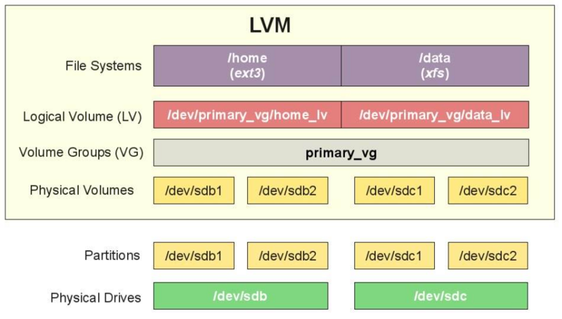

Physical Drivers
- Thiết bị lưu trữ dữ liệu, ví dụ như trong linux nó là /dev/sdb,/dev/sdc .

Partitions:
- Partitions là các phân vùng của Hard drives, mỗi Hard drives có 4 partition, trong đó partition bao gồm 2 loại là primary partition và extended partition.
- Primary partition: Phân vùng chính, có thể khởi động , mỗi đĩa cứng có thể có tối đa 4 phân vùng này.
- Extended partition: Phân vùng mở rộng

Physical Volumes:
- Là những thành phần cơ bản được sử dụng bởi LVM dể xây dựng lên các tầng cao hơn . Một Physical Volume không thể mở rộng ra ngoài phạm vi một ổ đĩa. Chúng ta có thể kết hợp nhiều Physical Volume thành Volume Groups

Volume Group
- Nhiều Physical Volume trên những ổ đĩa khác nhau được kết hợp lại thành một Volume Group
- Volume Group được sử dụng để tạo ra các Logical Volume, trong đó người dùng có thể tạo, thay đổi kích thước, lưu trữ, gỡ bỏ và sử dụng.

Logical Volumes:
- Có chức năng là các phân vùng trong ổ cứng vật lý , có thể thu hồi hoặc thêm dung lượng một cách dễ dàng . Là thành phần chính để người dùng và các phần mềm tương tác .

File Systems

- Tổ chức và kiểm soát các tập tin
- Được lưu trữ trên ổ đĩa cho phép truy cập nhanh chóng và an toàn
- Sắp xếp dữ liệu trên đĩa cứng máy tính
- Quản lý vị trí vật lý của mọi thành phần dữ liệu

Một số khái niệm liên quan:
- Physical volume: là một đĩa cứng vật lý (ví dụ: /dev/sda...) hoặc là partition
- Volume Group: là một nhóm các physical volume (Có thể xem Volume Group như 1 ổ đĩa ảo )
- Logical Volume: là các phân vùng ảo của ổ đĩa ảo

Một số lệnh cần thiết:

- Lệnh fdisk : Dùng để quản lý việc phân vùng trong ổ cứng. Là một công cụ hữu dụng tron linux tìm hiểu thêm FDISK
- Lệnh mount : Dùng để gắn một phân vùng vào thư mục root để có thể sử dụng được nó tìm hiểu thêm về mount
- Lệnh dd : Dùng Sao lưu và hồi phục toàn bộ dữ liệu ổ cứng hoặc một partition và kiểm tra tốc độ đọc của kiểu lưu trữ dữ liệu trong LVM
## 5.Tạo LVM
Chuẩn bị
    Máy ảo Centos 7 trên VMWare

### 5.1 Thêm ổ cứng ảo


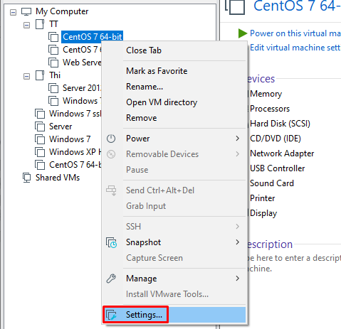

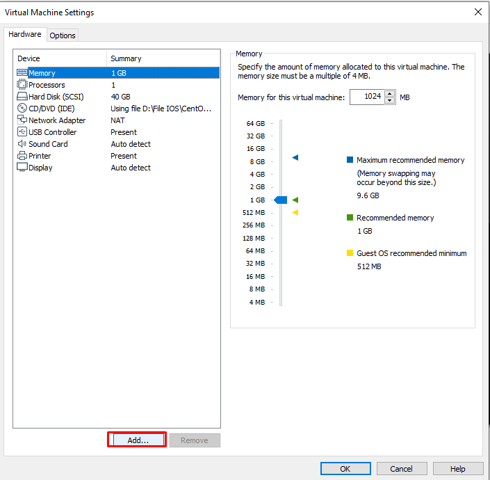

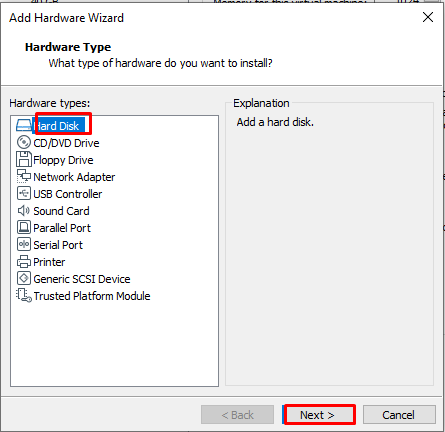

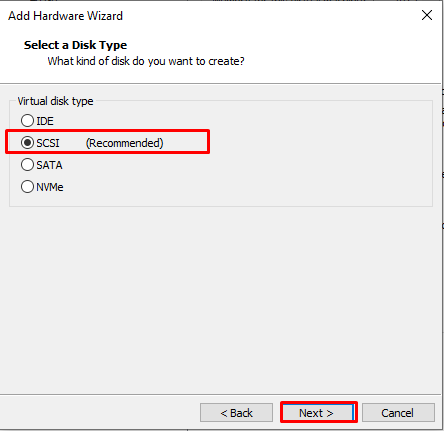

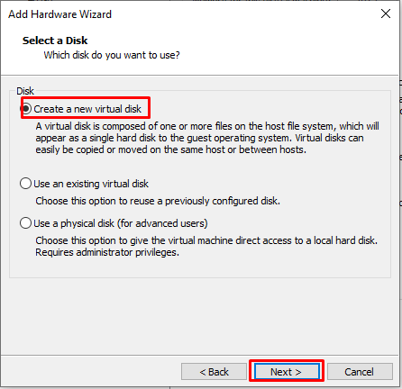

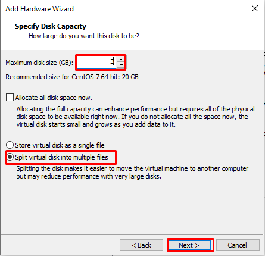

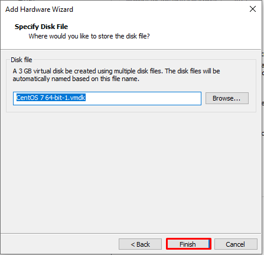

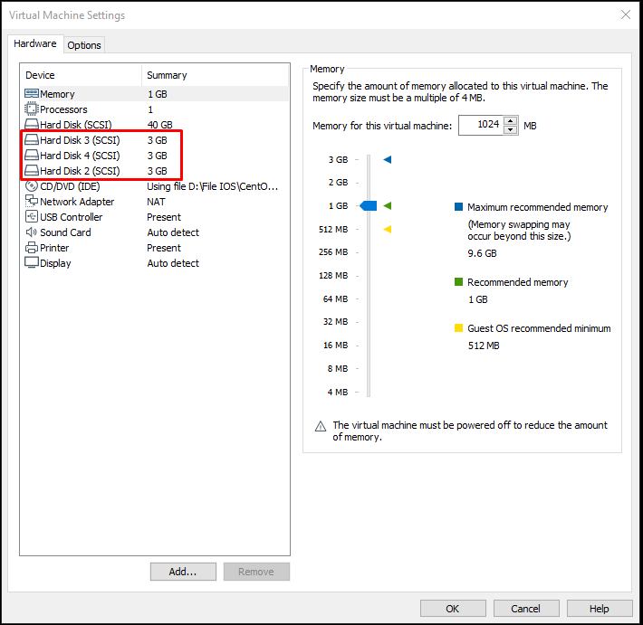

Kiểm tra ổ đĩa trên Linux bằng lệnh: `lsblk`

Kết quả:
```
[root@localhost ~]# lsblk
NAME            MAJ:MIN RM  SIZE RO TYPE MOUNTPOINT
sda               8:0    0   40G  0 disk
├─sda1            8:1    0    1G  0 part /boot
└─sda2            8:2    0   39G  0 part
  ├─centos-root 253:0    0   37G  0 lvm  /
  └─centos-swap 253:1    0    2G  0 lvm  [SWAP]
sdb               8:16   0    3G  0 disk
sdc               8:32   0    3G  0 disk
sdd               8:48   0    3G  0 disk
sr0              11:0    1 1024M  0 rom
```

Ảnh minh hoạ:

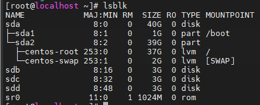

### 5.2 Tạo Partition
– Tạo các partition cho các ổ mới , bắt đầu từ sdb với lệnh :
fdisk /dev/sdb

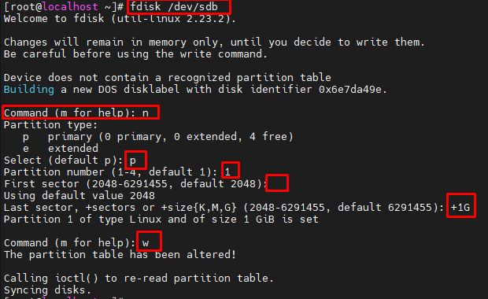

Trong đó:
- Chọn `n` để bắt đầu tạo `partition`
- Chọn `p` để tạo `partition primary`
- Chọn `1` để tạo `partition primary 1`
- Tại `First sector (2048-20971519, default 2048)` để mặc định
- Tại `Last sector, +sectors or +size{K,M,G} (2048-20971519, default 20971519)` Nhập +1G để partition tạo ra có dung lượng 1G
- Chọn `w` để lưu lại và thoát.

Tiếp theo bạn thay đổi định dạng của partition vừa mới tạo thành LVM

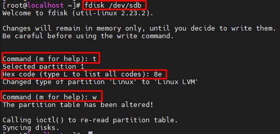

- Chọn `t` để thay đổi định dạng partition
- Chọn `8e` để đổi thành LVM

Tương tự, bạn tạo thêm các partition primary từ sdb và tạo các partition primary từ sdc bằng lệnh `fdisk /dev/sdc`

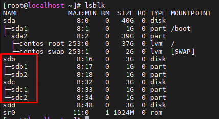

###  5.3 Tạo Physical Volume

Tạo các Physical Volume là `/dev/sdb1` và `/dev/sdc1` bằng các lệnh sau:

```
# pvcreate /dev/sdb1
```
```
# pvcreate /dev/sdc1
```

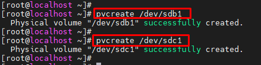

Kiểm tra bằng lệnh pvs hoặc pvdisplay xem các physical volume đã được tạo chưa :

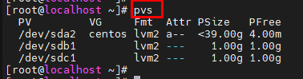

### 5.4 Tạo Volume Group

Tiếp theo, nhóm các Physical Volume thành 1 Volume Group bằng cách sử dụng câu lệnh sau:

`# vgcreate vg-cong1 /dev/sdb1 /dev/sdc1`

Trong đó `vg-cong1` là tên của `Volume Group`

Có thể sử dụng câu lệnh sau để kiểm tra lại các `Volume Group` đã tạo
```
# vgs
```
```
# vgdisplay
```

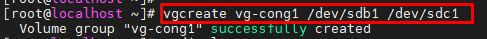

Kiểm tra:

```
[root@localhost ~]# vgdisplay
  --- Volume group ---
  VG Name               centos
  System ID
  Format                lvm2
  Metadata Areas        1
  Metadata Sequence No  3
  VG Access             read/write
  VG Status             resizable
  MAX LV                0
  Cur LV                2
  Open LV               2
  Max PV                0
  Cur PV                1
  Act PV                1
  VG Size               <39.00 GiB
  PE Size               4.00 MiB
  Total PE              9983
  Alloc PE / Size       9982 / 38.99 GiB
  Free  PE / Size       1 / 4.00 MiB
  VG UUID               5EycWR-ubHY-VMS8-NvIv-IGSC-7M6E-gvxPop

  --- Volume group ---
  VG Name               vg-cong1
  System ID
  Format                lvm2
  Metadata Areas        2
  Metadata Sequence No  1
  VG Access             read/write
  VG Status             resizable
  MAX LV                0
  Cur LV                0
  Open LV               0
  Max PV                0
  Cur PV                2
  Act PV                2
  VG Size               1.99 GiB
  PE Size               4.00 MiB
  Total PE              510
  Alloc PE / Size       0 / 0
  Free  PE / Size       510 / 1.99 GiB
  VG UUID               X2XzVq-jRof-fFCD-5S4A-veiE-9RJy-dt77BW
```
Hoặc
```
[root@localhost ~]# vgs
  VG       #PV #LV #SN Attr   VSize   VFree
  centos     1   2   0 wz--n- <39.00g 4.00m
  vg-cong1   2   0   0 wz--n-   1.99g 1.99g
```
### 5.5 Tạo Logical Volume
Từ một Volume Group, Có thể tạo ra các Logical Volume bằng cách sử dụng lệnh sau:

```
# lvcreate -L 1G -n lv-cong1 vg-cong1
```

Trong đó
- `L`: Chỉ ra dung lượng của logical volume
- `n`: Chỉ ra tên của logical volume
- `lv-cong1` là tên Logical Volume
- `vg-cong1` là Volume Group vừa tạo ở bước trước

Lưu ý: có thể tạo nhiều Logical Volume từ 1 Volume Group

Kiểm tra lại các Logical Volume đã tạo

```
# lvs
```
```
# lvdisplay
```

Minh hoạ:

```
[root@localhost ~]# lvcreate -L 1G -n lv-cong1 vg-cong1
  Logical volume "lv-cong1" created.
[root@localhost ~]# lvs
  LV       VG       Attr       LSize  Pool Origin Data%  Meta%  Move Log Cpy%Sync Convert
  root     centos   -wi-ao---- 36.99g
  swap     centos   -wi-ao----  2.00g
  lv-cong1 vg-cong1 -wi-a-----  1.00g
```

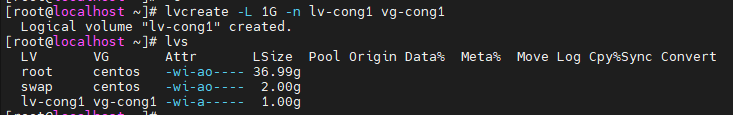

### 5.6 Định dạng Logical Volume

Để format các Logical Volume thành các định dạng như ext2, ext3, ext4, có thể làm như sau:

```
# mkfs -t ext3 /dev/vg-cong1/lv-cong1
```


Minh hoạ:

```
[root@localhost ~]# mkfs -t ext3 /dev/vg-cong1/lv-cong1
mke2fs 1.42.9 (28-Dec-2013)
Filesystem label=
OS type: Linux
Block size=4096 (log=2)
Fragment size=4096 (log=2)
Stride=0 blocks, Stripe width=0 blocks
65536 inodes, 262144 blocks
13107 blocks (5.00%) reserved for the super user
First data block=0
Maximum filesystem blocks=268435456
8 block groups
32768 blocks per group, 32768 fragments per group
8192 inodes per group
Superblock backups stored on blocks:
        32768, 98304, 163840, 229376

Allocating group tables: done
Writing inode tables: done
Creating journal (8192 blocks): done
Writing superblocks and filesystem accounting information: done
```

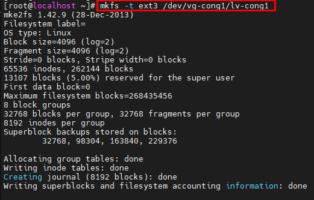

### 5.7 Mount và sử dụng

Tạo ra một thư mục để mount Logical Volume đã tạo vào thư mục đó

```
# mkdir Luutru
```

Tiến hành mount logical volume lv-cong1 vào thư mục Luutru như sau:

```
# mount /dev/vg-cong1/lv-cong1 Luutru
```

Kiểm tra lại dung lượng của thư mục đã được mount:

```
# df -h
```

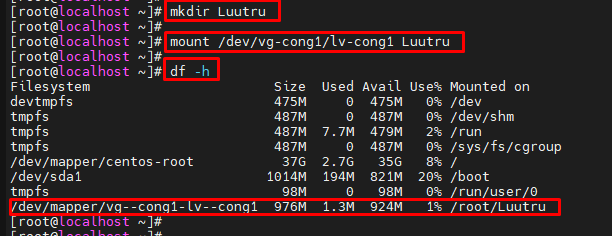

## 6. Các thao tác trên LVM
### 6.1 Thay đổi dung lượng Logical Volume trên LVM
Lệnh kiểm tra các thông tin LVM:
```
# vgs

# lvs

# pvs
```

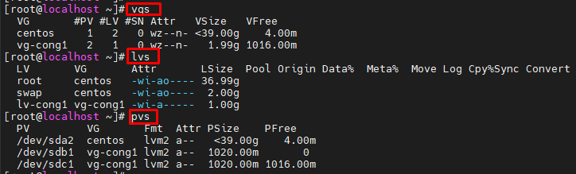

Cần thay đổi Logical Volume lv-cong1 (thuộc Volume Group vg-cong1)

- Kiểm tra Volume Group (VG) còn dư dung lượng không(VG đã cấp phát hết thì LV cũng không thể tăng dung lượng).
  - Sử dụng lệnh:
    ```
    # vgdisplay
    ```
    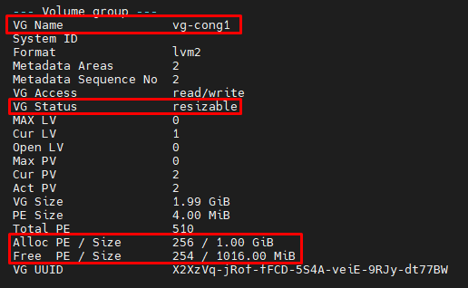

    Volume Group (VG) vẫn còn dung lượng để cấp phát thông qua 2 trường thông tin:
    - ```VG Status resizable```
    - ```Free PE /Size  254 / 1016.00 MiB``` với dung lượng Free là 254*4=1016 Mb
- Để tăng kích thước Logical Volume sử dụng lệnh sau:
  ```
  # lvextend -L +100M /dev/vg-cong1/lv-cong1
  ```
  - Với `L` là tuỳ chọn để tăng kích thước.
    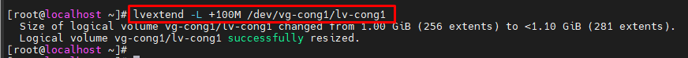
  - Kiểm tra lại bằng cách dùng lệnh: `#lvs`
    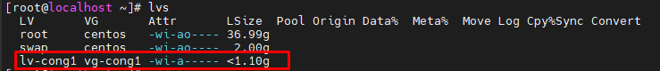
  - Sau khi tăng kích thước cho Logical Volume thì Logical Volume đã được tăng nhưng file system trên volume này vẫn chưa thay đổi, bạn phải sử dụng lệnh sau để thay đổi:
    ```
    # resize2fs /dev/vg-cong1/lv-cong1
    ```
    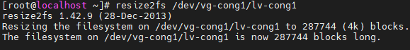
- Để giảm kích thước của Logical Volume, trước hết các bạn phải umount Logical Volume mà mình muốn giảm
  ```
  # umount /dev/vg-demo1/lv-demo1
  ```

  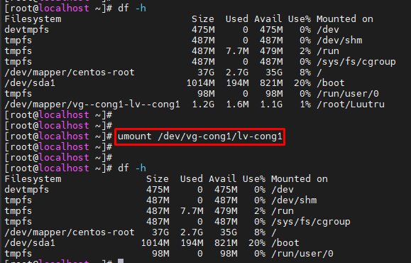

  Tiến hành giảm kích thước của Logical Volume
  ```
  # lvreduce -L 90M /dev/vg-demo1/lv-demo1
  ```
  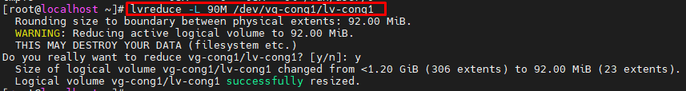

  Sau đó tiến hành format lại Logical Volume
  ```
  # mkfs.ext4 /dev/vg-demo1/lv-demo1
  ```

  Cuối cùng là mount lại Logical Volume
  ```
  # mount /dev/vg-demo1/lv-demo1 demo1
  ```
  Kiểm tra kết quả ta được như sau:
  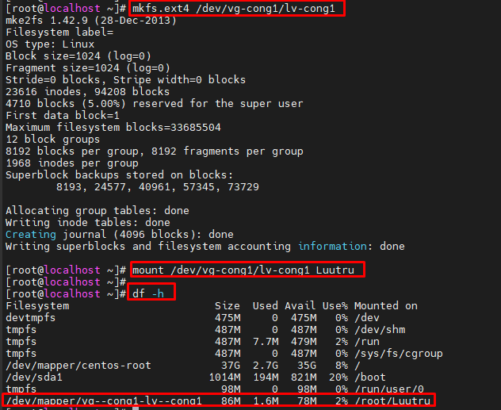
### 6.2 Thay đổi dung lượng Volume Group trên LVM
Việc thay đổi kích thước của Volume Group là việc nhóm thêm Physical Volume hay thu hồi Physical Volume ra khỏi Volume Group
- Kiểm tra lại các partition và Volume Group
  ```
  # vgs
  ```
  ```
  # lsblk
  ```
  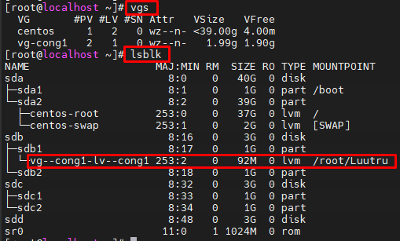
- Tiếp theo, nhóm thêm 1 partition vào Volume Group như sau:
  ```
  # vgextend /dev/vg-cong1 /dev/sdb2
  ```
  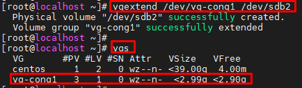
  Ở đây, muốn nhóm vào Volume Group phải là Physical Volume nên hệ thống đã tự động tạo cho mình Physical Volume và nhóm vào Volume Group.

- Chúng ta có thể cắt 1 Physical Volume ra khỏi Volume Group như sau:
  ```
  # vgreduce /dev/vg-demo1 /dev/sdb3
  ```
  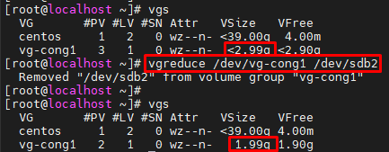

### 6.3 Xoá Logical Volume, Volume Group, Physical Volume
- Xóa Logical Volumes

  - Trước tiên ta phải Umount Logical Volume
    ```
    # umount /dev/vg-demo1/lv-demo1
    ```
  - Sau đó tiến hành xóa Logical Volume bằng câu lệnh sau:
    ```
    # lvremove /dev/vg-demo1/lv-demo1
    ```
  - Ta kiểm tra lại kết quả
  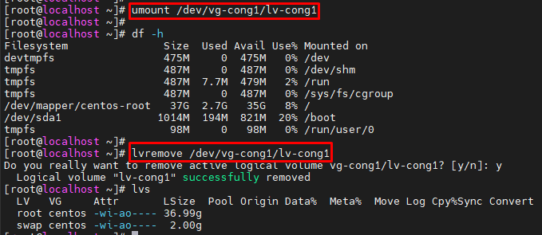
- Xóa Volume Group

  - Trước khi xóa Volume Group, chúng ta phải xóa Logical Volume

  - Xóa Volume Group bằng cách sử dụng lệnh sau:
    ```
    # vgremove /dev/vg-demo1
    ```
  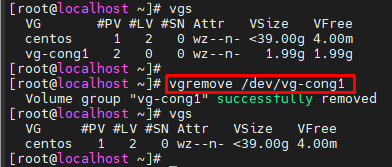
- Xóa Physical Volume
  ```
  # pvremove /dev/sdb3
  ```
  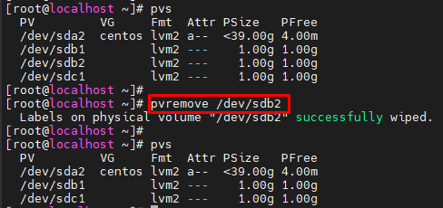

# II. Snapshots và Restoring snapshot
## 1. Giới thiệu
LVM Snapshots là bản sao thời gian trỏ chuột hiệu quả về không gian của lvm volume. 
Nó chỉ hoạt động với lvm và chỉ sử dụng dung lượng khi thực hiện các thay đổi đối với nguồn Logical volume thành Snapshot volume. Nếu source volume có những thay đổi lớn được thực hiện đối với tổng 1GB, những thay đổi tương tự sẽ được thực hiện đối với snapshot volume. Tốt nhất là luôn luôn có một kích thước nhỏ thay đổi để tiết kiệm không gian. 

Trong trường hợp snapshot hết bộ nhớ, có thể sử dụng lvextend để grow. Và nếu cần shrink the snapshot, có thể sử dụng lvreduce.


Nếu chúng ta vô tình xóa bất kỳ tệp nào sau khi tạo Snapshot, chúng ta không phải lo lắng vì Snapshot có tệp gốc mà chúng ta đã xóa. Có thể xảy ra nếu tệp đã ở đó khi tạo snapshot. Không thay đổi snapshot volume, hãy giữ nguyên nó trong khi snapshot được sử dụng để khôi phục nhanh.

Không thể sử dụng snapshot cho backup option. Backups là Bản sao chính của một số dữ liệu, vì vậy chúng tôi không thể sử dụng snapshot làm backup option.

- Snapshot trong LVM là một tính năng hữu ích cho phép tạo ra các bản sao lưu dữ liệu của một Logical Volume nào đó.
- Snapshot cung cấp cho ta một tính năng phục hồi dữ liệu của một Logical Volume trước thời điểm tạo ra nó.
## 2. Tạo Snapshots và restoring
Số liệu:
- 2 Logical Volume:

  - /dev/cong/Public     2GiB
  - /dev/cong/Private    1GiB

- 1 Volume Group:
    cong    còn trống 1GiB
- 4 Physical Volume:
  - dev/sdb, /dev/sdc, /dev/sdd, /dev/sde

- Snapshot sẽ tạo cho Logical Volume /dev/cong/Private

    - Đầu tiên, ta cần kiểm tra dung lượng còn trống trong Volume Group:

      ```vgdisplay cong```
kết quả sẽ hiển thị tương tự như sau:
```
[root@localhost ~]# vgdisplay cong
  --- Volume group ---
  VG Name               cong
  System ID
  Format                lvm2
  Metadata Areas        2
  Metadata Sequence No  3
  VG Access             read/write
  VG Status             resizable
  MAX LV                0
  Cur LV                2
  Open LV               0
  Max PV                0
  Cur PV                2
  Act PV                2
  VG Size               3.99 GiB
  PE Size               4.00 MiB
  Total PE              1022
  Alloc PE / Size       768 / 3.00 GiB
  Free  PE / Size       254 / 1016.00 MiB
  VG UUID               qNa9r0-bwxb-bmxk-ILYq-tUMC-kZcY-KHUoKU
```

để ý vào `Free  PE / Size       254 / 1008.00 MiB` ta biết được dung lượng còn trống, và ta sẽ sử dụng 1 phần của toàn bộ dung lượng này để tạo ra một snapshot cho `/dev/cong/private` với câu lệnh sau:

```lvcreate -l 50 --snapshot -n pri_sns /dev/cong/private```

- Private_Snapshot là tên Logical Volume đóng vai trò Snapshot

kết quả sẽ hiển thị tương tự như sau:

              Using default stripesize 64.00 KiB.
              Logical volume "Private_Snapshot" created.

- Để kiểm tra kết quả đã tạo thành công hay chưa, ta có thể sử dụng câu lệnh `lvs` và nó sẽ hiển thị tương tự như sau:

          LV               VG          Attr       LSize    Pool Origin  Data%  Meta%  Move Log Cpy%Sync Convert
          Private          LVMVolGroup owi-aos---    1.00g
          Private_Snapshot LVMVolGroup swi-a-s---  200.00m      Private 0.00
          Public           LVMVolGroup -wi-ao----    2.00g
          root             cl          -wi-ao----   17.00g
          swap             cl          -wi-ao----    2.00g

    

- Vì Snapshot cũng được coi là một Logical Volume, lên khi ta muốn xóa, thay đổi dung lượng một snapshot, ta có thể thực hiện nó như việc làm đối với một Logical Volume thông thường. Ví dụ:

  - Để thêm dung lượng cho Snapshot, ta chỉ cần thực hiện như sau:

    ```lvextend -L +1G /dev/cong/pri_sns```

  - Để xóa đi snapshot, ta chỉ cần thực hiện:

    ```lvremove /dev/cong/pri_sns```


## 3. Cách sử dụng Snapshot

- Để phục hồi một snapshot cho Logical Volume, ta cần phải unmount Logical Volume đó ra trước tiên và sử dụng snapshot. Cách thực hiện như sau:

  `umount -v /dev/cong/private`
            
  lvconvert --merge /dev/cong/pri_sns

sau khi chạy câu lệnh trên thì snapshot Private_Snapshot sẽ bị xóa.
# III. Tìm hiểu về LVM Thin Provisioning
## 1. Giới thiệu
Thin Provisioning là tính năng cấp phát ổ cứng dựa trên sự linh hoạt của LVM. Giả sử ta có một Volume Group, ta sẽ tạo ra 1 Thin Pool từ VG này với dung lượng là 20GB cho nhiều khách hàng sử dụng. Giả sử ta có 3 khách hàng, mỗi khách hàng được cấp 6GB lưu trữ. Như vậy ta có 3 x 6GB là 18GB. Với kỹ thuật cấp phát truyền thống thì ta chỉ có thể cấp phát thêm 2GB cho khách hàng thứ 4.

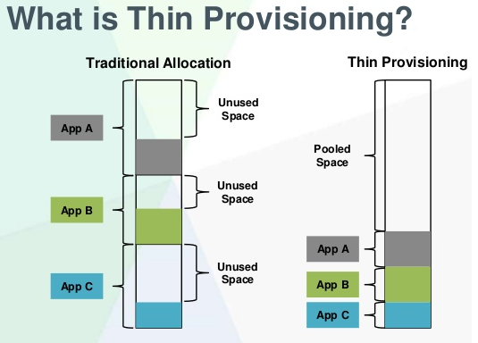
*So sánh giữa cách cấp phát truyển thống so với Thin Provisioning (Nguồn: VMware)*

Nhưng với kỹ thuật Thin Provisioning, ta vẫn có thể cấp thêm 6GB nữa cho khách hàng thứ 4. Tức là 4 x 6GB = 24GB > 20GB lúc đầu. Sở dĩ ta có thể làm được như vậy là do mỗi user tuy được cấp 6GB nhưng thường thì họ sẽ không xài hết số dung lượng này (nếu 4 khách hàng đều xài hết thì ta sẽ gặp tình trạng Over Provisioning). Ta sẽ giả dụ là họ không xài hết dung lượng được cấp thì trên danh nghĩa mỗi người sẽ được 6GB, nhưng thực tế thì họ xài đến đâu, hệ thống sẽ cấp thêm dung lượng đến đó.

Đối với cơ chế cấp phát bình thường thì LVM sẽ cấp phát 1 dãy block liên tục mỗi khi người dùng tạo ra 1 volume mới. Nhưng với cơ chế thin pool thì LVM chỉ sẽ cấp phát các block ổ cứng (là một tập hợp các con trỏ, trỏ tới ổ cứng) khi có dữ liệu thật sự ghi xuống đó. Cách tiếp cận này giúp tiết kiệm dung lượng cho hệ thống, tận dụng tối ưu dung lượng lưu trữ. Tuy nhiên, khuyết điểm là có thể gây phân mảnh hệ thống và gây ra tình trạng Over Provisioning như đã nói ở trên.

## 2. Cách thức thực hiện
Sau đây là kịch bản demo Thin Provisioing + Over Provisioning trên LVM

1. Tạo một Virtual Volume từ 2 đĩa sdb và sdc.
2. Tạo một Thin Pool (thực chất là tạo một Logical Volume với cờ –thinpool).
3. Tạo 4 Thin Volume (thực chất vẫn là Logical Volume) cho 4 user.
  3.1. Tạo filesystem cho 4 Volume này.
  3.2. Tạo mount point và mount 4 volume này.
4. Mở rộng Thin Pool.

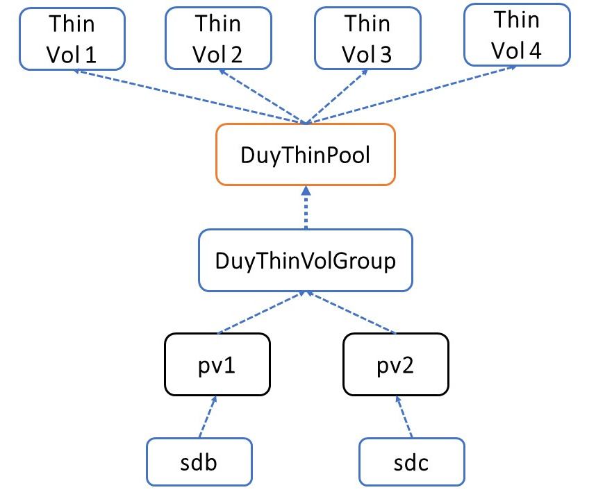
*Kịch bản tạo Thin Pool và Thin Volume*

### 2.1 Tạo Virtual Volume
Khởi tạo Virtual Volume từ 2 đĩa sdb và sdc với tổng dung lượng là 20GB (10GB + 10GB):
```
vgcreate cong1 /dev/sdb /dev/sdc
pvg
vgs
```

### 2.2 Tạo Thin Pool
Khởi tạo 1 Thin Pool với dung lượng là 18GB (phải có cờ –thinpool):
```
lvcreate -L 18G --thinpool "congThinPool" cong1

vgs -o +lv_size,lv_name

lvdisplay
```

### 2.3 Tạo các Thin Volumes
Tạo 4 Thin Volume cho các user, mỗi Volume có dung lượng là 6G (6*6 = 24GB > 18GB).

Đây chính là Over Provisioning dựa trên Thin Provisioning
```
lvcreate -V 6G --thin -n "Thin_User1" cong1/congThinPool

lvcreate -V 6G --thin -n "Thin_User2" cong1/congThinPool

lvcreate -V 6G --thin -n "Thin_User3" cong1/congThinPool

lvcreate -V 6G --thin -n "Thin_User4" cong1/congThinPool
```
*Hệ thống cảnh báo khi ta cấp các Volume nhiều hơn tổng dung lượng của Thin Pool*


Format 4 volume này về định dạng ext4
```
mkfs.ext4 /dev/cong1/Thin_User1

mkfs.ext4 /dev/cong1/Thin_User2

mkfs.ext4 /dev/cong1/Thin_User3

mkfs.ext4 /dev/cong1/Thin_User4
```

Tạo mount point và mount 4 volume này lên hệ thống
```
mkdir -p /mnt/{user1,user2,user3,user4}

mount /dev/cong1/Thin_User1 /mnt/user1

mount /dev/cong1/Thin_User2 /mnt/user2

mount /dev/cong1/Thin_User3 /mnt/user3

mount /dev/cong1/Thin_User4 /mnt/user4

df -h
lvdisplay cong1
```


### 2.4 Mở rộng Thin Pool
Về bản chất, Thin Pool vẫn là 1 Logical Volume nên ta có thể dễ dàng mở rộng Thin Pool, miễn là Volume Group chứa nó vẫn còn dung lượng trống:
```
lvscan

lvresize -L +1G cong1/congThinPool

hoặc

lvextend -L +1G cong1/congThinPool
```

# Tài liệu tham khảo
1. https://www.techwiz.ca/~peters/presentations/lvm/oclug-lvm.pdf
2. https://bachkhoa-aptech.edu.vn/gioi-thieu-ve-logical-volume-manager/279.html
3. https://www.tecmint.com/take-snapshot-of-logical-volume-and-restore-in-lvm/
4. https://cloudcraft.info/gioi-thieu-ve-lvm-logical-volume-management/