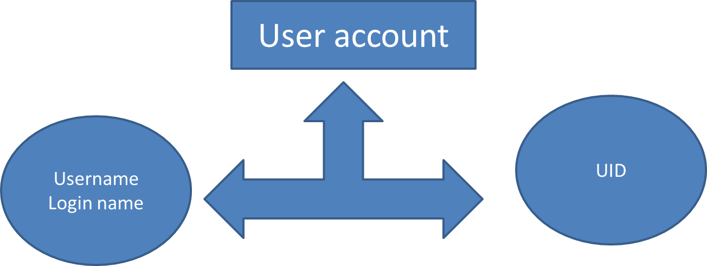
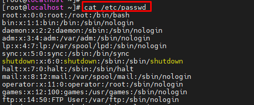
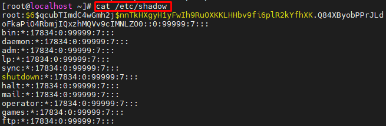

# Tìm hiểu về tài khoản người dùng và lệnh ```sudo```, ```su``` trong Centos

**Muc Lục**

- [Tìm hiểu về tài khoản người dùng và lệnh ```sudo```, ```su``` trong Centos](#tìm-hiểu-về-tài-khoản-người-dùng-và-lệnh-sudo-su-trong-centos)
  - [1. Tài khoản người dùng trong linux](#1-tài-khoản-người-dùng-trong-linux)
    - [1.1 Tài khoản người dùng là gì?](#11-tài-khoản-người-dùng-là-gì)
    - [1.2 Các loại tài khoản người dùng](#12-các-loại-tài-khoản-người-dùng)
    - [1.3 Tệp quản lý người dùng](#13-tệp-quản-lý-người-dùng)
    - [1.4 Tạo các tài khoản cá nhân và nhóm:](#14-tạo-các-tài-khoản-cá-nhân-và-nhóm)
  - [2. Sudo là gì?](#2-sudo-là-gì)
    - [2.1 Lý do phải sử dụng sudo](#21-lý-do-phải-sử-dụng-sudo)
    - [2.2 Chức năng](#22-chức-năng)
    - [2.3 Cú pháp cơ bản của sudo](#23-cú-pháp-cơ-bản-của-sudo)
    - [2.4 File /etc/sudoers](#24-file-etcsudoers)
  - [3. Su là gì](#3-su-là-gì)
    - [3.1 Cú pháp:](#31-cú-pháp)
  - [Tài liệu tham khảo:](#tài-liệu-tham-khảo)

## 1. Tài khoản người dùng trong linux
### 1.1 Tài khoản người dùng là gì?
- Tài khoản người dùng là một cách tiếp cận có hệ thống để theo dõi và giám sát việc sử dụng tài nguyên hệ thống. 
- Mỗi tài khoản người dùng chứa hai số nhận dạng duy nhất
  - Tên người dùng
  - UID.(User Identifier)
- Khi một tài khoản người dùng được tạo, tên người dùng của nó được ánh xạ tới một UID duy nhất.

- Tên người dùng phải là duy nhất trong hệ thống. 
- UID được cố định. Nó không thể thay đổi được.
### 1.2 Các loại tài khoản người dùng
- **Tài khoản root**:
  - Đây là tài khoản người dùng chính trong hệ thống Linux. 
  - Nó được tạo tự động trong quá trình cài đặt. 
  - Nó có đặc quyền cao nhất trong hệ thống. 
  - Nó có thể thực hiện bất kỳ công việc quản trị nào và có thể truy cập vào bất kỳ dịch vụ nào. 
  - Tài khoản này dành cho quản trị hệ thống và chỉ được sử dụng cho mục đích này. 
  - Nó không nên được sử dụng cho các hoạt động thường ngày.
  -  Không thể xóa nó. Nhưng nếu được yêu cầu, nó có thể bị vô hiệu hóa.

- **Tài khoản người dùng thông thường**:
  - Sau khi cài đặt, Có thể tạo nhiều tài khoản người dùng thông thường nếu cần. 
  - Tài khoản này có quyền bị hạn chế. 
  - Tài khoản này dành cho các công việc thường ngày. 
  - Nó chỉ có thể thực hiện các tác vụ mà nó được phép và chỉ có thể truy cập những tệp và dịch vụ mà nó được phép. 
  - Nó có thể bị vô hiệu hóa hoặc bị xóa.

- **Tài khoản dịch vụ**
  - Tài khoản dịch vụ được tạo bởi các gói cài đặt khi chúng được cài đặt. 
  - Các tài khoản này được các dịch vụ sử dụng để chạy các quy trình và thực thi các chức năng. 
  - Những tài khoản này không nhằm mục đích cũng như không được sử dụng cho công việc thường ngày.
### 1.3 Tệp quản lý người dùng
Có 4 file chính quản lý người sử dụng:
- ```/etc/passwd```: Giữ tài khoản người dùng và thông tin mật khẩu. 
  - Trường: tên tài khoản,Ký tự giữ chỗ cho mật khẩu, UID, GID (Group Identifier), Description(Sự miêu tả), Thư mục chính, Shell đăng nhập



- ```/etc/shadow```: Giữ mật khẩu được mã hoá của tài khoản tương ứng.
  - Trường: tên tài khoản, Mật khẩu được mã hóa,Số ngày thay đổi mật khẩu lần cuối, Số ngày trước khi mật khẩu có thể được thay đổi, Số ngày sau khi mật khẩu phải được thay đổi, Số ngày trước ngày hết hạn mật khẩu để hiển thị thông báo cảnh báo, Số ngày để vô hiệu hóa tài khoản sau khi hết hạn mật khẩu, Số ngày kể từ khi tài khoản bị vô hiệu hóa, Trường dành riêng.



- ```/etc/group```: File này giữ thông tin nhóm cho mỗi tài khoản.
- `/etc/gshadow`: File này giữ các thông tin tài khoản nhóm bảo mật.
### 1.4 Tạo các tài khoản cá nhân và nhóm:

|  Lệnh |  Mô tả |
|---|---|
|useradd|Thêm các tài khoản cá nhân tới hệ thống|
|usermod|	Chỉnh sửa các thuộc tính của tài khoản cá nhân.|
|userdel|	Xóa các tài khoản cá nhân từ hệ thống.|
|groupadd|	Thêm các tài khoản nhóm tới hệ thống.|
|groupmod|	Chỉnh sửa các thuộc tính của tài khoản nhóm.|
|groupdel|	Dỡ bỏ các tài khoản nhóm khỏi hệ thống.|

## 2. Sudo là gì?
- Lệnh sudo cho phép một user thực thi một lệnh bằng quyền của root. 
- Lệnh ```sudo``` cấp một lần hoặc giới hạn thời gian truy cập vào chức năng gốc. 
- Thông thường, lệnh sudo được sử dụng để chạy nhanh một lệnh quản trị, sau đó quay lại quyền thông thường của tài khoản người dùng.
### 2.1 Lý do phải sử dụng sudo
- Tăng cường tính **bảo mật** cho hệ thống.
- **Quản lý quyền hạn** của từng user hoặc group trong việc thực thi lệnh.
- Cho phép quản trị viên **kiểm soát được các thao tác của người dùng** có can thiệp đến hệ thống. 
- Kiểm soát lệnh từ xa thông qua **telnet/SSH**
### 2.2 Chức năng
- Sudo được dùng khi ta muốn **thực thi** một lệnh trên Linux với **quyền của một user khác** khi được cho phép
- Quyền của user trong ```file /etc/sudoers```.
- Những ghi nhận (**log**) của hệ thống khi sudo được sử dụng theo mặc định:
  - ```/var/log/secure``` (Red Hat/Fedora / CentOS Linux)
  - ```/var/log/auth.log``` (Ubuntu / Debian Linux).
### 2.3 Cú pháp cơ bản của sudo
**Cú pháp:**
```sudo [Option] [Lệnh]```

- Mặc định sudo sẽ xem như ta đang mượn quyền root để thực thi.
- Nếu ta muốn **“mượn” một người dùng** nào khác thì khai báo định danh rõ ràng của người đó:

```sudo -u <username> <lệnh cần thực hiện>```

### 2.4 File /etc/sudoers
Nội dung trong file này thường được đặc tả bằng cú pháp sau:

```USER HOSTNAME=(TARGET-USERS) COMMAND```

Trong đó:
- **USER**: Tên của người sử dụng
- **HOSTNAME**: Tên máy mà luật được áp dụng lên. Lúc này sudo sẽ xem máy đang chạy được dùng các luật nào. Nói cách khác, bạn có thể thiết kế các luật cho từng máy trong hệ thống.
- **TARGET-USERS**: Tên người dùng đích cho “mượn” quyền thực thi.
- **COMMAND**: Tên “lệnh” (thực ra là các chương trình thực thi) mà người dùng được quyền thực thi với bất kỳ tham số nào mà họ muốn. Tuy nhiên bạn cũng có thể đặc tả các tham số của lệnh (bao gồm các dấu thay thế wildcards). Ngược lại, có thể dùng kí hiệu “” để ám chỉ là lệnh chỉ được thực thi mà không có tham số nào cả.
- Nếu là cấp quyền cho group, ta thay tham số USER bằng %GROUP
**Thiết lập cho sudo**
Tiến hành thiết lập cho sudo bằng cách soạn thảo file này. Để mở file sudo lên và soạn thảo, ta dùng lệnh sau:

```# visudo``` hoặc ```#vi /etc/sudoers```

- **” root ALL=(ALL) ALL”**có nghĩa là người dùng root, trên tất cả các máy, có thể mượn quyền tất cả các người dùng, để thực thi tất cả các lệnh.
- **“%admin ALL=(ALL) ALL”** có nghĩa là nhóm người dùng admin, trên tất cả các máy, có thể mượn quyền tất cả các người dùng, để thực thi tất cả các lệnh.
**Ví dụ:Thêm quyền/giới hạn quyền cho User**
- User3 để có thể đọc các thư mục ở Root

```
root ALL=(ALL) ALL
user3 ALL=(root) /bin/ls
```

- Muốn User User3 không phải nhập mật khẩu mỗi lần ls /root, ta thêm như sau :

```user3 ALL=(root) NOPASSWD: /bin/ls```

## 3. Su là gì
- Su là viết tắt của **switch user**.
- ```Su``` lệnh cho phép chuyển đổi người dùng hiện đối với bất kỳ người dùng khác. (Cần chia sẻ mật khẩu,)
- Người dùng **root** dùng ```su``` không cần nhập mật khẩu khi chuyển sang người dùng khác.
### 3.1 Cú pháp:
Có 2 dạng:

- ```su -l username``` hoặc ```su - username```

=> Cung cấp **một giao diện đăng nhập** tương tự như khi bạn **đăng nhập bình thường**.
- ```su username```
  
=> Người dùng mới **giữ lại** toàn bộ **môi trường làm việc** của user trước như: **thư mục làm việc hiện tại và đường dẫn đến file thực thi cũng được giữ nguyên**.
Trong đó:
  - ```-l``` là viết tắt của login.

**Note**: 
- Nếu **không chỉ định tên user**, thì **root** được coi là tùy chọn **mặc định**
- Lệnh để chuyển sang root là: 
  - ```su - root``` hoặc ``su -``
  - ```su root``` hoặc ```su```


## Tài liệu tham khảo:
1. https://freetuts.net/lenh-su-trong-linux-3290.html
2. http://estih.edu.vn/wp-content/uploads/2017/08/quan_tri_user.pdf
3. https://www.computernetworkingnotes.com/linux-tutorials/types-of-users-in-linux-explained-with-accounts.html