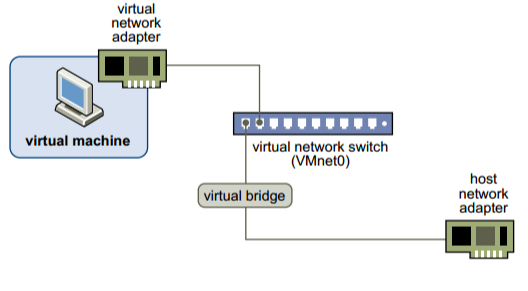
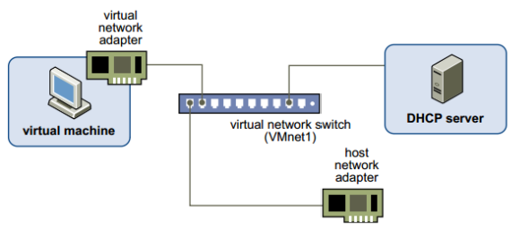
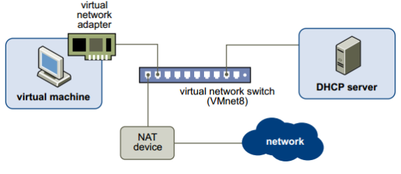

<h2> CÁC LOẠI NETWORK TRONG VMWARE WORKSTATION
#
Mục lục

- [1.Bridge](#1bridge)
- [2.Host - Only](#2host---only)
- [3.NAT (Network Address Translation)](#3nat-network-address-translation)
## 1.Bridge
- Ở chế độ này, card mạng trên máy ảo được gắn vào VMnet0, VMnet0 này liên kết trực tiếp với card mạng vật lý trên máy thật, máy ảo lúc này sẽ kết nối internet thông qua  card mạng vật lý và có chung lớp mạng với card mạng vật lý.

- Máy ảo có kết nối vào hệ thống mạng thật(card ethernet hoặc wireless)
- Máy ảo chung môi trường kết nối switch (layer 2) với các máy thật
- IP của máy ảo sẽ cùng với dải IP của máy thật.

## 2.Host - Only
- Máy ảo được kết nối với VMnet có tính năng Host-only, trong trường hợp này là VMnet1.VMnet Host-only kết nối với  một card mạng ảo tương ứng ngoài máy thật
- Hai máy ảo thấy được nhau.(Card Host-only chỉ có thể giao tiếp với card mạng ảo VMnet1 trên máy thật)

- Các máy ảo và máy thật thấy được nhau.
- Card Host-only chỉ có thể giao tiếp với các card Host-only trên các máy ảo khác.
- Card Host-only không thể giao tiếp với mạng vật lý mà máy tính thật đang kết nối.
- Mặc định các máy ảo không có khả năng kết nối internet, có nghĩa là mạng VMnet Host-only và mạng vật lý hoàn toàn tách biệt.
- IP của máy ảo được cấp bởi DHCP của VMnet tương ứng, ta có thể tắt DHCP trên VMnet và cấu hình IP bằng tay cho máy ảo.
## 3.NAT (Network Address Translation)
- ở chế độ này, card mạng của máy ảo kết nối với VMnet8, VNnet 8 cho phép máy ảo đi ra mạng vật lý bên ngoài internet thông qua cơ chế NAT (NAT device). 
- lớp mạng bên trong máy ảo khác hoàn toàn với lớp mạng của card vật lý bên ngoài, hai mạng hoàn toàn tách biệt.
- IP của card mạng máy ảo sẽ được cấp bởi DHCP của VMnet8, trong trường hợp muốn thiết lập IP tĩnh cho card mạng máy ảo bạn phải đảm bảo chung lớp mạng với VNnet8 thì máy ảo mới có thể đi internet.

- Card NAT chỉ có thể giao tiếp với card mạng ảo VMnet8 trên máy thật.
- Card NAT chỉ có thể giao tiếp với các card NAT trên các máy ảo khác.
- Card NAT không thể giao tiếp với mạng vật lý mà máy tính thật đang kết nối. Tuy nhiên nhờ cơ chế NAT được tích hợp trong VMWare, máy tính ảo có thể gián tiếp liên lạc với mạng vật lý bên ngoài.
- Nhiều máy tính kết nối internet bằng một ip public.
